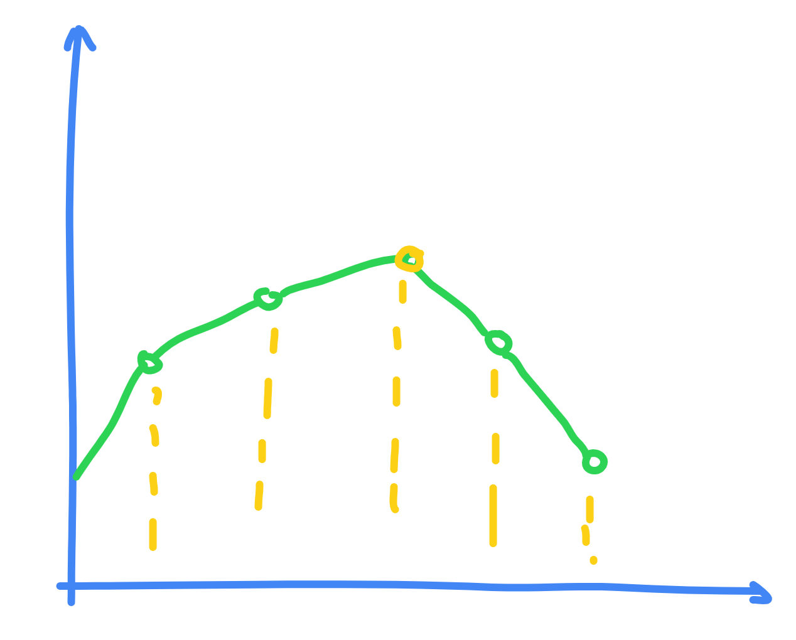

# WQS二分 优化 DP

## 引入

首先我们需要知道这个 WQS 二分能够适配哪些情况的 DP 转移，一般来说这个题目要求中会出现恰好出现 **"至少选择 $k$ 个"** / **"恰好选择 $k$ 个"** 这样的词语。然后 WQS 二分则能够把这个 $k$ 这个维度的枚举从 $\mathcal O(N)$ 变成 $\mathcal O(\log N)$ 。

当然使用 WQS 也是需要有前提的，我们令 $f(x)$ 表示当 $k = x$ 情况下的最大答案。 此时对于 $f(x)$ 的图像一定需要满足是一个凸包。并且一般来说对于原来的问题，如果不考虑 $k$ 的限制，其可以较快处理。

这里我有两种理解办法: **图像法** 和 **文本法** ， 这里我选择 **图像法** 。

## 具体内容

首先对于原来的 DP 方程，我们想一下有 $k$ 的约束和没有 $k$ 的约束有什么区别。实际上没有约束相当于所有有约束情况的最优解！这个时显然的。

所以对于没有约束情况的 DP 方程，它其实会选择所有有约束条件中答案的最有解。如果这个 $f(x) - x$ 是一个凸包。那么很明显最优解时这个图像的拐点，如图：



但是很明显大概率这个选择的最优解不会满足 $k$ 的要求。所以我们如果想要继续使用快速的不带限制的DP， 那么必须让最优解的位置正好满足 $k$ 的要求。

因此我们考虑构造一个新的代价函数 $g(x) = f(x) + x \times t$ 此时我们对于这一个进行 DP 求解最小值，如果有一个正好的 $t$ 能够刚好令满足 $k$ 的要求，那么此时 $g(x) - x \times t$ 就是真正的答案。

如果放到图像上相当于有一条 $y = -x \times t + b$ 的图像正好与 $f(x)$ 相切（因为当一条直线和一条曲线想切时，这两个函数图像的差的拐点就是切点位置）。

所以现在的问题相当于就变成了需要求解一个 $y = b - x \times t$ 的直线，然后能够正好相切，由于这个 $f(x)$ 为一个凸包，所以我们可以使用二分解决。

具体来说，如果此时我们把 $mid$ 带进去计算最优解，然后假设对于约束条件使用了 $k'$ 个，那么：

* 如果 $k' < k$ 说明约束的太多了，所以令 $r = mid-1$ 。

* 如果 $k' = k$ ，此时说明约束正好达成，直接输出答案 。

* 如果 $k' > k$ 说明约束的太少了，所以令 $l = mid+1$ 。

> [!warning] 细节需注意
>
> * 前面的情况时对应 DP方程 取 $\min$ 的情况的，如果为 $\max$ 那么需要颠倒，因为凸包的方向颠倒了
>
> * 如果出现类似 **至多选择 $k$** 这样的情况，需要在二分的每一个满足要求的地方记录答案，但是记得还原 $g$ 时要减去的一定为 $k \times mid$ 而不是真是使用的 $cnt \times mid$ ，然后答案选择最后出现的一个。
>
> * 初始的 $l, r$ 最稳妥为 $[-inf, inf]$ 。

代码实现：

=== "求解最小值"
注意这里对应的是下凸函数

````
```cpp
int l=-inf, r=inf, ans=0;
while(l<=r) {
    int mid=(l+r)>>1;
    auto res=check(mid); // 第一项为加上额外代价的答案， 第二项为真实使用 k
    if(res.second<=m) {
        ans = res.first - m*mid;
        r=mid-1;
    }else l=mid+1;
}
```
````

=== "求解最大值"
注意这里对应的是下凸函数

````
```cpp
int l=-inf, r=inf, ans=inf;
while(l<=r) {
    int mid=(l+r)>>1;
    auto x=check(mid);
    if(x.second <= k) {
        ans=min(ans, x.first-k*mid);
        l=mid+1;
    }else r=mid-1;
}
```
````
