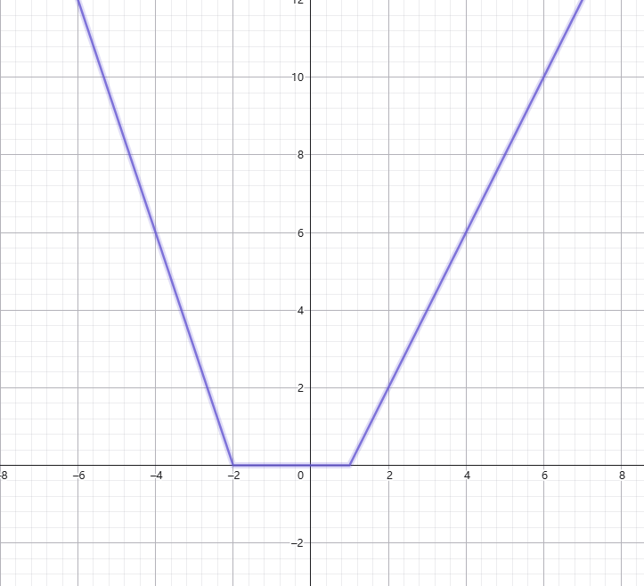
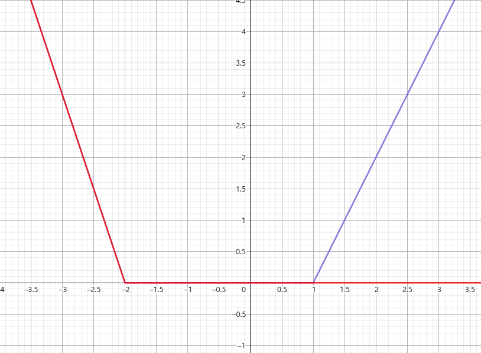

# Slope Trick

## 引入

**Slope Trick** 是一种 **DP优化** 的办法， 其主要针对下面类似方程式：

* DP 方程为两维， 并且第二维取值单调， 迭代时都有上一个迭代的结果产生

* 假设方程为 $f(i, j)$ ，令 $g(j)_i = f(i, j)$ ，满足对于每一个 $i$ ，$g(j)$ 是一个凸函数， 且凸包相邻两点之间的斜率为整数。

然后使用 **Slope Trick** 能够做出以下操作：

* 维护一个凸包 $g$ ，其中会经过若干次迭代，每一次相当于从 $f(i-1, *) \to f(i, *)$ 。

* 迭代出对于所有 $j$ 组成的新函数 $f(i, j) = \min *{k<j} f(i-1, k)$ 和 $f(i,j) = \min*{k>j} f(i-1, k)$ （这里是 $\min / \max$ 是通过是上凸函数还是下凸函数决定的，本文章都以下下凸函数为例）

* 给整个 DP 函数 加上一个类似 $|k - x|$ 这样的折线

* 给整个 DP 函数 加上一个类似 $y = kx+b$ 的一次函数

通过这些东西，我们能够把一个简单的 DP 方程 拆分成上面几步，比如对于 $f(i,j) = \min_{k<j} {f(i-1, K) + |a_i - j|}$ ，此时我们把它拆分为：

* $f(i, j) = \min_{k<j} {f(i-1, K)}$

* $f(i, j) = f(i, j) + |a_i - j|$

此时这两步都是刚才所说的范围了。

## 维护

转换已经完成，剩下的最重要的就是如何维护上面所说的那些操作了，首先我们应当考虑如何维护函数构成的凸包。

一个一个点记录当然不行，所以我们可以考虑记录相邻两个点之间的斜率，比如下面这幅图：

我们可以先记录最左边这条线段的表达式 $y = kx+b$ （对于上图为 $y=-3x-6$ ），然后记录每一个拐点。如果是朴素的小法，那么你可能会直接记录每一个拐点变化的斜率，但是由于这样不好维护，并且每一个拐点斜率变化不大，所以一般对于集合中出现了几次这个拐点，那么就代表斜率变化了多少，比如对于上图集合为 ${-2, -2, -2, 1, 1}$ 。

此时如果我们想要合并两个凸包（在 DP 方程式中相加），那么只需要 $k, b$ 分别相加，两个维护的拐点集合合并。

## 操作

## 前后缀 min

然后考虑如何维护 前缀/后缀 $\min$ ，当我们进行此操作时，相当于：

（新的函数为红色部分）

所以说只需把 $k>0$ 部分的拐点删去就可以了，另一个同样道理。

## 加入折线函数 / 加入一次函数

相当于合并两个凸包，不用说了。

## 实现

我们发现需要处理两部分拐点 $k>0$ / $k<0$ ，所以不如分两个优先队列维护。

然后再加入删除节点时动态维护左右两边拐点，其实就是一个对顶堆