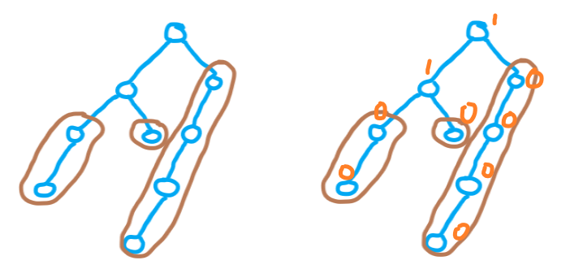
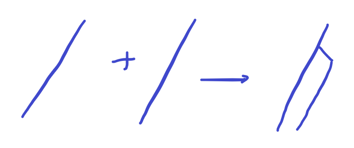

# 左偏树

## 引入

二叉堆固然好（更有可能指的是 $\texttt{priority_queue}$ ），但是如果遇到需要合并的操作，最直接的办法就是把两个堆的其中一个堆全部放到另一个堆中，时间复杂度 $\mathcal O(N \log N)$ 。

但是此时我们令 **外节点** 为所有子节点个数不为 $2$ 的节点，然后令 $\texttt{dist}_x$ 为在 $x$ 的子树中的 **外节点** 中（可以包含自己）距离的最小值。

对于一颗左偏树我们只需要在一颗二叉树上同时满足 "堆的性质" 和 "左子节点的 $\texttt{dist}$ 大于右子节点"。其大致结构如图所示：



(这里右边的那副图的数字为 $\texttt{dist}$)

可以发现所有的 **外节点** 组成了若干条左偏链，并且他们的 $\texttt{dist}$ 为 $0$ 。进一步观察，我们还发现对于节点 $x$ ，其 $dist_x = dis_{rc(x)} + 1$ ，这个就是为什么一般要把空节点设为 $-1$ 。

## 合并操作

左偏树一切操作都是基于合并操作的。毕竟这个也就是二叉堆的短板。

每当我们尝试合并两个堆分别以 $x,y$ 为根时，我们把他们两个值大的当作根，然后把权值小的和全职大的右子节点合并。

> [!info]+ 时间复杂度
>
> **Step1:** 首先我们可以证明时间复杂度是和 $\texttt{dist}$ 成线性的：
>
> 由于每一次往下走 $\texttt{dist}$ 都会减去 $1$ ，所以走了 $\texttt{dist}$ 步之后 $\texttt{dist} = 0$ ，相当于到了两个链上。 然而链的合并为：
>
> 
>
> 只需要执行一次。
>
> **Step2:** 然后还可以证明 $\texttt{dist}$ 为 $\log$ 级别的。
>
> 这个是因为对于一个节点 $x$ ，令离他最近的 **外节点** 为 $y$ ，那么 $x \to y$ 的路径上全部节点都有两个子节点，所以类似树链剖分。直接证明出来了。

当然这里还有什么 **随机堆** ，其他算法也可以达到相同效果。

> [!success]- 参考代码
>
> ```cpp
> template<class T=int, class Cmp=less<T>>
> struct KBH {
>     /**
>     * 这里一个数据结构同时维护多个序列
>     * 然后每一个序列的编号为其top()
>     */
>
>     struct DSU {
>         int fa[N];
>         int find(int x) {
>             if(x==fa[x]) return x;
>             return fa[x]=find(fa[x]);
>         }
>         DSU() {for(int i=1; i<N; i++) fa[i]=i;}
>     }dsu;
>
>     int cnt;
>     bool del[N];
>     struct node {
>         T val;
>         int ls, rs;
>
>         node(): val(0), ls(0), rs(0) {}
>         node(T v): val(v), ls(0), rs(0) {}
>     }tr[N];
>
>     int merge(int x, int y) {
>         if(!x || !y) return x|y;
>
>         if(tr[x].val!=tr[y].val && !Cmp()(tr[x].val,tr[y].val) ) swap(x, y);
>         if(tr[x].val==tr[y].val && x>y) swap(x, y);
>         tr[x].rs=merge(tr[x].rs, y);
>         
>         swap(tr[x].ls, tr[x].rs);
>         return x;
>     }
>
>     void join(int x, int y) {
>         if(x==-1 || y==-1) return;
>         dsu.fa[x]=dsu.fa[y]=merge(x,y);
>     }
>
>     // x 为需要插入的队列编号，返回插入节点标号
>     int push(int x, T v) {
>         tr[++cnt]=node(v);
>         return merge(x, cnt);
>     }
>
>     // 创建一个新的队列，返回队列编号(节点编号)
>     int new_que(T v) {
>         tr[++cnt]=node(v);
>         return cnt;
>     }
>
>     // 查询一个节点编号所在的队列
>     int que(int x) {
>         if(del[x]) return -1;
>         int ans=dsu.find(x);
>         return (del[ans])?-1:ans;
>     }
>
>     // 查询一个队列的 top
>     int top(int x) {
>         if(x==-1) return -1;
>         return tr[x].val;
>     }
>
>     void pop(int x) {
>         if(x==-1) return;
>         del[x]=1;
>         int new_root = merge(tr[x].ls, tr[x].rs);
>         if(new_root) {
>             dsu.fa[x]=new_root;
>             dsu.fa[new_root]=new_root;
>             dsu.fa[tr[x].ls]=new_root;
>             dsu.fa[tr[x].rs]=new_root;
>         }
>     }
> };
> ```
