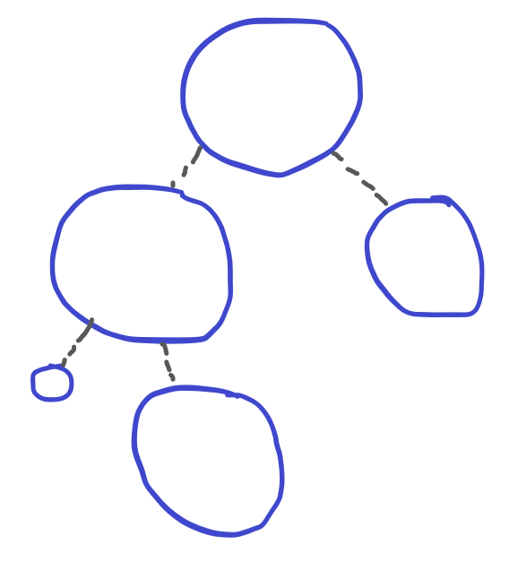
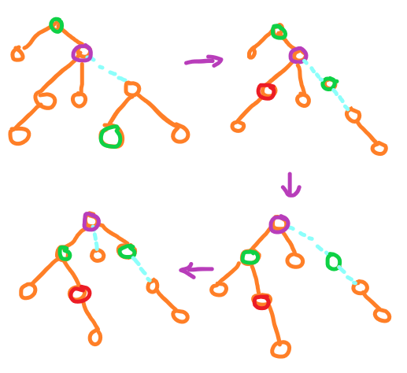

# Link Cut Tree

学完LCT后2个月终于开始写总结了。

## 引入

对于维护树上信息，应当已经十分清楚了： 重链剖分，长链剖分 ··· 。

但是看到下面的一道题：

???+ "P3690 【模板】动态树（LCT）"
    给定 $n$ 个点以及每个点的权值，要你处理接下来的 $m$ 个操作。 

    - `0 x y` 代表询问从 $x$ 到 $y$ 的路径上的点的权值的 $\text{xor}$ 和。保证 $x$ 到 $y$ 是联通的。
    - `1 x y` 代表连接 $x$ 到 $y$，若 $x$ 到 $y$ 已经联通则无需连接。
    - `2 x y` 代表删除边 $(x,y)$，不保证边 $(x,y)$ 存在。
    - `3 x y` 代表将点 $x$ 上的权值变成 $y$。

1,4操作都好说，就是普通重链剖分支持的，但是对于 2,3 操作，就不太好说了。

我们思考一下为什么？ 因为如果新加连边或者断边，那么意味着我们之前处理的重边，轻边都需要重新处理，否则不仅复杂度错误，而且 $\texttt{dfn}$ 也不再连续。

所以我们要找到一种数据结构，能够快速切换轻重边，从而支持动态增删边操作。

## 辅助树

LCT 依然有实虚边，其除名字唯一的区别是一个节点可以完全不选择相邻的边作为实边。

辅助树是由多颗 Splay 由虚边连成的树，他有一下性质：

- 原树中的节点和辅助树中的节点一一对应。

- 每一颗单独的 Splay 维护一条实链，其满足这个 Splay 的中序遍历为此链由上到下的顺序。

- 一个 Splay 的根节点会连接到这条链顶端节点的父亲节点，除非这条链是最上面的链，因此一颗辅助树中的最上面的 Splay 一定是原树根节点所在的链。

- 有上面的约束可以发现： 每一颗原树和辅助树都是一一对应的。

注意我们维护的不是一颗辅助树，而是辅助树森林，对应的原树也是森林。

??? example "结构示意图"
    

所以此时我们只需要维护辅助树即可。

## 具体操作

对于如何维护实虚边，LCT 的方法是 **认父不认子** ：

- 对于实边，父亲记录儿子节点，儿子记录父亲节点
- 对于虚边，父亲不记录儿子，儿子记录父亲

因此可以得到判断是否为 Splay 的根：
```cpp
#define isRoot(x) (ch[fa[x]][0]!=x && ch[fa[x]][1]!=x)
```

### 信息上下传递

这个 `tag[p]` 不是修改标记，而是子树翻转标记，类似文艺平衡树。

```cpp
void push_up(int p){
    siz[p]=siz[lc]+siz[rc]+1;
    sum[p]=sum[lc]^sum[rc]^val[p];
}

void push_down(int p){
    if(tag[p]){
        if(lc) swap(ch[lc][0],ch[lc][1]);
        if(rc) swap(ch[rc][0],ch[rc][1]);
        if(lc) tag[lc]^=1;
        if(rc) tag[rc]^=1;
        tag[p]=0;
    }
}
// 从上到x进行信息的下传
void Update(int x){
    if(!isRoot(x)) Update(fa[x]);
    push_down(x);
}
```

### Splay 相关操作

很 Splay 差不多，但是注意信息的更新。

```cpp

// 获取x是左儿子还是右儿子
#define Get(x) (ch[fa[x]][1]==x)
// 左旋右旋
void Rotate(int x){
    int y=fa[x],z=fa[y],k=Get(x);
    if(!isRoot(y)) ch[z][(ch[z][1]==y)]=x;
    ch[y][k]=ch[x][!k],fa[ch[x][!k]]=y;
    ch[x][!k]=y,fa[y]=x,fa[x]=z;
    push_up(y),push_up(x);
}
// 双旋
void Splay(int x){
    Update(x); // [Important!!!]
    for(;!isRoot(x);Rotate(x))
        if(!isRoot(fa[x])) Rotate(Get(fa[x])==Get(x)?fa[x]:x);
}
```

这里之所以不会破坏树的结构，分为两个点：

- Splay 内部依然满足中序遍历不变。
- Splay 依然是顶端连接实际链顶的父亲节点、。

### Access 操作

LCA中最重要的一个操作，功能是把辅助树上 $x$ 到 $root$ 的路径放在同一个路径中。

流程：
1. 把当前点 $x$ Splay 到头部 。
2. 令 `ch[x][1]=p` 即虚变实 。
3. 信息上传 。
4. 令 `p=x,x=fa[x]` 。



中间的一些细节：

- 为什么一定要把每一个点 Splay 到头： 令 $x$ 向上的连边变成虚边，从而方便在维护 LCT 性质是虚变实。
- 为什么一定是连接到右节点： 因为上面的 Splay 旋转之后是依然满足中序遍历，然后下面的 Splay 在原树上的链也一定是在下面的，此时才能满足规则。
- Splay 转玩之后会 $x$ 往下的边变成虚边，即他是他所在LCT的中序遍历最后一个点。

此时我们发现满足旋转了之后，此LCT对应的原树不变，但是 $x$ 到根在同一颗 Splay 上。

```cpp
void Access(int x){
    for(int p=0;x;p=x,x=fa[x])
        Splay(x),ch[x][1]=p,push_up(x);
}
```

### Find 寻根

寻找现在对应原树上的根节点。

我们回忆一下最开始的哪一个性质：

1. 原树根节点所在的 Splay 一定是LCT最顶上的哪一个
2. 每一颗单独的 Splay 维护一条实链，其满足这个 Splay 的中序遍历为此链由上到下的顺序。

所以可以发现，沿着LCT根节点一直往左走能够走到的最远的点就是中序遍历的第一个。

```cpp
// 寻找x所在原树上的根
int Find(int p){
    Access(p);
    Splay(p); // 前两步是转到LCTroot
    push_down(p);
    while(lc) p=lc,push_down(p); // 走到最左边
    Splay(p); // 方便之后操作
    return p;
}
```

### Makeroot 换根

有了前面的 Find 的指引，因此很好算了。

首先把当前节点转到原树上根，然后因为他是他所在LCT的中序遍历最后一个点。

所以如果我们能够反转一下这个 Splay ，那么他就是 中序遍历的第一个了。

反转标记回归上文。

```cpp
void makeRoot(int p){
    Access(p);
    Splay(p);
    swap(ch[p][0],ch[p][1]),tag[p]^=1;
}
```

### Link 连边

首先需要判断两个点时候在同一颗树上：

然后一个转到根，连边（虚边）就可以了。

```cpp
#define isConnect(x,y) (Find(x)==Find(y))
void Link(int x,int y){
    makeRoot(x);
    if(x!=Find(y)) fa[x]=y;
}
```

### Cut 断边

首先判断是否需要有这个边。

由于 makeroot + Find 后 x 所在的 Splay 的只包含 x 到 y 路径上的点，所以如果 Find 一次之后，就一定挨着了。

```cpp
void Cut(int x,int y){
    makeRoot(x);
    if(x==Find(y) && fa[y]==x && !ch[y][0])
        fa[y]=ch[x][1]=0,push_up(x);
}
```

### Split 提取路径

作用是把 x 到 y 的路径放在同一个 Splay 中，并且没有其他节点。

```cpp
void Split(int x,int y){
    makeRoot(x);
    Access(y);
    Splay(y);
}
```

此时这个 Splay 的根为 $y$

## 时间复杂度

大致是单次 $\log n$ 级别。我不会证。

