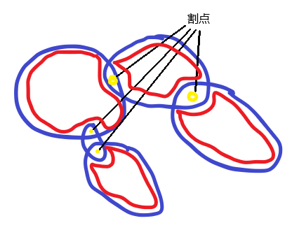
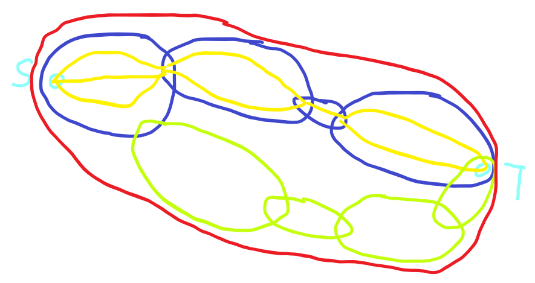
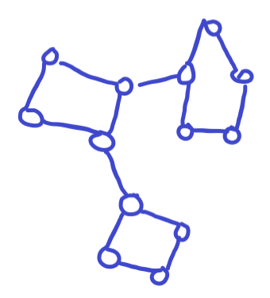
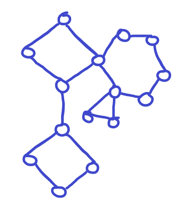

# Tarjan

首先所有的 Tarjan 都有两个重要的数组 `dfn` 和 `low` 。

!!! info "dfn 的定义"
    即 **DFS序** ，图按照DFS顺序遍历的时间戳

!!! info "low 的定义"
    `low[x]` 的值为以下节点中 `dfn` 的最小值
    
    1. $x$ 子树中的节点
    2. 能够通过一条非树边到达 $x$ 的子树中的节点的节点 

## 无向图连通性

### 点双连通分量

点双连通分量，一般简写为 `v-DCC` 。

定义是原图的一个极大子图满足 **无论删除哪一个点都能够保证图中节点互相连通**。

#### 求解办法

首先是一个简单的思路，我们找出所有的割点，然后把剩下留下的连通块加上与之相邻的割点作为一个 “点双连通分量” 。如下图：



(红色部分为剩下的连通块)

所以现在只需要找到所有的割点：

!!! note "求割点"
    如果对于两个点 $x,y$ ，满足 $dfn_x < dfn_y$ 且 $dfn_x = low_y$ 。
    
    相当于 $y$ 之后的子树节点都没有返祖边到达 $x$ 以前，只能通过边 $(x,y)$ 获得最小的 $dfn$ 序，故而前后部分一定不是连通的。

具体实施办法就是把所有访问过的节点压入栈，然后通过刚才的结论找到割点之后把所有在当前割点之后压入栈的节点全部加入当前 “点双连通分量” （注意割点不需要压出，因为割点同时存在在多个点双之中）。

??? success "示例代码"
    ```cpp
    void Tarjan(int x){
        dfn[x]=low[x]=++idx;
        st[++top]=x;
        if(!head[x]){
            v[++cnt].push_back(x);
            return;
        }
        for(int i=head[x];i;i=nxt[i]){
            int y=ver[i];
            if(!dfn[y]){
                Tarjan(y);
                low[x]=min(low[x],low[y]);
                if(low[y]>=dfn[x]){
                    int z;cnt++;
                    do{
                        z=st[top--];
                        vdcc[z]=cnt;
                        v[cnt].push_back(z);
                    }while(z!=y);
                    v[cnt].push_back(x);
                }
            }else
            low[x]=min(low[x],dfn[y]);
        }
    }
    ```

#### 点双性质

1. 求解割点： 每一次分配完 "点双" 剩下的哪一个点就是割点。
2. 求解割边： 对于一个 "点双" ，如果他只有一条边（连个节点），那么那条边就是一个桥。并且这个条件是充要的。
3. 一个点双中的所有点对必然存在两条没有相同节点的路径（除了头尾）。

## 圆方树

有一些问题在树上十分好解决（比如说 **树上DP**），但是在图上却不一定。

!!! note "示例问题 [CF1763F Edge Queries](https://vjudge.net/problem/CodeForces-1763F#author=translator:1281311:zh)"
    多次询问，询问 $x$ 到 $y$ 的所有简单路径包含的边中 **割边** 的数量。

我们要想一个办法，能够同时处理所有的简单路径的并集。

我们发现，对于随机一条路径所经过的 "点双" ，一定都是并集中的点。并且这是冲要的，证明如下图：



（这里一定不可能出现绿色这几个点双凑成其他的路径，如果这样整个红色部分都是一个 "点双"）

此时我们发现其实可以把整个点双当作一个整体（根据前面点双的性质，要么这个 "点双" 里面所有的边都不是 "割边" ，要么都是）。

此时我们建立 **方点** 的概念，对于每一个点双，建立一个方点，然后连接到所有的点双中的节点（此时普通节点被称为原点）

  

(引用 OI-WIKI 的图片)

此时我们发现这个图变成一颗树了，然后如果把所有圆点的信息统计到他周围的方点上，此时我们只需要处理在 "圆方树" 上 $S$ 到 $T$ 的路径信息即可。

这棵树就是圆方树。

??? success "代码"
    ```cpp
    #include <bits/stdc++.h>
    using namespace std;
    /*~~~~~~~~~~~~~~~~~~~~ Boundary Line ~~~~~~~~~~~~~~~~~~~~*/
    const int N=5e5+5;
    int n,m;
    int siz[N],sum[N];
    vector<int> v[N];
    namespace TAR{
        vector<int> v[N];
        vector<int> div[N];

        int idx,cnt;
        int dfn[N],low[N];
        int top,st[N];
        int esum[N];
        void Tarjan(int x){
            dfn[x]=low[x]=++idx;
            st[++top]=x;
            for(auto y: v[x]){
                if(!dfn[y]){
                    Tarjan(y);
                    low[x]=min(low[x],low[y]);
                    if(low[y]>=dfn[x]){
                        int z;cnt++;
                        do{
                            z=st[top--];
                            ::v[cnt].push_back(z);
                            ::v[z].push_back(cnt);
                            div[cnt].push_back(z);
                            siz[cnt]++;
                        }while(z!=y);
                        ::v[cnt].push_back(x);
                        ::v[x].push_back(cnt);
                        div[cnt].push_back(x);
                        siz[cnt]++;
                    }
                }else low[x]=min(low[x],dfn[y]);
            }
        }
    
        void Getsiz(){
            bitset<N> in;
            for(int i=n+1;i<=cnt;i++){
                in.reset();
                for(auto x: div[i]) in[x]=1;
                for(auto x: div[i]){
                    for(auto y: v[x]){
                        if(in[y]==0) continue;
                        esum[i]++;
                    }
                }
                esum[i]>>=1;
            }
        }
    }
    
    namespace LCA{
        int dep[N];
        int fa[N][20];
    
        void build(int x,int f=0){
            dep[x]=dep[f]+1;
            fa[x][0]=f;
            for(int i=1;i<20;i++)
                fa[x][i]=fa[fa[x][i-1]][i-1];
            for(auto y: v[x]){
                if(y==f) continue;
                build(y,x);
            }
        }
    
        int lca(int x,int y){
            if(dep[x]<dep[y]) swap(x,y);
            for(int i=19;i>=0;i--)
                if(dep[fa[x][i]]>=dep[y])
                    x=fa[x][i];
            if(x==y) return x;
            for(int i=19;i>=0;i--)
                if(fa[x][i]!=fa[y][i])
                    x=fa[x][i],y=fa[y][i];
            return fa[x][0];    
        }
    }
    /*~~~~~~~~~~~~~~~~~~~~ Boundary Line ~~~~~~~~~~~~~~~~~~~~*/
    void dfs(int x,int fa){
        sum[x]+=(siz[x]!=2 && x>n)?TAR::esum[x]:0;
        for(auto y: v[x]){
            if(y==fa) continue;
            sum[y]+=sum[x];
            dfs(y,x);
        }
    }
    int query(int x,int y){
        int lca=LCA::lca(x,y);
        return sum[x]+sum[y]-sum[lca]-sum[LCA::fa[lca][0]];
    }
    /*~~~~~~~~~~~~~~~~~~~~ Boundary Line ~~~~~~~~~~~~~~~~~~~~*/
    signed main(){
        cin>>n>>m;
        for(int i=1;i<=m;i++){
            int x,y;cin>>x>>y;
            TAR::v[x].push_back(y);
            TAR::v[y].push_back(x);
        }
    
        TAR::cnt=n;
        TAR::Tarjan(1);
        TAR::Getsiz();
    
        LCA::build(1);
        dfs(1,0);
    
        int q;cin>>q;
        while(q --> 0){
            int x,y;cin>>x>>y;
            cout<<query(x,y)<<'\n';
        }
    
        return 0;
    }
    ```

!!! warning "**圆方树的应用条件**"
    对于一个查询的信息，一个 "双连通分量" 要么同时被计算贡献，要么同时不计算。

    因为圆点的贡献会被统一计算到方点上。

**修改操作的优化**

!!! note "典型例题"
    每一次修改一个点的权值，求解 $S$ 到 $T$ 所有简单路径上节点权值最小值。

看似就是模板，就算使用树链剖分，但是如果每一次修改都到修改周围所有方点，此时时间复杂度堪忧。

我们可以修改一下方点记录的信息，改为记录所有自己 "圆方树" 上子节点的信息。

此时修改的时候只需要修改自己的父亲，但是记得特判 $\texttt{LCA}$ 为方点的情况。

### 仙人掌

仙人掌其实有两种仙人掌： "点仙人掌"，"边仙人掌"。

??? info "点仙人掌的定义"
    一个无向图，满足没有一个点同时在多个环中。

    如下：
    
    

??? info "边仙人掌的定义"
    一个无向图，满足没有一个点同时在多个环中。

    如下：
    
    

可以发现，一个 "点仙人掌" 一定是一个边仙人掌。

看到一道简单例题：

!!! node "仙人掌例题"
    多次询问仙人掌上两个点之间的最短路。
