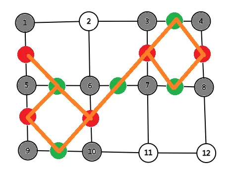

# 二分图匹配

## 什么是二分图

!!! definition "定义"
    二分图是一个没有奇环的图

这是因为二分图的点要分为左部和右部，而边只能连接左部和右部。

如果要回到原点，必然走偶数次，我们可以用染色法判断

??? success "染色法判断二分图"
    ```cpp
    void dfs(int x,int val){
    	vis[x]=val;
    	for(int i=0;i<v[x].size();i++){
    		int y=v[x][i];
    		if(vis[y]==0) dfs(y,3-val);
    		else if(vis[y]==val)
    			flag=1;
    	}
    }
    for(int i=1;i<=n;i++)
        if(!vis[i])
            dfs(i,1);
    cout<<(flag?"No":"Yes");
    ```

## 二分图最大匹配

### 匈牙利算法

匹配指的是一个边的集合，使其两两不公用节点。

我们发现所有的边可以连成多条链，且每一条必定为一个 `10101010101` 的匹配串，且我们可以尝试对匹配串取反

比如：

???+ example "增广路演示"
    ```
    	1+1010101
    =   1+0101010
    =    10101010
    ```

这样虽然答案不一定会增加，但不减少。

因而记录一下 `match[]` 为右边匹配左边，一直往前跳并取反。

??? success "示例代码"
    ```cpp
    bool dfs(int x){
    	for(int i=head[x];i;i=nxt[i]){
    		int y=ver[i];
    		if(!vis[y]){
    			vis[y]=1;
    			if(match[y]==-1||dfs(match[y])){
    				match[y]=x;
    				return 1;
    			}
    		}
    	}
    	return 0;
    }
    int ans=0;
    memset(match,-1,sizeof match);
    for(int i=1;i<=n;i++){
        memset(vis,0,sizeof vis);
        if(dfs(i)) ans++;
    }
    cout<<ans<<'\n';
    ```

时间复杂度：$\mathcal O(NM)$。

但是这种算法有一个性质： 左侧选择的节点编号一定时所有最大匹配方案中字典序最小的。

### 网络流

建图做法：

- 对于每一个左部的点 $x$ ，连接 $(S,x,1)$
- 对于每一个右部的点 $x$ ，连接 $(x,T,1)$
- 对于二分图中的边 $(x,y)$ ， 连接 $(x,y,1)$

然后求解最大流：

??? success "示例代码"
    ```cpp
	for(int i=1; i<=m; i++){
        int x,y;cin>>x>>y;
        nt.add(x,y+n,1);
    }
    for(int i=1; i<=n; i++)
        nt.add(0,i,1), nt.add(i+n,2*n+1,1);

    int ans=nt.Dinic(2*n+1,0,2*n+1);
	```

## 应用

一般是一个位置对应一个答案，然后连接后跑二分图

如这道题：**[P1963 变换序列 - 洛谷](https://www.luogu.com.cn/problem/P1963)**

我们对每一个 $i$ 连上 $i+d$，$i-d$，$i-(n-d)$，$i+(n-d)$。

然后直接跑二分图：

??? success "示例代码"
    ```cpp
    #include<bits/stdc++.h>
    using namespace std;
    /*!@#$%^&*!@#$%^&*~~优美的分界线~~*&^%$#@!*&^%$#@!*/
    const int N=1e4+5,M=2e5+5;
    int n;
    int a[N];
    int ans[N];
    int match[N],vis[N];
    int tot,head[N],nxt[M],ver[M];
    /*!@#$%^&*!@#$%^&*~~优美的分界线~~*&^%$#@!*&^%$#@!*/
    void add(int a,int b){
    	ver[++tot]=b;
    	nxt[tot]=head[a],head[a]=tot;
    }
    bool dfs(int x){
    	for(int i=head[x];i;i=nxt[i]){
    		int y=ver[i];
    		if(!vis[y]){
    			vis[y]=1;
    			if(match[y]==-1||dfs(match[y])){
    				match[y]=x;
    				ans[x]=y;
    				return 1;
    			}
    		}
    	}
    	return 0;
    }
    /*!@#$%^&*!@#$%^&*~~优美的分界线~~*&^%$#@!*&^%$#@!*/
    signed main(){
    	cin>>n;
    	for(int i=0;i<n;i++){
    		int x;cin>>x;
    		int a[4]={-1,-1,-1,-1};
    		if(i-x>=0) a[0]=i-x;
    		if(i+x<n) a[1]=i+x;
    		if(x!=n-x){
    			if(i-(n-x)>=0) a[2]=i-(n-x);
    			if(i+(n-x)<n) a[3]=i+(n-x);
    		}
    		sort(a,a+4);
    		for(int j=3;j>=0;j--)
    			if(a[j]!=-1)
    				add(i,a[j]);
    	}
    	memset(match,-1,sizeof match);
    	for(int i=n-1;i>=0;i--){
    		memset(vis,0,sizeof vis);
    		if(!dfs(i)){
    			cout<<"No Answer";
    			return 0;
    		}
    	}
    	for(int i=0;i<n;i++)
    		cout<<ans[i]<<' ';
    	return 0;
    }
    ```

## 不可重路径覆盖

!!! question "示例问题"
	给定一个 DAG，用最少的不交路径覆盖所有的点。

这里我们相当于需要对于每一个节点需要选择一个后续节点（当然可以不选，作为最后一个节点），并且每一个节点只能被当作一次后续节点。这个就是典型的二分图最大匹配。

然后方案就看那一条边在二分图匹配中。

??? success "示例代码"
	```cpp
	#include <bits/stdc++.h>
	typedef long long ll;
	using namespace std;
	/*~~~~~~~~~~~~~~~~~~~ Boundary Line ~~~~~~~~~~~~~~~~~~~*/
	const ll inf=0x3f3f3f3f3f3f3f3f;
	const int N=1e5+5,M=1e6+5;
	int n,m;
	int nxt[N];
	bool beg[N];
	/*~~~~~~~~~~~~~~~~~~~ Boundary Line ~~~~~~~~~~~~~~~~~~~*/
	namespace FLOW{
		int n;
		int s,t;

		int tot=1,head[N],ver[M],nxt[M],edg[M],fm[N];
		void add(int x,int y,int z){
			// cerr<<x<<' '<<y<<' '<<z<<'\n';
			ver[++tot]=y,edg[tot]=z,fm[tot]=x;
			nxt[tot]=head[x],head[x]=tot;

			ver[++tot]=x,edg[tot]=0,fm[tot]=y;
			nxt[tot]=head[y],head[y]=tot;
		}

		ll dis[N];
		bool BFS(){
			deque<int> q;
			for(int i=0;i<=n;i++) dis[i]=inf;
			q.push_back(s),dis[s]=0;
			while(!q.empty()){
				int x=q.front(); q.pop_front();
				for(int i=head[x];i;i=nxt[i]){
					int y=ver[i];
					if(edg[i] && dis[y]==inf){
						dis[y]=dis[x]+1;
						q.push_back(y);
						if(y==t) return 1;
					}
				}
			} 
			return 0;
		}

		int cur[N];
		int dfs(int x,int flow){
			if(x==t || flow==0) return flow;
			int sum=0;
			for(int i=cur[x];i;i=nxt[i]){
				int y=ver[i];
				cur[x]=i;
				if(edg[i] && dis[y]==dis[x]+1){
					int k=dfs(y,min(flow,edg[i]));
					edg[i]-=k,edg[i^1]+=k;
					sum+=k,flow-=k;
					if(flow==0) break;
				}
			}
			if(sum==0) dis[x]=0;
			return sum;
		}

		int Dinic(int ss,int tt,int nn){
			n=nn,s=ss,t=tt;
			int ans=0;
			while(BFS()){
				for(int i=0;i<=n;i++)
					cur[i]=head[i];
				ans+=dfs(s,inf);
			}
			return ans;
		}

		void clear(){
			tot=1;
			memset(head,0,sizeof head);
		}
	};
	using FLOW::add;
	/*~~~~~~~~~~~~~~~~~~~ Boundary Line ~~~~~~~~~~~~~~~~~~~*/
	signed main(){
		cin>>n>>m;
		for(int i=1;i<=m;i++){
			int x,y;cin>>x>>y;
			add(x,y+n,1);
		}
		for(int i=1;i<=n;i++)
			add(0,i,1),add(i+n,2*n+1,1);

		int ans=n-FLOW::Dinic(0,2*n+1,2*n+1);

		for(int i=2;i<=FLOW::tot;i+=2){
			int x=FLOW::fm[i],y=FLOW::ver[i];
			if(x>=1 && x<=n && y>=n+1 && y<=2*n){
				if(FLOW::edg[i^1]==0) continue;
				nxt[x]=y-n,beg[y-n]=1;
				cerr<<x<<' '<<y-n<<'\n';
			}
		}
		for(int i=1;i<=n;i++){
			if(beg[i]) continue;
			int p=i;
			while(p){
				cout<<p<<' ';
				p=nxt[p];
			}
			cout<<'\n';
		}
		cout<<ans<<'\n';
		return 0;
	}
	```

### 可重路径覆盖

其实就是 [传递闭包](https://www.luogu.com.cn/problem/B3611) 得到的图再次进行上面的 [不可重路径覆盖](#_7)，这里代码就不需要了。

## 图博弈

!!! question "博弈内容"
	有一颗棋子在一颗无向图上的 $x$ 点，选手依次操作，选择走到一个与之相邻的节点上。

	走过的位置不能在走，不能移动者输。问谁赢？

结论： 如果存在一种图的最大匹配情况使得 $x$ 不在任意一个匹配上，那么先手必败。否则先手必胜。

!!! node "证明"
	当 $x$ 是图最大匹配必经点：

	- $x$ 由于一定在一个匹配上，那么他一定可以走到他所在匹配的另一个点上。（先手）
	- $x$ 走一步之后后手发现他所在的匹配的另一个点已经走过了，所以他只能跨越非匹配边，走到另一个匹配上。
	- 一定不存在后手走一步之后走到一个非匹配点的情况，否则 $x$ 不再是图最大匹配必经点（存在一条增广路）。

所以现在就是需要找到二分图匹配必经点 （为什么不是图呢，因为图最大匹配时 $\texttt{NP-Hard}$）。

根据前面的我们也能够大致知道了，有两种情况：

- 初始求解的二分图匹配 $x$ 就不是匹配点，直接 $\texttt{pass}$ 掉。
- 能够通过一个非匹配点走增广路到达的点， 同样 $\texttt{pass}$ 掉。

??? success "[模板题](https://www.luogu.com.cn/problem/P4055) 代码"
	```cpp
	#include <bits/stdc++.h>
	#define PII pair<int,int>
	using namespace std;
	/*~~~~~~~~~~~~~~~~~~~~ Boundary Line ~~~~~~~~~~~~~~~~~~~~*/
	const int N=100*100+5;
	int n,m;
	char a[105][105];
	const int dx[4]={0,0,-1,1};
	const int dy[4]={-1,1,0,0};
	/*~~~~~~~~~~~~~~~~~~~~ Boundary Line ~~~~~~~~~~~~~~~~~~~~*/
	#define pos(x,y) (((x)-1)*m+(y))

	int tot=1,head[N],ver[N*8],nxt[N*8];
	void add(int x,int y){
		ver[++tot]=y;
		nxt[tot]=head[x],head[x]=tot;
	}


	namespace BI_GRAPH{

		int col[N];
		int match[N];  // 如果不为0代表是匹配点
		bool vis[N];

		void Getcol(int x,int c=1){
			col[x]=c;
			for(int i=head[x];i;i=nxt[i]){
				int y=ver[i];
				if(col[y]) continue;
				Getcol(y,3-c);
			}
		}

		bool GetBI(int x){
			for(int i=head[x];i;i=nxt[i]){
				int y=ver[i];
				if(vis[y]==0){
					vis[y]=1;
					if(match[y]==-1 || GetBI(match[y])){
						match[y]=x,match[x]=y;
						return 1;
					}
				}
			}
			return 0;
		}

		map<PII,bool> mp;

		void init(){
			for(int i=1;i<=n*m;i++)
				if(!col[i]) Getcol(i);

			memset(match,-1,sizeof match);
			for(int i=1;i<=n*m;i++){
				if(col[i]==1 && GetBI(i))
					memset(vis,0,sizeof vis);
			}
		}

		int rec[N];

		void dfs2(int x){
			if(rec[x]) return;
			rec[x]=1;
			for(int i=head[x];i;i=nxt[i]){
				int y=ver[i];
				if(match[y]) dfs2(match[y]);
			}
		}
	}
	using BI_GRAPH::col;
	using BI_GRAPH::init;
	using BI_GRAPH::match;
	using BI_GRAPH::dfs2;
	using BI_GRAPH::rec;
	/*~~~~~~~~~~~~~~~~~~~~ Boundary Line ~~~~~~~~~~~~~~~~~~~~*/
	signed main(){
		cin>>n>>m;
		for(int i=1;i<=n;i++) 
			for(int j=1;j<=m;j++) 
				cin>>a[i][j];

		for(int i=1;i<=n;i++)
			for(int j=1;j<=m;j++)
				for(int u=0;u<4;u++){
					int x=i+dx[u],y=j+dy[u];
					if(x<1 || y<1 || x>n || y>m) continue;
					if(a[i][j]=='#' || a[x][y]=='#') continue;
					add(pos(i,j),pos(x,y));
				}
		
		init();

		vector< pair<int,int> > ans;

		for(int i=1;i<=n;i++)
			for(int j=1;j<=m;j++){
				// 枚举每一个可能的起点
				if(a[i][j]=='#') continue;
				if(match[pos(i,j)]==-1)
					dfs2(pos(i,j));
			}
		
		for(int i=1;i<=n;i++) for(int j=1;j<=m;j++)
			if(rec[pos(i,j)]) ans.emplace_back(i,j);
		
		if(ans.size()==0) puts("LOSE");
		else{
			puts("WIN");
			for(auto x: ans) 
				cout<<x.first<<' '<<x.second<<'\n';
		}
		return 0;
	}
	```

## Konig 定理

这个定理就说明了一个事情： 二分图最大独立集 = 点数 – 最大匹配。

主要是为 **最大独立集** 提供了一种特殊图的解法， 因为 **最大独立集** 是 $\texttt{NP-Hard}$ 。

???+ info "例题： [CF1404E Bricks](https://www.luogu.com.cn/problem/CF1404E)"

	因为对于每一个点，他只能被横着的或者竖着的砖覆盖，所以我们按照一下建图：

	

	然后跑最大独立集即可。答案就是 总需要覆盖木板数 - 二分图最大独立集

## Dilworth 定理

这个定理就说明了一个事情： DAG 最长反链 = 最小可重链覆盖。

最长反链：最大的子集使得互相不可达。

但是如何求出最长反链？

!!! node "最长反链方案"
	首先我们可以求出拿一些点可以被选进最长反链中：

	- 确定每一个点 $x$ 是否可行时，将与他相连点全部去掉。
	- 再次查询答案，如果 $ans'=ans-1$ ，那么这个点可以被选。

	然后就好做了：

	- 我们枚举每一个可行的点，如果他没有被标记，那么把他加入反链。
	- 然后把所有与他相连的点标记。

模板题目： [P4298 [CTSC2008] 祭祀](https://www.luogu.com.cn/problem/P4298)：

??? success "示例代码"
	```cpp
	#include <bits/stdc++.h>
	#define int long long
	using namespace std;
	/*~~~~~~~~~~~~~~~~~~~~ Boundary Line ~~~~~~~~~~~~~~~~~~~~*/
	const int inf=0x3f3f3f3f3f3f3f3f;
	const int N=105,M=1005;
	int n,m;
	bool d[N][N];

	template<int N,int M>
	struct BIG{
		vector<int> v[N];

		bool vis[N];
		bool del[N];
		int match[N];
		int cho[N];

		bool dfs(int x){
			if(del[x]) return 0;
			for(auto y: v[x]){
				if(!vis[y] && !del[y]){
					vis[y]=1;
					if(match[y]==-1 || dfs(match[y])){
						match[y]=x,cho[x]=y;
						return 1;
					}
				}
			}
			return 0;
		}

		int solve(){
			int ans=0;
			memset(match,-1,sizeof match);
			for(int i=1;i<=n;i++){
				memset(vis,0,sizeof vis);
				if(dfs(i) && del[i]==0)
					ans++;
			}
			return ans;
		}
	};
	BIG<N*2,N*N+2*N> nt;
	/*~~~~~~~~~~~~~~~~~~~~ Boundary Line ~~~~~~~~~~~~~~~~~~~~*/

	/*~~~~~~~~~~~~~~~~~~~~ Boundary Line ~~~~~~~~~~~~~~~~~~~~*/
	signed main(){
		cin>>n>>m;
		for(int i=1;i<=m;i++){
			int x,y;cin>>x>>y;
			if(x==y) continue;
			d[x][y]=1;
		}

		// 传递闭包
		for(int i=1;i<=n;i++)
			for(int j=1;j<=n;j++)
				for(int k=1;k<=n;k++)
					d[i][j]|=(d[i][k]&d[k][j]);
		for(int i=1;i<=n;i++)
			for(int j=1;j<=n;j++)
				for(int k=1;k<=n;k++)
					d[i][j]|=(d[i][k]&d[k][j]);
		for(int i=1;i<=n;i++)
			for(int j=1;j<=n;j++)
				for(int k=1;k<=n;k++)
					d[i][j]|=(d[i][k]&d[k][j]);
		
		for(int i=1;i<=n;i++)
			for(int j=1;j<=n;j++)
				if(d[i][j]) nt.v[i].push_back(j);

		int ans=n-nt.solve();
		cout<<ans<<'\n';

		vector<int> ans2;

		for(int i=1;i<=n;i++){
			int cnt=0;
			for(int j=1;j<=n;j++)
				if(d[i][j] || d[j][i] || i==j) nt.del[j]=1;
				else nt.del[j]=0,cnt++;

			ans2.push_back(cnt-nt.solve()==ans-1);
		}

		bitset<N> vis(0);
		for(int i=1;i<=n;i++){
			if(ans2[i-1] && vis[i]==0){
				vis[i]=1;
				for(int j=1;j<=n;j++) if(d[i][j] || d[j][i] || i==j)
					vis[j]=1;
				
				cout<<1;
			}else cout<<0;
		}

		cout<<'\n';
		for(auto x: ans2) cout<<x;
		return 0;
	}
	```

## Hall 定理

这个定理就说明了一个事情： 二分图的左侧的 $S$ 集合存在完美匹配，当且仅当 $\forall A⊆S,|N(A)|≥|A|$。

这个定理如果直接计算当然慢的一批，但是如果这个图建图有一定规律：

比如下面这道例题：

!!! note "ARC106E Medals"
    首先 $nk\le ans \le 2nk$

    然后明显外面是一个二分答案，现在假设当前正在执行 `check(x)`，$x$ 表示需要 $x$ 天。

    然后建出二分图，即左边每个人有 $k$ 个点（表示每一个奖牌），右边有 $x$ 个点（表示每一天），然后每一个左部点连到所有他工作的时间，然后如果存在完美匹配，就返回 $1$。

    但是很明显会 **TLE**。

    首先我们发现对于一个点分裂的 $k$ 个点，他们连的边一定是相同的，所以未了让 $|S|$ 尽量大，所以可以在枚举左侧端点子集时直接选择它的所有 $k$ 个点，因而假设现在枚举子集只需要枚举 $n$ 个人 **选 or 不选**,此时左侧节点个数为 $|S| = mk$（$m$ 为选人的数量）。

    但是对于右侧节点，我们假设 $d_i$ 为第 $i$ 天上班人的集合，所以我们需要找到的是 $|S|$ 和 $d_i$ 有交的结点个数。

    有交不是很好求，但是我们可以转化为 **总结点 - 不相交的节点**，而不相交的节点相当于 $|S|$ 的补集的子集。

    对于求解一个 $s_i$ 为有多少天工作人集合为 $i$ 的子集，这个就好求多了。