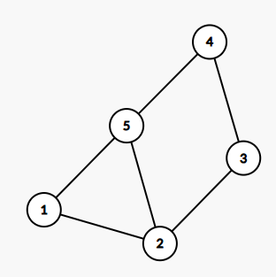
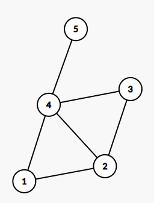
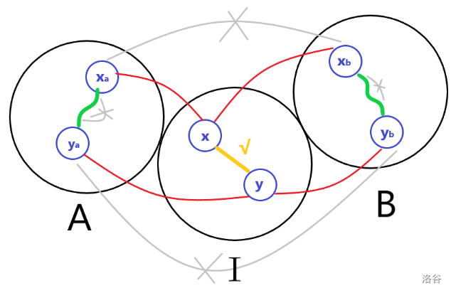

# 弦图

## 概念

首先弦图有许多概念，如下：

**弦图：** 对于图中任意一个环中之间的连边，如下图边 $(2,5)$。



**导图子图：** 原图的一个子图，满足任意边 $(u,v)$ 满足 $u,v$ 都在子图中的边都在子图中。

**团：** 完全子图，没两个点之间都有连边，明显是导出子图。

**最大团：** 点数最大的团，对于普通的图是 $\texttt{NP-Hard}$ 问题。

**极大团：** 对于一个团 $V$ ，满足不存在 $V\subsetneq V'$ 且 $V'$ 也是一个团。

**点割集：** 对于两个点 $u,v$ ，他们的点割集 $V$ 满足去掉 $V$ 中所有的点之后 $u,v$ 不连通。

**极小点割集：** 对于一个点割集 $V$ ，不存在一个点割集 $V' \subsetneq V$ 。

**弦图** 每一个长度大于 $4$ 的环都有弦，如下：



其他为了解决弦图问题引入的定义：

**单纯点：** 对于节点 $x$ ，对于所有与他相连节点的集合 $V$ ， 集合 ${V+x}$ 的导出子图为团。

**完美消除序列：** 对于一个长度为 $n$ 的排列 $V = \{v_1,v_2,v_3,\dots,v_n\}$ ，满足对于任意 $i$ ， $V = {v_i,v_{i+1},\dots,v_n}$ 的导出子图中 $v_i$ 为单纯点。

就比如对于上图，其完美消除序列为 $\{3,2,1,4,5\}$ 。

## 性质

**性质一：** 弦图的导出子图还是弦图

这个定理显然成立，就不证明了。

**性质二：** 对于弦图上的两个点 $u,v$ ,他们的极小点割集为一个团。

!!! info "证明"
    首先我们假设现在求出的极小点割集为 $V$ 。 此时根据点割集的性质 $u,v$ 会不连通，因此此时假设 $u,v$ 分别所在的连通块为 $A,B$ ，此时整个图被分为了 $A,B,C$ 和一些不是十分相关的点。如下图：

    

    然后此时取 $V$ 中的两个点 $x,y$。 可以发现 $x,y$ 一定有连向 $A,B$ 的边（否则可以直接把 $x,y$ 从 $V$ 中去掉），设连向 $A,B$ 中的四个点分别为 $x_a,y_a,x_b,y_b$。此时连边情况如图上。

    此时由于 $\{x_a,y_a,x_b,y_b,x,y\}$ 组成了一个环，由于这个环大于 $4$ ，所以 $x,y$ 之间必定有一条边。由于对于每一个 $x,y \in V$ 都满足，所以 $V$ 为团。

**性质三：**  非完全图的弦图至少存在两个不相邻的单纯点。

不会证明，读者自便。

**性质四：**  一个无向图是弦图当且仅当其有 **"完美消除序列"** 。

证明同上，差不多，一定说的十分清楚了。

## 弦图应用

### 求解完美消除序列（最大势算法）

这个最终解决办法十分简单： 维护一个数组 $label$ 表示周围已经加入 **"完美消除序列"** 的节点个数。 每一次：

- 找到 $label$ 最大并且没有加入 **"完美消除序列"** 的节点。

- 把这个节点加入 **"完美消除序列"** 的开头。

- 更新 $label$ 值。

证明请看 [这里](https://www.luogu.com.cn/article/bku0emja) ，至于具体实现一般是维护 $n$ 个值域堆，然后采用懒删除。 每一次只是新加入节点，动态维护最大值。

```cpp
struct Chord{
    vector<int> v[N]; // 边

    int label[N];
    int rnk[N], ans[N];

    vector<int> t[N];
    // MCS 算法
    bool mcs() {
        int maxl=0;
        for(int i=1; i<=n; i++)
            t[0].push_back(i);

        for(int pos=n; pos>=1; pos--) {
            int x=-1; // 最终选择的最大点
            while(x==-1) {
                while(t[maxl].size()) {
                    // 这里其实不需要写那么麻烦， 但是看起来安心一点
                    if(rnk[t[maxl].back()] || label[t[maxl].back()] != maxl) {
                        t[maxl].pop_back();
                    }else if(label[t[maxl].back()] == maxl) {
                        x=t[maxl].back();
                        t[maxl].pop_back();
                        break;
                    }
                }
                if(x==-1) maxl--;
            }

            ans[pos]=x, rnk[x]=pos;
            for(auto y: v[x]) {
                if(rnk[y]==0){
                    t[++label[y]].push_back(y);
                    maxl=max(maxl,label[y]);
                }
            }
        }

        return check();
    }

    void clear() {
        for(int i=1; i<N; i++) {
            v[i].clear(), t[i].clear();
            rnk[i]=ans[i]=label[i]=0;
        }
    }
};
Chord mcs;
```

### 判定弦图

根据 **"[性质四](#性质)"** ，我们知道非弦图是没有完美消除序列的，所以我们只需要建议给出的序列是否合法即可。

但是暴力判断是 $\mathcal O(nm)$ 的。所以我们需要寻找一些性质。

我们从后往前判断是否满足完美消除，假设现在在判断 $i$ ，因此现在 $[i+1,n]$ 都是满足的。 然后我们令与 $i$ 相连的点为集合 $V = \{a_1,a_2,\dots,a_n\}$ 。 由于 $i$ 已经和 $V$ 中的边相连。所以只需要满足 $V$ 为一个完全图即可。

然后对于 $a_1$ （我们假设他是 $V$ 在 **"完美消除序列"** 中），与他相连的所有点构成一个团。 所以我们只需要满足 $i$ 连接的所有点（即 $V$） $a_1$ 都有连接就可以了。

```cpp
bool check() {
    vector<int> g[N]; // 对与当前点相邻的点

    for(int i=1; i<=n; i++) {
        sort(v[i].begin(),v[i].end());
        for(auto j: v[i]) {
            if(rnk[i]<rnk[j])
                g[i].push_back(j);
        }
    }


    for(int i=1; i<=n; i++) {
        if(g[i].empty()) continue;
        int x=g[i].front();
        
        for(auto y: g[i]){
            if(x==y) continue;
            if(binary_search(v[x].begin(), v[x].end(), y)==0)
                return 0;
        }
    }
    return 1;
}
```

### 最大团/染色问题

!!! question "染色问题定义"
    对于每一个节点设定一个颜色，要求每一条边两个节点颜色不能相同。

    问颜色最小数量。

首先给出结论： 两个问题答案一致，并且答案为计算完之后 $label+1$ 的最大值。

!!! info "证明"
    首先我们令染色问题答案为 $A_i$ ， 最大团问题为 $B_i$ 。

    由于对于一个团，其中所有节点颜色都不相同，所以可以得到 $A_i \ge B_i$ 。

    然后我们寻找一种构造办法，按照 **"完美消除序列"** 倒叙计算染色，设此时结果为 $T$ 。

    那么可以得到 $T \ge A_i$ 。

    对于一个节点 $i$ ，我们发现这个节点在现在的构造中要求不与所有与他相邻的颜色相同，而所有与他相邻的点构成一个团，所以此时 $B_i = T = \max\{label+1\}$ 。 
    
    所以可以得到 $A_i = B_i = C$ 。

然后此时求解就十分简单了：

```cpp
int Max_Group() {
    int ans=0;
    for(int i=1; i<=n; i++) {
        ans=max(ans,label[i]+1);
    }
    return ans;
}
```
### 最小团覆盖/最大独立集

得到结果和上面相似，两个问题的答案相同，为从前往后构造的方案数。

```cpp
int Min_Group() {
    bitset<N> vis(0);

    int ans=0;
    for(int i=1; i<=n; i++) {
        if(vis[Chord::ans[i]]) continue;
        ans++;
        for(auto to: v[Chord::ans[i]]) {
            vis[to]=1;
        }
    }
    return ans;
}
```

**完整代码：**

??? success "示例代码"

    ```cpp
    struct Chord{
        vector<int> v[N]; // 边

        int label[N];
        int rnk[N], ans[N];

        bool check() {
            vector<int> g[N]; // 对与当前点相邻的点

            for(int i=1; i<=n; i++) {
                sort(v[i].begin(),v[i].end());
                for(auto j: v[i]) {
                    if(rnk[i]<rnk[j])
                        g[i].push_back(j);
                }
            }


            for(int i=1; i<=n; i++) {
                if(g[i].empty()) continue;
                int x=g[i].front();
                
                for(auto y: g[i]){
                    if(x==y) continue;
                    if(binary_search(v[x].begin(), v[x].end(), y)==0)
                        return 0;
                }
            }
            return 1;
        }

        vector<int> t[N];
        // MCS 算法
        bool mcs() {
            int maxl=0;
            for(int i=1; i<=n; i++)
                t[0].push_back(i);

            for(int pos=n; pos>=1; pos--) {
                int x=-1; // 最终选择的最大点
                while(x==-1) {
                    while(t[maxl].size()) {
                        // 这里其实不需要写那么麻烦， 但是看起来安心一点
                        if(rnk[t[maxl].back()] || label[t[maxl].back()] != maxl) {
                            t[maxl].pop_back();
                        }else if(label[t[maxl].back()] == maxl) {
                            x=t[maxl].back();
                            t[maxl].pop_back();
                            break;
                        }
                    }
                    if(x==-1) maxl--;
                }

                ans[pos]=x, rnk[x]=pos;
                for(auto y: v[x]) {
                    if(rnk[y]==0){
                        t[++label[y]].push_back(y);
                        maxl=max(maxl,label[y]);
                    }
                }
            }

            return check();
        }

        /// 剩下是其他应用代码

        // 求解最大团/染色问题
        int Max_Group() {
            int ans=0;
            for(int i=1; i<=n; i++) {
                ans=max(ans,label[i]+1);
            }
            return ans;
        }

        // 求解最小团覆盖/最大独立集
        int Min_Group() {
            bitset<N> vis(0);

            int ans=0;
            for(int i=1; i<=n; i++) {
                if(vis[Chord::ans[i]]) continue;
                ans++;
                for(auto to: v[Chord::ans[i]]) {
                    vis[to]=1;
                }
            }
            return ans;
        }


        void clear() {
            for(int i=1; i<N; i++) {
                v[i].clear(), t[i].clear();
                rnk[i]=ans[i]=label[i]=0;
            }
        }
    };
    Chord mcs;
    ```