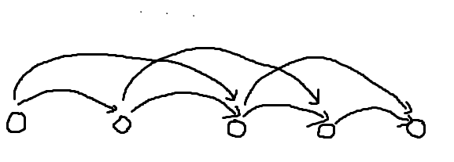

# 竞赛图

## 定义

对于一个图，满足其任意两个点之间有且只有一条有向边。

其实就是一个 **"有向完全图"** 。

## 性质

### 兰道定理

这个定理最大的作用就是判定竞赛图

（对于竞赛图实际上计算出度入度是一样的，结论可以互通）

**兰道定理：** 对于一个出度序列 $di_i$ ，"该图是竞赛图" 的充要条件为 "对于把 $du_i$ 排序后的结果 $s_i$ ，满足 $\forall x,\sum_{i=1}^x s_i \ge \frac{x*(x-1)}{2}$" 。

!!! info "证明"
    **必要性：**

    我们考虑对于一个 $x$ ，那么属于 $[1,x]$ 之中的点之间有 $\frac{x*(x-1)}{2}$ 个连边，每一个边贡献一个出度，所以至少有 $\frac{x*(x-1)}{2}$ 个连边。

    **充分性：**

    这里我们是要证明任何满足 **兰道定理** 的序列都可以构造出一组解。

    我们先找到一种简单的构造，对于节点 $i$ ，他向 $j \in [i+1,n]$ 连边。 此时出度序列升序排列之后为 $t = \{0,1,2,\dots,n-2,n-1\}$ 。
    
    此时对于目标的 $s_i$ ，我们寻找到第一个 $x$ 满足 $t_x < s_x$ 的位置。相当与这个节点出度太少了；我们需要到最后一个 $y$ 满足 $t_y > s_y$ （这里因为总和固定，所以一定能够找到），相当于出度多了。

    此时因为是从后往前（在构造是是从前往后，但是按照出度升序排列之后就是从后往前）连边，所以我们之间把 $(y,x)$ 反转 。

    如此往复，由于总和相同，必然能够构造出一组解。 

## 缩点

对于一个竞赛图，其缩点之后的形态是固定的，如下（上面的边省略不画）：

（其中这里每一个点代表一个 $\texttt{scc}$）

（以下所有的点都是已经经过 $du_i$ 排序后的点）

**性质：** 假设计算一个集合 $V$ 满足其中是所有节点满足 $\sum_{i=1}^x s_i = \frac{x*(x-1)}{2}$ 的节点。 此时满足对于 $V$ 排序之后相邻的节点 $x,y$ 区间 $[x+1,y]$ 为一个 **强联通分量** （这里节点都是按照 $du_i$ 排序后每一个点所代表的节点）。

!!! info "证明"
    如果对于一个节点 $x$ 满足 $\sum_{i=1}^x s_i = \frac{x*(x-1)}{2}$ 。由于对于 $[1,x]$ 这个区间内的互相独立的点都有 $\frac{x*(x-1)}{2}$ 个了，说明对于 $[1,x]$ 中的点只有连进来的，没有出去的。

    如果有存在一个节点 $y$ 满足上面条件 。那么相当于知存在 $[y+1,x] \to [1,y]$ 的边。对于 $|x-y|$ 最小时， $[y+1,x]$ 的点就是一个 **强连通分量** 了。

典型例题： [CF1498E Two Houses](https://www.luogu.com.cn/problem/CF1498E)。

