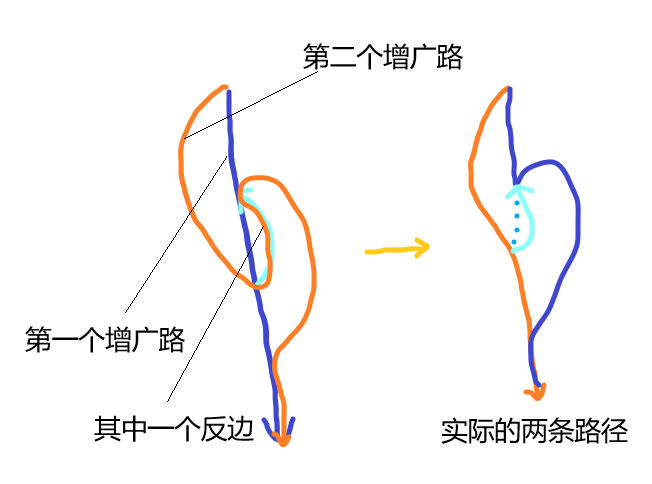

# 网络流

## 网络流概念

首先先对基础的网络流进行一个定义：

- 网络流是一个有向无环图（DAG）
- 每一个边有一个流量 $c(i,j) \ge 0$ ，如果边 $(i,j)$ 不在 $\texttt{E}$ 中，那么可以当作 $c(i,j) = 0$ 。
-  有两个特殊的点 $S$ 和 $T$ 分别为源点和汇点。

对于网络流流量部分的定义和限制：

- 每一条边还有一个流量 $f(i,j)$ ，满足 $f(i,j)\in[0,c(i,j)]$ 。
- 对于一个节点 $x$ ，如果 $x$ 不是 $S$ 或 $T$ ，则满足流量守恒，即 $\sum_{i=1}^n f(i,x) = \sum_{i=1}^n f(x,i)$ 。

## 最大流问题

!!! question "问题概述"
    在满足上述条件的情况下，求源点流出的流量最多为多少。

由于需要满足流量守恒，很明显这个问题可以理解为有多条路径从源点到汇点，每条路径上的边都会加上一个统一的流量，然后令每一个边经过的路径权值和小于其容量。

所以一个单纯的贪心思路出现了： 每一次找到一条容量都不为 $0$ 的路径（增广路），然后把这条路径上的流量都加上他们之中容量最小的一个。

但是这样很明显是错的，有可能前面选的路径并不是最优的，我们需要相处一种办法每一次都找到最优的，或者是说想出一种反悔的办法。

???+ note "如何反悔？？？"
    我们对于每一条边 $(x,y,w)$ 建立一个反边 $(y,x,0)$。

    当原边的 $(x,y)$ 的流量增加（可用容量减少）时，其反边的可用流量增加。

    每一次寻找增广路时把反边也当作一个正常的边进行搜索。

    看似这十分反直觉是吧，但是这个实际上时合法的，如图：

    

    其实我们真实找到的路径不是那两条增广路。

这个就是基础的 EK 算法了，时间复杂度大概 $\mathcal O(NM^2)$ 。

但是很明显我们发现这个样子太满了，现在时每一次增广一条增广路，我们可以考虑一次增广多条。

具体执行办法如下：

1. 找到每一个点到 $S$ 的最短路径，从而进行分层。其中只能走剩余容量不为 $0$ 的点，如果无法到达 $T$ 那么推出程序。
2. 从 $S$ 开始 DFS ，然后每一次走相同层之间的节点进行转移，递归是记录一个前面路径所剩余的最大流量。
3. 当走到 $T$ 时，反悔当前记录的最大流量，回溯时对于前面所有路径减去这个流量。

当然还有一些优化：

1. 当钱弧优化： 如果 DFS 到同一个节点，我们发现其实后面的节点都已经被榨干了，所以记录每一个点后面的第一个边。
2. XXXX 优化： 忘了名字了，就是如果当前节点 $sum=0$ ，那么标记一下，以后不来了。

??? success "示例代码"
    ```cpp
    struct FLOW{

        int n;
        int s,t;

        int tot=1,head[N],ver[M],nxt[M],edg[M],from[M];
        void add(int x,int y,int z){
            ver[++tot]=y, edg[tot]=z,from[tot]=x;
            nxt[tot]=head[x], head[x]=tot;
            ver[++tot]=x, edg[tot]=0,from[tot]=y;
            nxt[tot]=head[y], head[y]=tot;
        }

        int dis[N];
        bool vis[N];
        bool BFS(){
            queue<int> q;
            for(int i=0; i<=n; i++) vis[i]=0, dis[i]=inf;
            dis[s]=0, q.push(s);

            while(!q.empty()){
                int x=q.front(); q.pop();
                if(vis[x]) continue;
                vis[x]=1;
                for(int i=head[x]; i; i=nxt[i]){
                    int y=ver[i];
                    if(edg[i] && dis[y]>dis[x]+1){
                        dis[y]=dis[x]+1; 
                        q.push(y);
                    }
                }
            }
            return (dis[t]!=inf);
        }

        int cur[N];
        int dfs(int x,int flow){
            if(x==t) return flow;
            int sum=0;
            for(int i=cur[x]; i; i=nxt[i]){
                int y=ver[i];
                cur[x]=i;
                if(edg[i] && dis[y]==dis[x]+1){
                    int f=dfs(y,min(flow,edg[i]));
                    edg[i]-=f, edg[i^1]+=f;
                    sum+=f, flow-=f;
                    if(flow==0) break;
                }
            }
            if(sum==0) dis[x]=-1;
            return sum;
        }

        int Dinic(int nn,int ss,int tt){
            n=nn,s=ss,t=tt;
            int ans=0;
            while(BFS()){
                for(int i=0; i<=n; i++)
                    cur[i]=head[i];
                ans+=dfs(ss,inf);
            }
            return ans;
        }
    };
    FLOW nt;
    ```

## 最小割问题

!!! question "最小割问题"
    给你一个有向无环图，每一个边有一个权值 $w_i$ 。

    问你如何删去几条边使得从 $S$ 无法到达 $T$ ，并且割去的边权值和最小。

首先给出最小割定理： 最小割等于最大流。

这个重要的地方不是在于这个定理，而是如何建图：

!!! info "最小割模型"
    现在有 $n$ 个 bool 值 $p_i$ 满足以下几种关系：

    1. 如果 $p_i$ 为 $0$ 那么代价为 $w_u$
    2. 如果 $p_i$ 为 $1$ 那么代价为 $w_u$
    3. 如果 $p_i$ 为 $0$ 并且 $p_j$ 为 $1$ 那么代价为 $w_u$
    4. 如果 $p_i$ 为 $1$ 并且 $p_j$ 为 $0$ 那么代价为 $w_u$

    此时对于最小割 ($S$ 表示 $1$， $T$ 表示 $0$)，我们分别连边：

    1. $(s,i,w_u)$
    2. $(i,t,w_u)$
    3. $(j,i,w_u)$
    4. $(i,j,w_u)$

    此时求解最小割就是最小代价，证明参考最小割。

    但是注意到此模型对于两个点的约束条件只能处理值不同的情况，所有有的时候可以采用把某些固定的 $p_i$ 让他表达的意思相反。

相当于此时如果割完之后 $x$ 与 $S$ 相连，那么他就是 $1$ ，否则就是 $0$ 。

!!! tip "一个小Tip"
    观察发现最小割处理的都是 $x \wedge \neg y$ 的问题，如果是 $x \wedge y$ 怎么办？

    我们可以把一边的 bool 值取反，然后就变成了最小割模型。


## 最小费用最大流

!!! question "最小费用"
    对于每一条边 $(x,y)$ 除了容量 $c(i,j)$ 还有一个费用 $w(i,j)$ 。

    要求在最大化 $\sum_i c(x,i)$ 的同时最大化 $\sum_e c(e) * f(e)$ 。

首先我们依然能够找到一种看起来很对的一种贪心做法：

> 每一次优先拓展 $\sum_e f(e)$ 小的增广路

这个样子很明显依然满足流量最大的限制，然后可以证明这样子一定能够找到没有负环情况下的最小费用最大流 ~~（绝对不是因为现在的我不会证）~~ 。

然后代码的区别就是求解的时候 BFS 换成 SPFA ，然后求得 $dis$ 的边权为 $w(i,j)$ 。


??? success "示例代码"
    ```cpp
    struct FLOW{
        int n;
        int s,t;
        int ans;

        int tot=1,head[N],ver[M],nxt[M],edg[M],cos[M];
        void add(int x,int y,int z,int c){
            ver[++tot]=y, edg[tot]=z, cos[tot]=c;
            nxt[tot]=head[x], head[x]=tot;
            ver[++tot]=x, edg[tot]=0, cos[tot]=-c;
            nxt[tot]=head[y], head[y]=tot;
        }

        int dis[N];
        bool vis[N];
        bool SPFA(){
            queue<int> q;
            for(int i=0; i<=n; i++) vis[i]=0, dis[i]=inf;
            q.push(s), dis[s]=0;

            while(!q.empty()){
                int x=q.front(); q.pop();
                vis[x]=0;
                for(int i=head[x]; i; i=nxt[i]){
                    int y=ver[i], w=cos[i];
                    if(edg[i] && dis[y]>dis[x]+w){
                        dis[y]=dis[x]+w;
                        
                        if(!vis[y]){
                            vis[y]=1;
                            q.push(y);
                        }
                    }
                }
            }

            return (dis[t]!=inf);
        }

        int cur[N];
        int dfs(int x,int flow){
            if(x==t) return flow;
            int sum=0;
            vis[x]=1;
            for(int i=cur[x]; i; i=nxt[i]){
                int y=ver[i], w=cos[i];
                cur[x]=i;
                if(vis[y]) continue;
                if(edg[i] && dis[y]==dis[x]+w){
                    int f=dfs(y,min(flow,edg[i]));
                    edg[i]-=f, edg[i^1]+=f;
                    sum+=f, flow-=f;
                    ans+=f*w;
                    if(flow==0) break;
                }
            }
            if(sum==0) dis[x]=-1;
            return sum;
        }

        int Dinic(int nn,int ss,int tt){
            int ans=0;
            n=nn, s=ss, t=tt;
            while(SPFA()){
                for(int i=0; i<=n; i++)
                    cur[i]=head[i], vis[i]=0;
                ans+=dfs(s,inf);
            }
            return ans;
        }
    };
    FLOW T;
    ```

然后对于最大费用最大流同理：

??? success "示例代码"
    ```cpp
    struct FLOW{
        int n;
        int s,t;
        int ans;

        int tot=1,head[N],ver[M],nxt[M],edg[M],cos[M];
        void add(int x,int y,int z,int c){
            ver[++tot]=y, edg[tot]=z, cos[tot]=c;
            nxt[tot]=head[x], head[x]=tot;
            ver[++tot]=x, edg[tot]=0, cos[tot]=-c;
            nxt[tot]=head[y], head[y]=tot;
        }

        int dis[N];
        bool vis[N];
        bool SPFA(){
            queue<int> q;
            for(int i=0; i<=n; i++) vis[i]=0, dis[i]=-inf;
            q.push(s), dis[s]=0;

            while(!q.empty()){
                int x=q.front(); q.pop();
                vis[x]=0;
                for(int i=head[x]; i; i=nxt[i]){
                    int y=ver[i], w=cos[i];
                    if(edg[i] && dis[y]<dis[x]+w){
                        dis[y]=dis[x]+w;
                        
                        if(!vis[y]){
                            vis[y]=1;
                            q.push(y);
                        }
                    }
                }
            }

            return (dis[t]!=-inf);
        }

        int cur[N];
        int dfs(int x,int flow){
            if(x==t) return flow;
            int sum=0;
            vis[x]=1;
            for(int i=cur[x]; i; i=nxt[i]){
                int y=ver[i], w=cos[i];
                cur[x]=i;
                if(vis[y]) continue;
                if(edg[i] && dis[y]==dis[x]+w){
                    int f=dfs(y,min(flow,edg[i]));
                    edg[i]-=f, edg[i^1]+=f;
                    sum+=f, flow-=f;
                    ans+=f*w;
                    if(flow==0) break;
                }
            }
            if(sum==0) dis[x]=-1;
            return sum;
        }

        int Dinic(int nn,int ss,int tt){
            int ans=0;
            n=nn, s=ss, t=tt;
            while(SPFA()){
                for(int i=0; i<=n; i++)
                    cur[i]=head[i], vis[i]=0;
                ans+=dfs(s,inf);
            }
            return ans;
        }
    };
    FLOW T;
    ```

（这篇代码是我在一个考试上写的，本来应当只是一个最大流，结果我写了一个最小费用，然后我把所有连接 $S$ 的边费用变成了 $1$ ，就过了）。

## 上下界网络流

与前面的所有的区别就在于多了一个下界，需要满足 $b(i,j) \le f(i,j) \le c(i,j)$ 。

### 无源汇可行流

这个下界有应当如何处理呢，我们可以先默认每一条边已经流了 $b(i,j)$ 的流量，然后建一个新图容量为 $c(i,j)-b(i,j)$ 。 然后跑网络流吗？

默认流 $b(i,j)$ 是有问题的，因为默认的流量很大概率流量不守恒。

所以我们令 $W_i$ 为 $\sum_j {b(i,j)} - \sum_j {b(j,i)}$ 。

- 当 $W_i < 0$ 说明出度多了，所以连边 $(S',i,W_i)$

- 当 $W_i > 0$ 说明入度多了，所以连边 $(i,T',W_i)$

- 当 $W_i = 0$ 是说明正好平衡，所以什么都不用做

???+ bug "注意"
    这里一定不要搞反了。
    
    我们并不是连边让他们平衡，而是两边让他们保持不平衡

然后我们从 $S'$ 到 $T'$ 跑一次 Dinic , 此时如果可以满足上下界要求，应当连接 $S$ 和 $T$ 的边全部流光。

因为是可行流，所以现在直接输出结果就可以了：

??? success "示例代码"
    ```cpp
    // 这里的代码没有经过封装，上面是使用一个 namespace 存储的FLOW
    signed main(){
        cin>>n>>m;
        for(int i=1;i<=m;i++){
            int a,b,c,d;cin>>a>>b>>c>>d;
            FLOW::add(a,b,d-c);
            h[a]+=c,h[b]-=c,cc[i]=c;
            id[i]=FLOW::tot;
        }
        int sum=0;
        for(int i=1;i<=n;i++){
            if(h[i]>0) FLOW::add(i,n+1,h[i]),sum+=h[i];
            else if(h[i]<0) FLOW::add(0,i,-h[i]);
        }
        int ans=FLOW::Dinic(0,n+1,n+1);
        if(ans!=sum) cout<<"No\n";
        else{
            cout<<"Yes\n";
            for(int i=1;i<=m;i++) 
                cout<<cc[i]+FLOW::edg[id[i]]<<'\n'; // 记得加上最开始的下界
        }
        return ~~(n - n);
    }
    ```

### 有源汇上下界最大流/最小流

首先依然是连边之后解决流量平衡问题，因为源点和汇点的流量不需要平衡。

此时我们可以连接 $(S,T,\infty)$ 从而平衡两点流量，注意的是因为计算的是最大流和最小流。需要在残留网络上去掉边 $(S,T)$ 再跑一次 Dinic ， 然后最小流应当是从 $T$ 到 $S$ ，然后退流到不能退为止。

??? success "参考代码"
    ```cpp
    namespace UDFLOW{
        int A[N];
        void add(int a,int b,int c,int d){
            nt.add(a,b,d-c);
            A[a]-=c,A[b]+=c;
        }
        
        int ss,tt; // 超级源点 

        int solveMax(int s,int t,int nn){
            int sum=0;
            ss=nn+1,tt=nn+2;
            for(int i=0;i<=nn;i++){
                if(A[i]>0) nt.add(ss,i,A[i]),sum+=A[i];
                else if(A[i]<0) nt.add(i,tt,-A[i]);
            }

            nt.add(t,s,inf);

            if(nt.Dinic(nn+2,ss,tt)<sum) return -1;
            else{
                int res=nt.edg[nt.tot];
                nt.edg[nt.tot]=0;
                nt.edg[nt.tot^1]=0;
                return res+nt.Dinic(nn+2,s,t);
            }
        }

        int solveMin(int s,int t,int nn){
            int sum=0;
            ss=nn+1,tt=nn+2;
            for(int i=0;i<=nn;i++){
                if(A[i]>0) nt.add(ss,i,A[i]),sum+=A[i];
                else if(A[i]<0) nt.add(i,tt,-A[i]);
            }

            nt.add(t,s,inf);

            if(nt.Dinic(nn+2,ss,tt)<sum) return -1;
            else{
                int res=nt.edg[nt.tot];
                nt.edg[nt.tot]=0;
                nt.edg[nt.tot^1]=0;
                return res-nt.Dinic(nn+2,t,s);
            }
        }
    }
    ```

!!! warning "注意"
    一定要分清楚超级源汇点（$S', T'$）和原来的源汇点（$S, T$）。