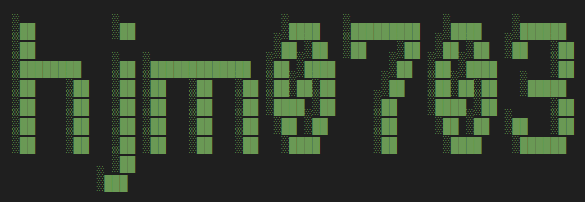

<!-- 引入 Font Awesome 6 图标库 -->
<link rel="stylesheet" href="https://cdnjs.cloudflare.com/ajax/libs/font-awesome/6.0.0-beta3/css/all.min.css">

<!-- 英雄区：星空特效 + 居中文字 + 靠右副标题 -->

  

    

      星图铺就的，未必是归途 
      但有人循着它，便不算迷路
    

    
———— 2026 四川省选

  

<!-- logo.png 占满一行 -->

  

<!-- 两列信息 -->

  

    <h3><i class="fas fa-pen-fancy"></i> 此地</h3>
    
这里是 <a href="https://hjm-start.pages.dev">hjm0703</a> 的 blog

    
以前的博客：<a href="https://cnblogs.com/hjm0703">博客园 - hjm0703</a>

  

  

    <h3><i class="fas fa-compass"></i> 出没地</h3>
    

      <a href="https://www.luogu.com.cn/user/1098988" class="link-badge"><i class="fab fa-luogu"></i> 洛谷</a>
      <a href="https://space.bilibili.com/1368842151" class="link-badge"><i class="fab fa-bilibili"></i> B站</a>
      <a href="https://www.acwing.com/user/myspace/index/546471/" class="link-badge"><i class="fas fa-code"></i> AcWing</a>
      <a href="https://hjm-start.pages.dev" class="link-badge"><i class="fas fa-home"></i> 我的主页</a>
    

  

<!-- 好用的网址 -->

  <h3><i class="fas fa-link"></i> 好用的网址</h3>
  

    <a href="https://tj.imken.dev/#/" class="link-badge"><i class="fas fa-edit"></i> 题解格式化</a>
    <a href="https://anacc22.github.io/another_graph_editor/" class="link-badge"><i class="fas fa-chalkboard"></i> 在线画图</a>
    <a href="https://fanyi.baidu.com/mtpe-individual/multimodal#/" class="link-badge"><i class="fas fa-language"></i> 百度翻译</a>
    <a href="https://oi-wiki.org/" class="link-badge"><i class="fas fa-book-open"></i> OI Wiki</a>
  

<!-- 洛谷 logo 占满一行 -->

  

