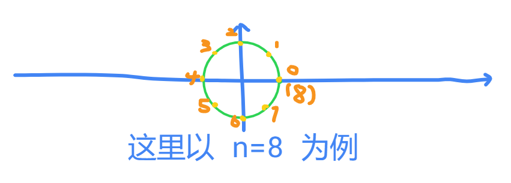

# FFT

## 问题引入

> [!question] 示例问题
>
> 给定一个 $n$ 次多项式 $F(x)$，和一个 $m$ 次多项式 $G(x)$。
>
> 请求出 $F(x)$ 和 $G(x)$ 的乘积。

这里如果我们暴力去做就是 $\mathcal O(n m)$ 的，但是貌似这里已经没有更好的办法了。

但是，如果题目提供的是 "两个多项式上相同 $x$ 下的多个点" （这里被称作 **"点表示法"**） 那么对于在两个多项式上的两个点 $(x, F(x)), (x, G(x))$ ，他们在乘积多项式上的点就直接是 $(x, F(x)\cdot G(x))$ ，只需要 $\mathcal O(n+m+1)$ 就可以求解。

于是现在的问题就变成了需要把原来的多项式转化为 **"点表示法"** 然后合并之后快速切换回去。

**Step 1：** 考虑如何转化过去，我们发现此时就算我们随机找 $n + m + 1$ 个点也需要 $\mathcal O\left((n+m+1)^2\right)$ ，但是由于选择任意不同点都是一样的，所以可以考虑选择一些特殊点进行计算。

**Step 2：** 考虑如何转化回去，首先有一个结论，对于一个 $n$ 次多项式，需要至少 $n+1$ 个点就能确定它，既然我们通过 **Step 1** 已经求出这 $n+1$ 个点了，那么一定可以做出来。而最直观的办法就是使用高斯消元，但是时间复杂度 $\mathcal O(n^3)$ 。

所以现在两个步骤都是不能直接使用前面的办法解决的，这时候就需要使用 $\texttt{FFT}$ 。

## 复数

关于 **Step 1** 我们不是需要找到 $n+1$ 个特殊点吗，所以这里我们可以使用性质良好的 **复数** 作为特殊点。

当然对于这个多项式，他当然支持 **复数**， 并且 **Step 2** 的那个结论仍然存在。

### 复数运算

**加法** $(a + b i) + (c+di) = (a+c) + (b+d)i$ ，在几何意义中就是和向量加法相同。

**乘法** $(a+bi)\times (c+di) = (ac - bd) + (ad + bc)i$ ，在几何意义中就是复平面上角度相加，长度相乘。

### 单位根

我们在复平面上画一个单位圆，然后均分这个园到 $n$ 份，然后每两份之间的交界点就是一个单位根，使用 $w_n^k$ ，图示如下：



此时有以下性质：

* $w_n^k = \left( cos(\frac{k \cdot 2\pi}{n}), sin(\frac{k \cdot 2\pi}{n}) \right)$

* $w_n^k = w_{2n}^{2k}$

* $w_n^k = w_n^{k+n}$

* $w_n^{k + n / 2} = -w_n^{k}$

* $w_n^{a+b} = w_n^{a} * w_n^{b}$

## FFT

现在终于到真正的 **FFT** 了，这里我们令一个多项式 $f(x) = \sum_{i=0}^{n-1} a_i x^i$ 。

我们考虑求出对于 $f(w_n)，k \in [0, n)$ ，那么这里我们考虑分成两个子问题：

* $f_1(x) = a_0 + a_2 x + a_4 x^2 + \dots + a_{n-2} x^{\frac{n}2 -1}$ 。

* $f_2(x) = a_1 + a_3 x + a_4 x^2 + \dots + a_{n-1} x^{\frac{n}{2}-1}$

那么不难发现: $f(x) = f_1(x^2) + x * f_2(x^2)$ 。

那么把特殊点 $w_n$ 带入：

$$
f(w_n^k) = f_1((w_n^k)^2) + w_n^k \times f_2((w_n^k)^2)
$$

此时分为两种情况：

1. $0\le k < \frac{n}{2}$ : $f(w_n^k) = f_1(w_n^{2k}) + w_n^k \times f_2(w_n^{2k}) = f_1(w_{n/2}^k) + w_n^k \times f_2(w_{n/2}^{k})$

2. $\frac{n}{2} \le \frac{n}{2} + k < n$ : $f(w_n^{k+\frac{n}{2}}) = f_1(w_n^{2k+n}) + w_n^{k+\frac{n}{2}} \times f_2(w_n^{2k+n}) = f_1(w_{n/2}^k) - w_n^k \times f_2(w_{n/2}^{k})$

所以我们发现这两个式子居然只有中间的符号不一样, 于是现在两个问题被分成了来嗯个规模相同的子问题。只需要递归下去。

然后当问题规模为 $1$ 的时候直接结束，总共时间复杂度 $\mathcal O(n \log n)$ 。

## IFFT

这里我们已经得到了 $c = (c_0, c_1, c_2, /dots, c_{n-1})$ ，然后我们考虑对于 $f(x) = \sum_{i=1}^{n-1} c_i x^i$ 求解他的 FFT : $d = (d_0, d_1, d_2, /dots, d_{n-1})$ 。

所以可以发现:

$$
d_k = f(W_n^{-k})
$$

$$
= \sum_{i=0}^{n-1} c_i(W_n^{-k})^i
$$

$$
= \sum_{i=0}^{n-1} c_i(W_n^{-k})^i
$$

$$
= \sum_{i=0}^{n-1} \sum_{j=0}^{n-1} a_j (W_n^{i})^j (W_n^{-k})^i
$$

$$
= \sum_{j=0}^{n-1} a_j \sum_{i=0}^{n-1} (W_n^{j-k})^i
$$

$$
= \sum_{j=0}^{n-1} a_j \frac{1 - (W_n^{j-k})^{n}}{1-W_n^{j-k}}
$$

$$
= \sum_{j=0}^{n-1} a_j \frac{1 - (W_n^n)^{j-k}}{1-W_n^{j-k}}
$$

所以只有 $j = k$ 时，所以 $d_i = n \cdot a_i$ ， 那么 $a_i = \frac{d_i}n$ 。

```cpp
void FFT(int n, vector<com>& v, bool invert) {
    if(n == 1) return ;
    
    int mid = n>>1;
    vector<com> al(mid+1), ar(mid+1);
    for(int i=0; i<mid; i++) 
        al[i] = v[i<<1], ar[i] = v[i<<1|1];

    FFT(mid, al, invert), FFT(mid, ar, invert);

    com j(1, 0);
    com step(cos(2*M_PI / n), sin(2*M_PI / n * (invert ? -1 : 1)));
    for(int i=0; i<mid; i++, j = j*step) {
        v[i] = al[i] + j*ar[i];
        v[i+mid] = al[i] - j*ar[i];
    }
}

/*~~~~~~~~~~~~~~~~~~~~ Boundary Line ~~~~~~~~~~~~~~~~~~~~*/
signed main() {
    cin>>n>>m; n++, m++;

    a.resize(n+1), b.resize(m+1);

    for(int i=0; i<n; i++) cin>>a[i];
    for(int i=0; i<m; i++) cin>>b[i];

    int mxn = n+m-1, t=1;
    while(t <= mxn) t<<=1;
    a.resize(t+1), b.resize(t+1);
    c.resize(t+1);

    FFT(t, a, 0), FFT(t, b, 0);
    for(int i=0; i<t; i++) c[i]=a[i]*b[i];
    FFT(t, c, 1);
    
    for(int i=0; i<mxn; i++) cout<< (int)round(c[i].real()/t) <<' '; 
    return 0;
}
```

## NTT

首先我们发现 FFT 有一个巨大的问题，其不能取膜，如果题目就是要求你取膜应当如何是好。

所以这里我们引入几个概念：

**价:** 在模 $p$ 下，如果 $a^x \equiv 1 \mod p$， 那么称 $x$ 为 $a$ 在 $p$ 下的价，记作 $|a|$ 。

**原根 $g$ :** 对于 $|g| = \varphi(p)$ ， 那么称 $g$ 为 $p$ 下的原根。对于 $p$ 为质数的情况，其一定有原根，其原根满足 $g^{p-1} \equiv 1 \mod p$ 。

然后我们现在实际上就是要选择一个单位根，满足前面的那些性质，这里我们选择单位根为 $g^{\frac{p-1}{n}}$ ，那么此时 $w_n^k = \left(g^{\frac{p-1}{n}}\right)^k$ 。

此时我们验证以下各个性质: ~~验证个球~~ 。

然后代码:

```cpp
emplate<int mod>
struct Pol {
    typedef long long ll;
    static constexpr int G = 3;

    int ksm(int x, int y) {
        int ans=1;
        while(y) {
            if(y&1) ans = (ll) ans*x%mod;
            x = (ll) x*x%mod, y>>=1;
        }
        return ans;
    }

    int rev[N];
    void init(int n) {
        int bit=0;
        while((1<<bit) < n) bit++;
        for(int i=0; i<n; i++) rev[i] = (rev[i>>1]>>1) + ((i&1) << (bit-1));
    }

    void NTT(int n, vector<int>& v, bool invert) {
        static int invG = ksm(G, mod-2);
        
        for(int i=0; i<n; i++) if(i < rev[i]) swap(v[i], v[rev[i]]);
        for(int len=1; len<=(n>>1); len<<=1) {
            int W = ksm(invert ? invG : G, (mod-1)/(len<<1));
            for(int i=0; i<n; i+=(len<<1)) {
                int w=1;
                for(int j=0; j<len; j++, w = 1LL* w*W%mod) {
                    int a1 = v[i+j], a2 = 1LL* w * v[i+j+len] % mod;
                    v[i+j] = (a1+a2)%mod, v[i+j+len] = ((a1-a2)%mod+mod)%mod;
                }
            }
        }
    }

    vector<int> main(vector<int> a, vector<int> b) {
        int n=a.size(), m=b.size(), t=1;
        while(t <= n+m-1) t<<=1;
        a.resize(t), b.resize(t), init(t);

        NTT(t, a, 0), NTT(t, b, 0);
        for(int i=0; i<t; i++) a[i] = (ll) a[i]*b[i] %mod;
        NTT(t, a, 1);

        int invT = ksm(t, mod-2);
        for(int i=0; i<n+m-1; i++) a[i] = ((ll) a[i]*invT%mod+mod)%mod;
        return a;
    }
};
```

## 多项式其他运算

### 多项式求逆元

这里我们另 $F(x)$ 是原多项式， $G(x)$ 为新的多项式，直接推式子：

$$
F(x) \times G(x) \equiv 1 \pmod{x^n}
$$

后面就不写同余了。

$$
F(x) - \frac{1}{G(x)} = 0
$$

因此我们直接上牛顿迭代法：

$$
G(x) = G_0(x) - \frac{F(x) - \frac{1}{G_0(x)}}{\frac{1}{G_0^2(x)}}
$$

（这里 $G_0$ 表示牛顿迭代法上一个，在 $\bmod~ {x^{\lceil \frac{n}{2} \rceil}}$ 下，这是因为在多项式中每牛顿迭代法一次精度翻倍）

那么:

$$
G(x) = 2 G_0(x) - F(x) G_0^2(x)
$$

$$
= G_0(x)\times\left( 2 - F(x) G_0(x)\right)
$$

然后递归求解就可以了，代码：

```cpp
void inv(int n, const Poly& a, Poly& res) {
    if(n == 1) return res.clean(1), res[0] = ksm(a[0], mod-2), void();
    inv((n+1)>>1, a, res), res.resize(n);

    static Poly b; b.clean();
    int t=1; while(t <= (n<<1)) t<<=1;
    init(t), b=a, b.resize(n);

    NTT(t, b, 0), NTT(t, res, 0);
    for(int i=0; i<t; i++) res[i] = 1LL* norm(2 - 1LL* b[i]*res[i]) * res[i]%mod;
    NTT(t, res, 1), res.resize(n);
}
```

### 多项式对数

$F, G$ 和上面相同，同样退式子：

$$G(x) = \ln F(x)$$

$$G'(x) = \frac{1}{F(x)} \cdot F'(x)$$

$$G'(x) = F'(x) \cdot F^{-1}(x)$$

然后直接使用 **求导**， **积分**， **求逆元** 就可以了。代码：

```cpp
// 多项式求积分
void Int(const Poly& a, Poly& res) {
    res.resize(a.size()+1);
    for(int i=1; i<=a.size(); i++) res[i] = 1LL* a[i-1] * ksm(i, mod-2) %mod;
    res[0] = 0;
}

// 多项式求导
void Der(const Poly& a, Poly& res) {
    res.resize(a.size()-1);
    for(int i=1; i<a.size(); i++) res[i-1] = 1LL* i*a[i] %mod;
}

// 多项式 ln
void Ln(const Poly& x, Poly& res) {
    static Poly a, b; a.clean(), b.clean();

    Der(x, a), inv(x.size(), x, b);
    mul(a, b, a), Int(a, res);

    res.resize(x.size());
}
```

### 多项式指数

同样直接推式子：

$$G(x) = \exp(F(x))$$

$$F(x) = \ln G(x)$$

$$\ln G(X) - F(x) = 0$$

然后直接使用牛顿迭代法：

$$
G(x) = G_0(x) - \frac{\ln G_0(x) - F(x)}{\frac{1}{G_0(x)}}
$$

$$
G(x) = G_0(x) (1 - \ln G(x) + F(x))
$$

~~真好，前面写的 $\ln$ 有可以用上了阿~~

代码：

```cpp
void Exp(int n, const Poly& x, Poly& res) {
    if(n == 1) return res.clean(1), res[0]=1, void();
    Exp((n+1)>>1, x, res), res.resize(n);

    static Poly lng, f; Ln(res, lng);
    int t=1; while(t <= (n<<1)) t<<=1;
    init(t), f=x, f.resize(n);

    NTT(t, f, 0), NTT(t, lng, 0), NTT(t, res, 0);
    for(int i=0; i<t; i++) res[i] = 1LL* norm(1 - lng[i] + f[i]) * res[i] %mod;
    NTT(t, res, 1), res.resize(n);
}
```

### 公用模板

> [!success]- 参考代码
>
> ```cpp
> struct Poly {
>     #define norm(x) (((x)%mod+mod)%mod)
>     typedef long long ll;
>
>     static constexpr int mod = 998244353, G = 3;
>     static constexpr int N = 5e5+5;
>     
>     vector<int> a;
>
>     inline void resize(int n) { a.resize(n); }
>     inline int operator [] (int x) const { return a[x]; }
>     inline int& operator [] (int x) { return a[x]; }
>     inline int size() { return a.size(); }
>     inline int size() const { return a.size(); }
>     inline void clean() { a.clear(); }
>     inline void clean(int m) { a.clear(), a.resize(m); }
>
>     static int rev[N];
>     static inline void init(int n) {
>         int bit = 1;
>         while((1<<bit) < n) bit++;
>         for(int i=1; i<n; i++) rev[i] = (rev[i>>1]>>1) | ((i&1) << (bit-1));
>     }
>
>     static int ksm(int x, int y) {
>         int ans = 1;
>         while(y) {
>             if(y&1) ans = 1LL* ans*x%mod;
>             x = 1LL* x*x%mod, y>>=1;
>         }
>         return ans;
>     }
>
>     static void NTT(int n, Poly& v, bool invert) {
>         v.resize(n);
>         for(int i=0; i<n; i++) if(i < rev[i]) swap(v[i], v[rev[i]]);
>         static int invG = ksm(G, mod-2);
>         for(int len=1; len <= (n>>1); len<<=1) {
>             int W = ksm(invert ? invG : G, (mod-1) / (len<<1));
>             for(int i=0; i<n; i += (len<<1)) {
>                 int w = 1;
>                 for(int j=0; j<len; j++, w = 1LL* w*W%mod) {
>                     int a0 = v[i+j], a1 = 1LL* w*v[i+j+len]%mod;
>                     v[i+j] = (a0+a1)%mod, v[i+j+len] = norm(a0-a1);
>                 }
>             }
>         }
>
>         if(invert) {
>             int invN = ksm(n, mod-2); // 这里不能加 static
>             for(int i=0; i<n; i++) v[i] = 1LL* v[i]*invN %mod;
>         }
>     }
>
>     static void mul(const Poly& va, const Poly& vb, Poly& res) {
>         static Poly a, b; a = va, b = vb;
>         int t = 1; while(t <= a.size() + b.size() - 1) t<<=1;
>         init(t), res.clean(), res.resize(t);
>         
>         NTT(t, a, 0), NTT(t, b, 0);
>         for(int i=0; i<t; i++) res[i] = 1LL* a[i] * b[i] % mod;
>         NTT(t, res, 1), res.resize(a.size() + b.size() - 1);
>     }
>
>     // 多项式逆元
>     static void inv(int n, const Poly& a, Poly& res) {
>         if(n == 1) return res.clean(1), res[0] = ksm(a[0], mod-2), void();
>         inv((n+1)>>1, a, res), res.resize(n);
>
>         static Poly b; b.clean();
>         int t=1; while(t <= (n<<1)) t<<=1;
>         init(t), b=a, b.resize(n);
>
>         NTT(t, b, 0), NTT(t, res, 0);
>         for(int i=0; i<t; i++) res[i] = 1LL* norm(2 - 1LL* b[i]*res[i]) * res[i]%mod;
>         NTT(t, res, 1), res.resize(n);
>     }
>
>     // 多项式求积分
>     static void Int(const Poly& a, Poly& res) {
>         res.resize(a.size()+1);
>         for(int i=1; i<=a.size(); i++) res[i] = 1LL* a[i-1] * ksm(i, mod-2) %mod;
>         res[0] = 0;
>     }
>
>     // 多项式求导
>     static void Der(const Poly& a, Poly& res) {
>         res.resize(a.size()-1);
>         for(int i=1; i<a.size(); i++) res[i-1] = 1LL* i*a[i] %mod;
>     }
>
>     // 多项式 ln
>     static void Ln(const Poly& x, Poly& res) {
>         static Poly a, b; a.clean(), b.clean();
>
>         Der(x, a), inv(x.size(), x, b);
>         mul(a, b, a), Int(a, res);
>     }
>
>     // 多项式 exp
>     static void Exp(int n, const Poly& x, Poly& res) {
>         if(n == 1) return res.clean(1), res[0]=1, void();
>         Exp((n+1)>>1, x, res), res.resize(n);
>
>         static Poly lng, f; Ln(res, lng);
>         int t=1; while(t <= (n<<1)) t<<=1;
>         init(t), f=x, f.resize(n);
>
>         NTT(t, f, 0), NTT(t, lng, 0), NTT(t, res, 0);
>         for(int i=0; i<t; i++) res[i] = 1LL* norm(1 - lng[i] + f[i]) * res[i] %mod;
>         NTT(t, res, 1), res.resize(n);
>     }
> };
>
> int Poly::rev[Poly::N];
> ```
