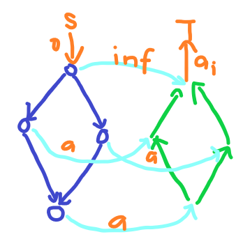
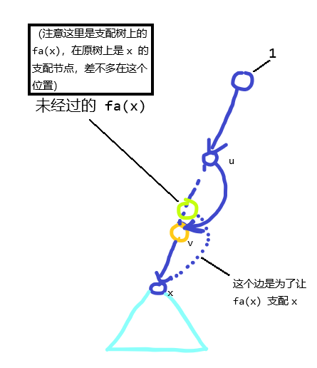

??? note "The Pilots Brothers' refrigerator"

    **标签： 位运算**

    我们发现对于同一个点进行两次反转操作相当于什么都没做

    所以我们直接枚举每一个点反转还是不反转，然后直接模拟即可。

??? note "P6599「EZEC-2」异或"

    **标签： 位运算**

    由于每一个二进制位独立，考虑分开处理

    对于一个二进制位，如果有 `x` 个 `0` 和 `y` 个 `1`，则此位贡献的答案为：`ans = x * y`

    因为 `x + y = l`

    所以 `x * y <= (x+y) * (x+y) / 4`，即 `x = y = l / 2`

??? note "P6225 [eJOI 2019] 异或橙子"

    **标签： 位运算**

    由于异或具有交换律，所以当 `l=2,r=4` 时
    ```
    ans = a2^a3^a4^a2^a3^a3^a4^a2^a3^a4
        = a2^a4
    ```
    我们能够发现:

    - 当 `l`,`r` 奇偶性不同，`ans=0`
    - 否则，取每隔一个异或。

    所以直接用 树状数组 维护

??? note "P9915「RiOI-03」3-2"

    **标签： 位运算**


    首先我们发现其中有一个重要的性质：

    $$
    0\le x\lt \min(2^n, 10^{18})
    $$

    所以我们其实只需要特判一下 左上角那一片`0`:

    ```cpp
    0 0 0
    1 0 0
    · 1 0
    1 1 0
    · · 1
    · · ·
    ```
    其他的联通块绝对走不出:
    $$
    (x,y) ~~ x \in [0,2^{63}],y \in [0,63]
    $$
    这些点，所以我们可以直接暴力到当前连通块的最右端，然后直接计算。

    这里有一个函数可以计算一个点是 0 还是 1.
    ```cpp
    bool ask(int x,int y){//查询 (x,y) 为 1 为 0
        int z=(1ll<<(y+1));
        if(x%z < z/2) return 0;
        else return 1;
    }
    ```

??? note "P4310 绝世好题"

    **标签：DP 动态规划**

    我们定义 `f[i]` 为当连续字串最后一个第 `i` 位的值为`1`时的最大长度。

    所以对于 一个`x=a[i]`

    $$
    f_j=\max_{_{x 的第 u 位为 1}} f_u+1 ~~~~~_{(x 的第 j 位为 1)}
    $$

??? note "P1381 单词背诵"

    **标签：hash，双指针**

    我们只需要进行一下 hash 然后直接一个双指针。

    但是要特判一下 `ans = 0,0`。

??? note "P4688 [Ynoi Easy Round 2016] 掉进兔子洞"

    **标签：bitset**

    我们发现其实 `ans = len1+len2+len3-3*(相同元素个数)`.

    我们可以将每一个区间的值按下标存储到 `bitset` 中，然后直接进行 `&` 操作，即可得到其相同元素个数。

    ~~然后问题就解决了？~~

    我们注意到按照下标存储处理的一定是 **不可重集合**，而这一道题要求可重，所以我们需要先对其进行离散化

    如对于全集为 `{1,1,2,3,3}`，处理区间集合为 `{1,2,3,3}`

    存储的 `bitset` 为：

    ```cpp
    全集：00000000000111110
    集合：00000000000111010
            n   <-----    0
    ```

    这个样子才能解决。

    ~~然后问题就解决了？~~

    我们发现如果每一次都重新把每一个区间存入其中，与暴力没什么两样，但是我们发现每一个区间之间有很大的重叠，所以考虑与莫队结合，这样就可以以大概为 $\mathcal O(N\sqrt{N})$ 的时间处理每一次把对应区间元素插入集合。
    但是还有一点需要注意：

    虽然说 `bitset` 的空间复杂度比较小，但是因为是离线，我们要求把每一次询问产生的 `bitset` 记录下来，一遍统计答案，所以 $\mathcal O(\frac{N^2}{w})$ 会炸，需要将其分为多个部分（每一个处理 `2e4` 次询问）。

??? note "CF126B Password - 洛谷"

    **标签：KMP**

    首先题目需要找的是一个字串满足即使前缀，又是后缀，还在中间出现。

    满足即使前缀，又是后缀及其 **公共先后缀**，可以使用 `while(j) j=nxt[j]`，遍历所有。

    但是如果考虑在中间也出现过，其实就是一个前缀的 **公共前后缀**，所以直接使用一个桶存储，就可以解决这个问题

??? note "P1470 [IOI 1996 / USACO2.3] 最长前缀 Longest Prefix - 洛谷"

    **标签：KMP**

    这里我们定义 `f[i]` 为长度为 `i` 的前缀是否能够被拼出

    可以推出递推式：`f[i]|=f[i-s[i].size]` ,（`s[i].size` 表示第 `i` 个字符串的长度）。

    这里有一个条件，就是这个时候的后缀必须与 `s[i]` 完全匹配。

    所以直接使用 **KMP** 就可以了，用 **hash** 的效果一样。

??? note "P4696 [CEOI 2011] Matching - 洛谷"

    **标签：KMP**

    重点依然是如何重定义两个字符是相同的。

    首先我们需要确定为什么能够使用 KMP。

    > **这里十分重要！！！**
    >
    > KMP 的一个利用特性在于字符串的连等：`S1=S2 , S2=S3 => S1=S3`。
    >
    > 这道题目显然满足，我们可以把题目中的第一个序列 `a[]` 转换为 `b[]`，即以值为下标，存储数值为位置。
    >
    > 例如序列 `2 1 5 3 4` 变成 `2 1 4 5 3`。
    >
    > 这个样子就可以把两个序列相等的条件转化为两个序列经过离散化之后相同，比如 `4 2 ==> 2 1` 与 `2 1` 相同。
    >
    > 这个时候显然有连等性。

    然后考虑如何定义相等：

    - 思路一：我们发现只要两个序列中当前比较字符的比他小的元素的个数相等，那么一定相同，于是出现了题解中有一篇使用树状数组的解法。
    - 优化：我们可以变为比较其前驱和后记，记录一下其中一个字符串每一个字符相对其前驱和后继的距离，然后再另一个字符传中是否也满足前驱后继（直接比较大小）。

    但是这里也有一个需要注意的，我们记录的前驱和后继必须是在当前比较区间中的（下面那一道题一样）。

    因为当前比较的字符一定是目前区间的最后一个，所以只需要保证前驱和后继都在当前字符之前，所以直接搞一个链表，然后从后往前便利，把一个字符处理完了之后就把他在链表中删去（把前后连在一起）。

??? note "P5256 [JSOI2013] 编程作业 - 洛谷"

    **标签：KMP**

    如果把'相同'当作完全相同，则这就是一个 **KMP** 板子，所以我们主要是要知道如何判断两个字符是 **相同的**。

    我们定义两个数组 s，t，表示当前字符对应的最近的上一个字符的距离，如 `abcab` 为 `00033`,（这里仅是示例），我们可以观察到如果两个字符串是'相同的'，则它们按这个规则组成的数组也一定相等 $\color {white} 吗$。

    有一种特殊情况，比如 `ababb` 和 `cdd`。这时两个分别为 `00221` 和 `001`, 所以需要特判是否在比较范围内，及 **KMP** 时的 `j`.

??? note "P5304 [GXOI/GZOI2019] 旅行者"

    **标签：二进制分组：**


    对于这种求两两点都要计算的问题（求得是最小值，因而可以重复计算）。

    我们可以拆分成多个 **A**，**B** 两个点集的之间的关联。

    我们按照二进制的每一位 $0/1$ 区分 **A** **B**，因为两个不同的点至少有一位二进制不同。

    这样假设处理两个集合之间子问题时间复杂度为 $\mathcal O(f(N))$ 那么总体时间复杂度为 $\mathcal O(\log N * f(N))$。

??? note "P6880 [JOI 2020 Final] 奥运公交 / Olympic Bus"

    **标签：图论，最短路**

    这里主要是一个优化：

    > **优化：**
    >
    > 这里要求不经过那一条边的最短路
    >
    > 可以预处理出没有该条件的普通最短路组成的树：
    >
    > - 如果去除的这一条边不是树边，那么直接返回预处理的值
    > - 否则重新计算
    >
    > 这样因为树边只有 $N-1$ 条，所以最多跑 $N$ 次最短路。

??? note "P2371 [国家集训队] 墨墨的等式"

    **标签：同余不等式**

    首先我们能够想出一个暴力建图的做法。

    我们连接每一个 $(i,i+a_j)$ 然后求解从 $0$ 出发的连通性，但是很明显这样要有 $1e12$ 个点，不知道多少条边。

    所以我们需要找到一种办法减少图的规模。

    我们令 $a_{min}$ 为 $a_i$ 中最小的一个；

    我们把所有目标是 $x$ 满足 $x \equiv y \mod a_{min}$ 放在一起计算，假设此时通过凑 $a_i$ 能凑出 $sum \equiv y \mod a_{min}$ 的 $sum$ 为 $dis_y$，那么这一组的 $ans = \lfloor{\frac{x-dis_y}{y}}\rfloor+1$ 所以需要让 $dis_y$ 最小。

    所以连接边 $(i,(i+a_j)\mod a_{min})$ 求解最短路。

??? note "P7515 [省选联考 2021 A 卷] 矩阵游戏"

    **标签：图论，差分约束**

    这里如果没有 ($0 \le a_i \le 10^6$) 是十分简单的。

    我们规定最后一列一行都为 0，就可以依次推出所有 $a$ 的值，但是不满足题目要求。

    所以我们可以选择调整。

    基础做法是对于 每一列 每一行，奇数增，偶数减。

    吧每一行每一列增减个数作为未知量进行差分约束

    但是这样 **有破绽**，就是有可能会出现 $0 \le a_{i,j}+L_{i}+R_j \le 10^6$ 或 $0 \le a_{i,j}-L_{i}-R_j \le 10^6$，差分约束无法解决。

    我们其实只需要改变调整的方法，变成：

    ```text
    L:

    + - + - + -
    - + - + - +
    + - + - + -
    - + - + - +
    + - + - + -

    R:

    - + - + - +
    + - + - + -
    - + - + - +
    + - + - + -
    - + - + - +
    ```

    这样就不会出现了.

??? note "P2045 方格取数加强版"
    **标签： 网络流**

    对于每一个格子，分成一个入点和一个出点。

    在之间连边：

    - 流量 $1$，费用 $a_{i,j}$。
    - 流量 $k-1$，费用 $0$。

    格子之间连边：

    - 流量 $k$，费用 $0$

    然后从 $(1,1)$ 的入点 到 $(n,n)$ 的出点 跑最大费用流。

??? note "P3358 最长 k 可重区间集问题"
    **标签： 网络流，最大流**

    对于每一个点 $i$，连接 $i+1$ 流量 $k$,费用 $0$ 表示最多每一个点被覆盖 $k$ 次。

    然后对于每一条线段，链接 $(l,r)$，流量 $1$，费用 $len$，表示每一条线段只能被走一次，计算一次贡献。

    然后跑最大费用。

??? note "P4249 [WC2007] 剪刀石头布"

    **标签：网络流，费用流**

    首先我们可以考虑 **正难则反**，计算没有三个点不组成三元组的个数。

    我们能发现此时有一个点入度为 $2$ , 一个点入度出度都为 $1$，一个点出度为 $2$。

    所以对于一个点 $x$，如果他入度为 $du_x$，那么会产生 $C_{du_x}^2$ 对三元组不组成成环。

    所以 $ans=C_n^3-\sum C_{du_x}^2 = C_n^3-\sum \frac{du_x*(du_x-1)}{2}=C_n^3-\sum{\frac{du_x^2}{2}} + \sum \frac{du_x}{2}$。

    而 $\sum du_x = \frac{n*(n-1)}{2}$，于是我们需要最小化 $\sum {\frac{du_x^2}{2}}$。

    由于对于一串 $x^2$：$1,4,9,16,25···$ 差分后为 $1,3,5,7,9···$，所以我们对于一个点 $x$，拆成两个点，一个入，一个处，然后入点出点之间连接多条边，容量都为 $1$，费用为 $1,3,5,7,···$。

    因为如果流这个点，就一定会先走小的边，所以总费用就按照 $1,4,9,16,25···$ 累加。

    然后对于每一个边，建一个点，连接他对应的两个顶点，并从 $s$ 连接一个容量为 $1$ 的边，表示这个边最多选择一个方向。

    最终的图类似如下：

    

    然后跑 $\texttt{Dinic}$，输出方案。

??? note "善意的投票 / [JLOI2010] 冠军调查"

    **标签：网络流，最小割**

    最小割解决的问题就是需要分配多个东西到两个集合，使得代价最小。

    这道题睡不睡午觉就是两个选择，如果一个节点（表示一个人），连接了 $S$ 说明他选择不睡，如果一个节点最后保持 $T$ 说明他选择睡

    所以我们连两种边。

    - 对于违背自己意愿：如果本来要睡，连接 $T$，容量为 $1$，不睡同理。
    - 对于违背朋友意愿：连接自己和朋友，容量为 $1$。

    然后求最小割。

??? note "P4313 文理分科"

    **标签：网络流，最小割**

    和上一道题基本相似，主要是处理同时选择三个人。

    我们可以把那三个人连接到一个虚拟点上，在有那个点链接到 $S$ 或 $T$

    一个小技巧，如果把一条边设为 $\inf$，那么代表一定不能割这一条边。最开始我陷入的思维误区就是既然一定不能割这一条边，那么被连接的三个点补救一定会在一边了嘛？

    

    这个主要是边是单向边，然后最小割是割边直到 $S$ 不能到 $T$，所以我们有两个选择：

    1. 割掉 **虚拟点** 到 **源汇点** 的路径，代表不然这三个点在一遍，此时就算不割掉 $\inf$ 的边，通过这条路也无法到达 $T$
    2. 割掉 **源汇点** 到这三个点的边，代表三个点在一边。

??? note "P3227 [HNOI2013] 切糕"

    **标签：网络流，最小割**

    同样的道理，边的长度为 $\inf$ 代表必须选择在同一边，这里分配长方体每一个点的两个选择为是否切下来，代价为不和谐值。

??? note "P3749 [六省联考 2017] 寿司餐厅"

    **标签：网络流，最大全闭合子图**

    > **最大全闭合子图**
    >
    > 基础模板问题是有 $n$ 个选择，每一个选择有一个贡献（可能为负），然后但是如果选择计算了一个贡献，就必须得要计算其他一些提前设定好的贡献，每一个贡献只能记算一次
    >
    > 首先建图，对于依赖进行连边，依然是进行最小割。
    >
    > 但是我们发现不太好处理容量为负的最小割，所以对于点权为负的节点我们先默认不其计算贡献，然后连接到 $T$，如果割掉代表选择该节点。
    >
    > 然后边权为正就连接 $S$，如果割掉就代表不选择该节点

    有了这个模板这个题也就是一个模板了。

??? note "P4843 清理雪道"

    **标签：网络流，上下界网络流**

    首先对于每一条边，必须被走一次，所以设定每一条边为下界 $1$，上界为 $\inf$。

    而对于每一个点
    - 从 $S$ 连过去，下界 $0$，上界 $\inf$，表示一条路径从这里出发。
    - 连接到 $T$，下界 $0$，上界 $\inf$，表示一条路径在这里结束。

    然后跑上下界最短路

??? note "CF708D Incorrect Flow"

    **标签：网络流，上下界网络流**

    **题目概述：** 对于一个流量不平衡的一个网络流调整流量和容量，使其满足网络流要求，不一定是最大流。

    首先分成两种情况：

    1\.  $f(e)\le g(e)$

    - 流量减少，从而调整流量平衡，这个操作最多进行 $f(e)$ 次。
    - 流量增加，从而调整流量平衡，这个操作最多进行 $g(e)-f(e)$。
    - 流量和容量同时增加，能做无限次。
    - （容量一定不会减少，费用自己应该都知道）

    2\. $f(e) > g(e)$

    首先能够确定，要么加 $g(e)$，要么减少 $f(e)$，一定会先操作 $f(e)-g(e)$ 次使得流量小于等于容量。

    - 流量减少，这个操作可以进行 $f(e)-g(e)$ 次，费用为 $0$。
    - 流量继续减少，这个操作进行 $g(e)$ 次，费用为 $1$。
    - 流量和容量继续增加，这个操作进行无限次，费用为 $2$
    - （这里如果流量增加，那么容量也一定会继续增加）

    然后就是一个问题，如何确保最后流量守恒，直接连一条上下界都为 $f(e)$ 的边，相当于固定流量。

    然后就直接跑上下界最小费用流：

    ??? note "**上下界最小费用流:**"

        1. 加边是记录每一个点流量不匹配的值，`du[a]-=c,du[b]+=c;`。
        2. 对于流量不匹配的点连接超级源点。
        3. 连接 $t$ 到 $s$ 流量为 $\inf$。
        4. 从超级源汇点跑 $\texttt{Dinic}$。

        ```cpp
        namespace UDFLOW{
            //有源汇上下界最小费用可行流

            ll sum;

            int du[N];
            void add(int a,int b,int c,int d,int w){
                FLOW::add(a,b,d-c,w);
                du[a]-=c,du[b]+=c;
                sum+=1ll*c*w;
            }

            ll solve(int n,int s,int t){
                int ss=n+1,tt=n+2;
                for(int i=0;i<=n;i++){
                    if(du[i]>0) FLOW::add(ss,i,du[i],0);
                    if(du[i]<0) FLOW::add(i,tt,-du[i],0);
                }

                FLOW::add(t,s,inf,0);

                FLOW::Dinic(n+2,ss,tt);
                return sum+FLOW::cost;
            }
        }
        ```

??? note "P4251 [SCOI2015] 小凸玩矩阵"

    **标签：网络流，二分图**

    每一行每一列选一个，一看就像是二分图。

    所以左部为 $i$，右部为 $j$。

    然后显然答案具有单调性，所以把所有 $A_{i,j} \le mid$ 的点加入二分图中 $(i,j)$，然后看一下最大匹配是否大于 $n-k+1$。

??? note "P2764 最小路径覆盖问题"

    **标签：网络流，二分图**

    其实就是每一个节点需要最多选择一个节点接下去，此时这两个点就在一个路径上了。

    所以把每一个点拆分成一个入点和一个出点，然后连边时从入点连到出点，然后跑二分图。

    最后每一个左端点选择的右端点就在同一个路径上。

??? note "P4055 [JSOI2009] 游戏"

    **标签：二分图，网络流**

    一道图博弈的模板题：

    ??? note "图博弈"

        对于一个 **DAG (有向无环图)**，最开始一个棋子放在 $x$。

        每一个人一次移动一次通过一条边。

        当一个人无法走动是他就输了。

    > **结论：**
    >
    > 如果这个点 $x$ 是最大匹配的闭经点，那么先手必胜。
    >
    > 否则先手必败

    **证明:**

    首先一个 **DAG** 一定是一个**二分图**。

    然后进行一次二分图最大匹配（任意方案）

    然后如果 $x$ 是最大匹配的闭经点，那么他一定在一对匹配边上，因此一定可以移动到另一个成对的点上。

    这样子他们走的路一定是一条 **增广路**，但是如果后手走到了一个未匹配的点上，那先手不久输了吗？

    但是此时我们可以通过饭方 **增光路** 上的匹配信息从而把这个点变成匹配点，起点不是匹配点，此时不满足
    $x$ 是最大匹配的闭经点。

    因此如果先手必败：

    - 对于当前情况，$x$ 为未匹配点。
    - 能够从一个未匹配点通过一条 **增广路** 到达 $x$。

    > **实现：**
    >
    > 对于这道题，需要验证多个点是否为必胜点。
    >
    > 所以可以从每一个为匹配点跑 dfs 跑增广路，走到的点打上标记。

??? note "P4298 [CTSC2008] 祭祀"

    **标签：二分图，最长反链**

    > **最长反链**
    >
    > 对于一个 **DAG**，寻找一组点，满足这组点互相无法到达，且点数最多

    **定理：** **最长反链** 长度为 **可重最少路径覆盖** 的路径数。

    ~~这个证明我只会感性证明：~~
    > **证明：**
    >
    > 先证 $A$ 的确是一个反链：这是容易的，因为任取 $x \in A$，$x_{in}$ 就一定是被 DFS 到的点，而 $x_{out}$ 一定是没被 DFS 到的点，任何两个 $x, y \in A$ 之间若是有连边就和 DFS 的过程冲突了。
    >
    > 首先有 $|I| = 2n - |S| = 2n - m$，而 $|I| - |A|$ 可以看作是满足「$x_{out}$ 或 $x_{in}$ 属于 $I$」的 $x$ 的个数，显然这样的 $x$ 不会超过 $n$ 个，所以 $|I| - |A| \le n$，所以 $|A| \ge |I| - n = n - m$。
    >
    > 但是 $A$ 再大，也不能大过 $n - m$，所以 $|A| = n - m$，也就是一个最长反链。
    >
    > **by 小粉兔**

    但是对于构造一组方案怎么办。

    1. 首先可以排除选 **链头/链尾**，自行构造
    2. 既然是选择中间的点，这个就很难办了

    但是我们可以先解决下一问，即那些点可以被选，

    我们只需要把当前枚举到的点的上下游都删除，然后在跑一次，如果 $ans' = ans-1$ 那么说明这个点可以选。

    此时我们已经知道拿一些点能够选了。

    所以我们只需要一次选择那些可以选且不在已选点上下游的点，然后就可以得到一组构造。

??? note "ARC106E Medals"

    **标签：二分图，Hall 定理**

    首先 $nk\le ans \le 2nk$

    然后明显外面是一个二分答案，现在假设当前正在执行 `check(x)`，$x$ 表示需要 $x$ 天。

    然后建出二分图，即左边每个人有 $k$ 个点（表示每一个奖牌），右边有 $x$ 个点（表示每一天），然后每一个左部点连到所有他工作的时间，然后如果存在完美匹配，就返回 $1$。

    但是很明显会 **TLE**。

    首先我们发现对于一个点分裂的 $k$ 个点，他们连的边一定是相同的，所以未了让 $|S|$ 尽量大，所以可以在枚举左侧端点子集时直接选择它的所有 $k$ 个点，因而假设现在枚举子集只需要枚举 $n$ 个人 **选 or 不选**,此时左侧节点个数为 $|S| = mk$（$m$ 为选人的数量）。

    但是对于右侧节点，我们假设 $d_i$ 为第 $i$ 天上班人的集合，所以我们需要找到的是 $|S|$ 和 $d_i$ 有交的结点个数。

    有交不是很好求，但是我们可以转化为 **总结点 - 不相交的节点**，而不相交的节点相当于 $|S|$ 的补集的子集。

    对于求解一个 $s_i$ 为有多少天工作人集合为 $i$ 的子集，这个就好求多了。

??? note "P5811 [IOI 2019] 景点划分"

    **标签：DFS 树**

    首先通过贪心策略，如果 $a \le b \le c$，那么选择 $a$ 和 $b$ 使他们联通一定是最优的，我们顺带还能得出结论 $a \le \frac{n}{3}, b \le \frac{n}{2}$。

    > **对于图为树的情况**
    >
    > 这个问题其实等价于找到一条边，是的这条边左右两边的大小一个大于 $a$，一个大于 $b$。
    >
    > 假设当前一边为 $x$，那么另一边为 $n-x$。即 $n-x \ge b , x \ge a $，所以 $a \le x \le n-b$。
    > 有或者前一边为 $n-x$，那么另一边为 $x$。即 $x \ge b , n-x \ge a$，所以 $n-b \le x \le a$。
    >
    > 将上面两个合并，$x \in [a,n-a]$。于是，我们就相出了树的解法：计算每一颗子树大小，然后看看有没有子树满足要求。

    但是对于图呢？

    我们发现如果原图为 $\texttt{True}$ 一定存在该图的一种生成树满足求出一种解。

    所以我们考虑先随便选一颗生成树（比如 DFS 树），然后进行调整。

    但是如何调整呢？？

    首先我们寻找是否有子树大小在 $[a,n-a]$ 之间的，如果有，直接输出构造方案。

    如果没有，那么找到深度最大的一个点 $x$ 满足其子树大小大于 $\frac{2n}{3}$，现在我们需要想一些办法把他的子树大小减小到 $[a,n-a]$（此时只能减小这个子树大小，因为其他子树大小总和加起来也最多只有 $\frac{n}{3}$）。

    如果这颗子树是孤立的（相当于没有返祖边），那么一定无法调整，直接为 $\texttt{False}$。

    如果存在返祖边，就可以连接返祖边为树边，是的这颗大子树的子树大小减去返祖边引导的子树大小，可以发现此时一定有解。

    > **证明：**
    >
    > 返祖边引导的子树大小满足 $siz \in [1,\frac{n}{3}]$，而大子树满足 $siz \in [\frac{n}{3},\frac{2n}{3}]$，因此固然不可能直接减到 $[1,\frac{n}{3}]$。
    >
    > 因为 $[\frac{n}{3},\frac{2n}{3}] \subset [a,n-a] $，所以一定能够构造出解。
    >
    > 至于解法，就是不停的找到返祖边，然后删掉他的子树。

    **代码实现过于困难**


??? node "[CF1470D Strange Housing](https://vjudge.net/problem/CodeForces-1470D#author=translator:1281311:zh)"
    **标签： DFS序**

    首先注意到这道题只要输出一种解，考虑构造。

    直接给出答案： 按照DFS顺序一个选，如果这组数据有答案，一定能够构造出一组解。

    证明也十分简单：

    - 如果当前枚举节点所有相连节点都没有被选（即可以选择这个点），那么选择这个点之后一定连通。
    - 如果当前枚举节点无法选择，那么一定存在他的一个父亲（或者返祖边连接的祖先）被选择，此时依然连通。


??? node "[CF51F Caterpillar](https://vjudge.net/problem/CodeForces-51F#author=translator:1281311:zh)"

    **标签： 圆方树**

    首先对于多个连通块，我们只需要把他们分别处理之后使用 $sum-1$ 次将他们连在一起。

    然后对于一个普通的图，对于一个 **边双连通分量** 中的节点，一定是要合并在一起的，所以先处理了。

    然后现在相当于面对的是一颗普通的树：

    首先答案为 总点数 -  选择的那条链的点数 - 不在链上的叶子节点
     
    所以我们发现链一定是要越长越好，所以直接选择直径。

??? node "[CF1893E Cacti Symphony](https://vjudge.net/problem/CodeForces-1893E#author=translator:1281309:zh)"

    **标签： 仙人掌，圆方树**

    因为 图的一条边被称为好的，如果它相邻顶点的权重的按位异或不等于0，且不等于这条边的权重。

    所以这个这个边的权值一定是两边点权其中一个。

    相当于先对每一个点染色，然后再对于每一条边定向。

    然后考虑对于对于每一个点的约束：

    !!! info "点的约束"
        假设当前点点权为 $a$ ，然后其余两个点权为 $x$ 和 $y$ ，所以 $x \oplus y = a$ 。

        此时总共疑惑和为（ $E$ 为当前点每一个颜色的边数）: $((E_a \mod 2)\times a) \oplus ((E_x \mod 2)\times x) \oplus ((E_y \mod 2)\times y)$ 。

        相当于： $((E_a \mod 2)\times a) \oplus ((E_x \mod 2)\times x) \oplus ((E_y \mod 2)\times (a \oplus y))$ 。

        ···

        最终可以推出入边数一定是奇数。

    
    我们发现如果 $n,m$ 奇偶性相同，一定能够找到一组解。

    ~~ 未完工

??? node "[CF1763F Edge Queries](https://vjudge.net/problem/CodeForces-1763F)"

    **标签： 仙人掌，圆方树**

    简单的模板。

    求两条路径之间的非割边数量。

    对于一个 **点双连通分量** ， 如果点数一共只有2个（不算方点），那么此时这个点双一定只包含一条边，此边为割边。

    所以对于所有方点，如果其对应的 点双 不是只有两个点，就给他复制为其包含的边数。

    然后查询跑两个点的路径权值和。

??? node "[P8496 [NOI2022] 众数](https://www.luogu.com.cn/problem/P8496)"
    
    **标签： 线段树合并，链表**

    首先观察到什么序列增删合并，很容易就想到使用链表维护。

    然后很容易能够对每一个序列维护一个权值线段树，因此此时链表合并时同时进行线段树合并。

    但是最麻烦的是如何对于多个序列相连之后求众数。

    如果暴力合并这几个序列询问出现次数最大的哪一个数，我们发现不能对于每一个序列预处理。

    由于本题定义的众数是出现数量严格大于一半的数，可以得到这个数一定是中位数。

    所以我们可以直接同时查询所有涉及到的线段树的中位数（线段树上二分）。

??? node "[P3241 [HNOI2015] 开店](https://www.luogu.com.cn/problem/P3241)"
    **标签： 点分树**

    就是一个点分树模板，但是注意到直接写线段树会 MLE，而且没有修改操作。

    所以直接使用 vevtor+前缀和 代替线段树。

??? note "[P6624 [省选联考 2020 A 卷] 作业题](https://www.luogu.com.cn/problem/P6624)"
    **标签： 矩阵树定理**

    首先我们需要想办法把 $gcd$ 拆掉， 由于 $𝑛=\sum_{𝑑|𝑛}\varphi(𝑑)$ ，所以我们可以把答案变成： 

    $$
    \begin{align}
    ans &= \sum_T [\sum_{e_i\in T} w_{e_i} *gcd(T)]\\
    & = \sum_{e_i\in T} w_{e_i} * \sum_{d|gcd(T)} \varphi (d) \\
    & = \sum_d \varphi (d) * \sum_{T} [\forall e_i\in T,d|w_{e_i}] w_{e_i}
    \end{align}
    $$

    相当于枚举一个属 $d$ ，然后加入所有 $d|w_{e_i}$ 的边，求他们所有生成树的边的权值和。

    但是如何求解权值和呢，由于对于矩阵树定理，边权不一定是一个树，只要是能够相乘的数据都可以，所以我们可以令边权为 $(1+wx)$ 此时如果两数相乘得到 $(1+w_1x)(1+w_2x) = 1 + (w_1+w_2)x + w_1*w_2*x^2$ 我们只需要在 $\mod x^2$ 的情况下计算，此时最后的答案就是最后表达式的一次项系数。

    但是如何处理除法呢，当然是逆元了： 我们令 $(a+bx)(c+dx)=1\mod x^2$ ，所以此时 $bc+ad=0, ac=1$ 因而 $(a+bx)(\frac{1}{a}+\frac{b}{a}x)=1\mod x^2$ ，然后就求出逆元了（注意 $\frac{1}{a}$ 是分数，需要求解逆元）。

    这里可以总结一下矩阵树定理的适用条件：
    1. 求解的是一种所有生成树的边权乘积之和。
    2. 满足边权能够进行相乘，相加
    3. 满足边权能够使用分配率： ($c*(a+b) = c*a+c*b$)

??? note "[P14832 [THUPC 2026 初赛] Unpair Ampere](https://www.luogu.com.cn/problem/P14832)"
    **标签： 最小割**

    首先这里我们最小割模型：

    !!! info "最小割模型"
        现在有 $n$ 个 bool 值 $p_i$ 满足以下几种关系：

        1. 如果 $p_i$ 为 $0$ 那么代价为 $w_u$
        2. 如果 $p_i$ 为 $1$ 那么代价为 $w_u$
        3. 如果 $p_i$ 为 $0$ 并且 $p_j$ 为 $1$ 那么代价为 $w_u$
        4. 如果 $p_i$ 为 $1$ 并且 $p_j$ 为 $0$ 那么代价为 $w_u$

        此时对于最小割 ($S$ 表示 $1$， $T$ 表示 $0$)，我们分别连边：

        1. $(s,i,w_u)$
        2. $(i,t,w_u)$
        3. $(j,i,w_u)$
        4. $(i,j,w_u)$

        此时求解最小割就是最小代价，证明参考最小割。

        但是注意到此模型对于两个点的约束条件只能处理值不同的情况，所有有的时候可以采用把某些固定的 $p_i$ 让他表达的意思相反。

    然后剩下的就是一个板子了

??? note "[P14832 [THUPC 2026 初赛] Unpair Ampere](https://www.luogu.com.cn/problem/P14832)"
    **标签： 最小割**

    首先我们需要处理同时能被太阳能和火力到达的情况：
    
    此时我们对于整个图取一个反图，然后如果一个点 ($p$) 存在能被太阳能和火力到达的情况，令火力为 ($x$) 太阳能 ($y$) ，一定存在两条路径 $x \to p$ 和 $p \to y$ （存在于两条路径上）。 所以我们只需要建设一个正图和一个反图，中间连边：

    - 对于正图之中的边或者反图之中的边，边权为 $inf$
    - 对于用电设施连接正图和反图，边权为 $a_i$
    - 对于供电设施连接正图和反图，边权为 $inf$
    - Other

    图解： 
    
    

    但是注意有可能同时剪掉 $S$ 和 $T$ 往外的所有路，所以需要给他们的边权加一个 $V$ 。

??? note "[P5934 [清华集训 2012] 最小生成树](https://www.luogu.com.cn/problem/P5934)"
    **标签： 最小割**

    我们可以思考一下边 $(x,y,w)$ 在最小生成树上的充要条件：

    把边权在 $[1,w-1]$ 的边全部插入之后 $(x,y)$ 不连通。

    （最大生成树同理，充要性显然，相信未来看到这篇总结的你一定知道 ~~吗？~~。）

    然后既然是需要求删去多少条边之后 $(x,y)$ 不联通，那么就是一个最小割模板。

    注意最小最大生成树的出的答案应当直接相加，因为他们删去的边一定是不相交的。

??? note "[P4336 [SHOI2016] 黑暗前的幻想乡](https://www.luogu.com.cn/problem/P4336)"
    **标签： 矩阵树定理**

    首先这里道题相比于矩阵树定理模板差别就在于一个公司只能修建一条边。

    所以我们考虑容斥，因为最开始如果我们不考虑这个限制直接计算生成树个数那么其实就是多算了至少有一个公司没有建边的方案数，转化为式子就是：

    $$ ans  = \sum_{k=1}^{n} (-1)^{k-1} \sum_{1 \le i_1 < i_2 < \cdots < i_k \le n} f_{i_1,i_2,i_3,\cdots,i_k}$$

    （这里 $f_{a,b,c,d,\cdots}$ 表示的是使用着一些公司建设的方案数，可以有公司不建边）

??? note "[P4768 [NOI2018] 归程](https://www.luogu.com.cn/problem/P4768)"
    **标签： Kruskal重构树**

    首先形式化提议就是要求解一个点 $x$ 使得从 $v$ 到 $x$ 的边全部满足 $w>p$ 。

    然后询问 $x$ 离 $1$ 距离的最小值。

    由于 Kruskal重构树 满足一个 "子树对应 Kruskal 过程中的一个连通块" 并且 "同一到根链上点越深，权值越小/大。" .

    所以我们直接在 Kruskal 重构树上倍增跳到祖先中最上面的节点 $x$ 满足 $val_x>p$ 。 然后此时 $x$ 在重构树上的子树中的节点都是可取的，然后直接子树查询到达 $1$ 的最短路径就可以了。
    
??? note "[P3831 [SHOI2012] 回家的路](https://www.luogu.com.cn/problem/P3831)"
    **标签： 分层图**

    看到两种交通网络，就知道一定是分层图，建两次一个为横一个为竖。然后在中间每一个换乘站之间连边。

    但是 $n\le2*10^4$ 所以直接建出有 $2*n^2$ 个点，一看就不行，但是我们其实只需要在起点，终点，换乘站处建点。就可以了。

    但是他的起点和终点也必须离线之后加进去。

??? note "[P3264 [JLOI2015] 管道连接](https://www.luogu.com.cn/problem/P3264)"
    **标签： 斯坦纳树**

    这道题与普通斯坦纳树的区别就在于他只需要组成一个斯坦纳树森林。

    换句话说，就是应当是对于每一组满足联通性。 但是这个样子就一定对吗？

    不，可能会算重。因为不同组别产生连通性时可能会有重复的边，但是当有重复的边时就一定会是这两个组别之间也联通。

    所以现在就变成了对于许多点分组，满足题目给出的一个组别全部都在现在分的同一组。

    为了方便，我们直接对于原来的点分组，当计算一个点的代价时，把他整个组都算上（每次计算一个组只算一次）。

    为什么这样没有问题呢，不会算多吗。 会算多，但是因为枚举了所有情况，又是取得最小值。所以算多的情况被排除了。

??? note "[P8499 [NOI2022] 挑战 NPC Ⅱ](https://www.luogu.com.cn/problem/P8499)"
    **标签： 树哈希**

    这道题目一个十分暴力的思路就是对于每一个子树，我们枚举他们儿子的对应关系。

    但是我们发现，两颗树上两个对应位置的子树哈希值最多有 $2k$ 个是不同的，否则一定无法变出来。

    但是哈希值相同的子树一定是拼在一起的吗？ 这是一定的，因为如果 $A=B$ （指的是哈希值），$C \to B$ （指的是 $C$ 可以通过删减子树变成 $B$）, $A \to D$ ，那么 $C \to D$ ，即可以仅仅只通过变化 $C$ 从而使两颗子树平衡。

    所以我们只需要暴力枚举 $k$ 颗子树的组队情况。 由于一共只有 $k$ 个点可以被删改， 所以可以证明时间复杂度为 $\mathcal O(k!N)$。

??? note "[P7520 [省选联考 2021 A 卷] 支配](https://www.luogu.com.cn/problem/P7520)"
    **标签： 支配树**

    首先肯定是要先建出来一颗支配树的， 然后考虑加上一条边 $(u,v)$ 之后的变化。

    有一个十分明显的结论： 增加边之后支配集合一定只会变少。

    如果对于一个节点 $x$ 他的支配集合有变化， 那么一定存在一条道路 $1 \to u \to v \to x$ 。并且这条道路不会经过支配树上 $1 \to x$ 中的某一个点。

    但是很明显如果想要处理不经过任意一个点不太好求，但是我们发现如果节点 $x$ 支配改变了，那么他在支配树上的子树也一定改变了。 所以我们更改条件为仅仅不经过 $idom(x)$ 即 $x$ 在支配树上的父亲。

    此时求解的东西就变成了需要寻找 $1 \to u \to v \to x$ 的路径并且不经过一个节点 $fa_x$ ，通过图像如下：

     

    然后我们只需要对于每一个节点 $x$ 预处理，删去 $fa_x$ 之后跑返图看一下能够从拿一些节点通过不走 $fa_x$ 到 $x$ 。

    当然还有一点是 $fa_x$ 不能为 $1 \to u$ 的支配点，否则此时 $fa_x$ 在 $u$ 上方并且是必经点。

??? note "[CF1583H Omkar and Tours](https://www.luogu.com.cn/problem/CF1583H)"
    **标签：Kruskal重构树**

    首先第一问十分简单： 我们只需要先把查询离线下来，然后从小到大加入边。然后计算一个并查集。

    对于第二题，相当与是要在第一问的基础上寻找路径最大值的最大值。所以我们使用 Kruskal 重构树，然后此时两个点之间的最大值为其 LCA 的权值。由于这个 Kruskal 重构树 是一个最大堆， 所以 LCA 要 $dep$ 越浅越好。

    所以这里有一个 **"tip"** 就是如果需要令 LCA 越高，那么需要两点的 $dfn$ 之差尽量小。 所以我们只需要取点集中 $dfn$ 最大和最小的点。

$$\_\_EOF\_\_$$
