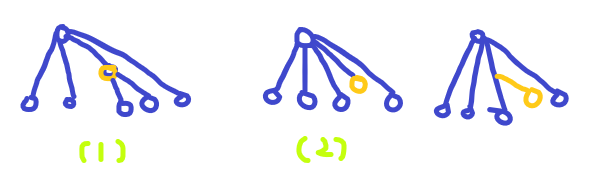
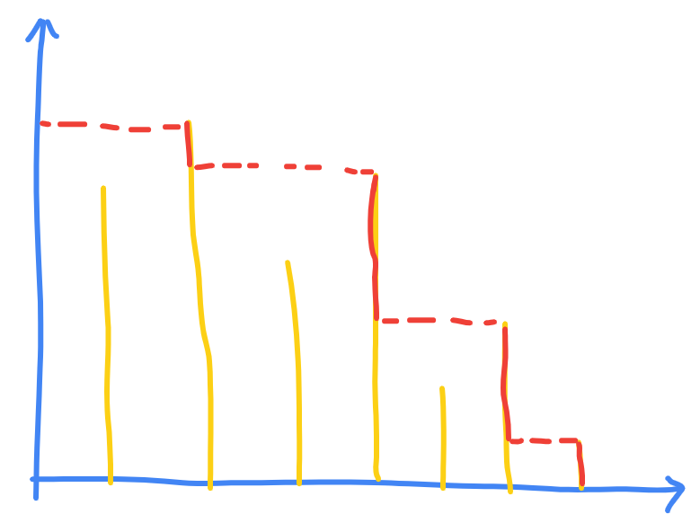

??? note "The Pilots Brothers' refrigerator"

    **标签： 位运算**

    我们发现对于同一个点进行两次反转操作相当于什么都没做

    所以我们直接枚举每一个点反转还是不反转，然后直接模拟即可。

??? note "P6599「EZEC-2」异或"

    **标签： 位运算**

    由于每一个二进制位独立，考虑分开处理

    对于一个二进制位，如果有 `x` 个 `0` 和 `y` 个 `1`，则此位贡献的答案为：`ans = x * y`

    因为 `x + y = l`

    所以 `x * y <= (x+y) * (x+y) / 4`，即 `x = y = l / 2`

??? note "P6225 [eJOI 2019] 异或橙子"

    **标签： 位运算**

    由于异或具有交换律，所以当 `l=2,r=4` 时
    ```
    ans = a2^a3^a4^a2^a3^a3^a4^a2^a3^a4
        = a2^a4
    ```
    我们能够发现:

    - 当 `l`,`r` 奇偶性不同，`ans=0`
    - 否则，取每隔一个异或。

    所以直接用 树状数组 维护

??? note "P9915「RiOI-03」3-2"

    **标签： 位运算**


    首先我们发现其中有一个重要的性质：

    $$
    0\le x\lt \min(2^n, 10^{18})
    $$

    所以我们其实只需要特判一下 左上角那一片`0`:

    ```cpp
    0 0 0
    1 0 0
    · 1 0
    1 1 0
    · · 1
    · · ·
    ```
    其他的联通块绝对走不出:
    $$
    (x,y) ~~ x \in [0,2^{63}],y \in [0,63]
    $$
    这些点，所以我们可以直接暴力到当前连通块的最右端，然后直接计算。

    这里有一个函数可以计算一个点是 0 还是 1.
    ```cpp
    bool ask(int x,int y){//查询 (x,y) 为 1 为 0
        int z=(1ll<<(y+1));
        if(x%z < z/2) return 0;
        else return 1;
    }
    ```

??? note "P4310 绝世好题"

    **标签：DP 动态规划**

    我们定义 `f[i]` 为当连续字串最后一个第 `i` 位的值为`1`时的最大长度。

    所以对于 一个`x=a[i]`

    $$
    f_j=\max_{_{x 的第 u 位为 1}} f_u+1 ~~~~~_{(x 的第 j 位为 1)}
    $$

??? note "P1381 单词背诵"

    **标签：hash，双指针**

    我们只需要进行一下 hash 然后直接一个双指针。

    但是要特判一下 `ans = 0,0`。

??? note "P4688 [Ynoi Easy Round 2016] 掉进兔子洞"

    **标签：bitset**

    我们发现其实 `ans = len1+len2+len3-3*(相同元素个数)`.

    我们可以将每一个区间的值按下标存储到 `bitset` 中，然后直接进行 `&` 操作，即可得到其相同元素个数。

    ~~然后问题就解决了？~~

    我们注意到按照下标存储处理的一定是 **不可重集合**，而这一道题要求可重，所以我们需要先对其进行离散化

    如对于全集为 `{1,1,2,3,3}`，处理区间集合为 `{1,2,3,3}`

    存储的 `bitset` 为：

    ```cpp
    全集：00000000000111110
    集合：00000000000111010
            n   <-----    0
    ```

    这个样子才能解决。

    ~~然后问题就解决了？~~

    我们发现如果每一次都重新把每一个区间存入其中，与暴力没什么两样，但是我们发现每一个区间之间有很大的重叠，所以考虑与莫队结合，这样就可以以大概为 $\mathcal O(N\sqrt{N})$ 的时间处理每一次把对应区间元素插入集合。
    但是还有一点需要注意：

    虽然说 `bitset` 的空间复杂度比较小，但是因为是离线，我们要求把每一次询问产生的 `bitset` 记录下来，一遍统计答案，所以 $\mathcal O(\frac{N^2}{w})$ 会炸，需要将其分为多个部分（每一个处理 `2e4` 次询问）。

??? note "CF126B Password - 洛谷"

    **标签：KMP**

    首先题目需要找的是一个字串满足即使前缀，又是后缀，还在中间出现。

    满足即使前缀，又是后缀及其 **公共先后缀**，可以使用 `while(j) j=nxt[j]`，遍历所有。

    但是如果考虑在中间也出现过，其实就是一个前缀的 **公共前后缀**，所以直接使用一个桶存储，就可以解决这个问题

??? note "P1470 [IOI 1996 / USACO2.3] 最长前缀 Longest Prefix - 洛谷"

    **标签：KMP**

    这里我们定义 `f[i]` 为长度为 `i` 的前缀是否能够被拼出

    可以推出递推式：`f[i]|=f[i-s[i].size]` ,（`s[i].size` 表示第 `i` 个字符串的长度）。

    这里有一个条件，就是这个时候的后缀必须与 `s[i]` 完全匹配。

    所以直接使用 **KMP** 就可以了，用 **hash** 的效果一样。

??? note "P4696 [CEOI 2011] Matching - 洛谷"

    **标签：KMP**

    重点依然是如何重定义两个字符是相同的。

    首先我们需要确定为什么能够使用 KMP。

    > **这里十分重要！！！**
    >
    > KMP 的一个利用特性在于字符串的连等：`S1=S2 , S2=S3 => S1=S3`。
    >
    > 这道题目显然满足，我们可以把题目中的第一个序列 `a[]` 转换为 `b[]`，即以值为下标，存储数值为位置。
    >
    > 例如序列 `2 1 5 3 4` 变成 `2 1 4 5 3`。
    >
    > 这个样子就可以把两个序列相等的条件转化为两个序列经过离散化之后相同，比如 `4 2 ==> 2 1` 与 `2 1` 相同。
    >
    > 这个时候显然有连等性。

    然后考虑如何定义相等：

    - 思路一：我们发现只要两个序列中当前比较字符的比他小的元素的个数相等，那么一定相同，于是出现了题解中有一篇使用树状数组的解法。
    - 优化：我们可以变为比较其前驱和后记，记录一下其中一个字符串每一个字符相对其前驱和后继的距离，然后再另一个字符传中是否也满足前驱后继（直接比较大小）。

    但是这里也有一个需要注意的，我们记录的前驱和后继必须是在当前比较区间中的（下面那一道题一样）。

    因为当前比较的字符一定是目前区间的最后一个，所以只需要保证前驱和后继都在当前字符之前，所以直接搞一个链表，然后从后往前便利，把一个字符处理完了之后就把他在链表中删去（把前后连在一起）。

??? note "P5256 [JSOI2013] 编程作业 - 洛谷"

    **标签：KMP**

    如果把'相同'当作完全相同，则这就是一个 **KMP** 板子，所以我们主要是要知道如何判断两个字符是 **相同的**。

    我们定义两个数组 s，t，表示当前字符对应的最近的上一个字符的距离，如 `abcab` 为 `00033`,（这里仅是示例），我们可以观察到如果两个字符串是'相同的'，则它们按这个规则组成的数组也一定相等 $\color {white} 吗$。

    有一种特殊情况，比如 `ababb` 和 `cdd`。这时两个分别为 `00221` 和 `001`, 所以需要特判是否在比较范围内，及 **KMP** 时的 `j`.

??? note "P5304 [GXOI/GZOI2019] 旅行者"

    **标签：二进制分组：**


    对于这种求两两点都要计算的问题（求得是最小值，因而可以重复计算）。

    我们可以拆分成多个 **A**，**B** 两个点集的之间的关联。

    我们按照二进制的每一位 $0/1$ 区分 **A** **B**，因为两个不同的点至少有一位二进制不同。

    这样假设处理两个集合之间子问题时间复杂度为 $\mathcal O(f(N))$ 那么总体时间复杂度为 $\mathcal O(\log N * f(N))$。

??? note "P6880 [JOI 2020 Final] 奥运公交 / Olympic Bus"

    **标签：图论，最短路**

    这里主要是一个优化：

    > **优化：**
    >
    > 这里要求不经过那一条边的最短路
    >
    > 可以预处理出没有该条件的普通最短路组成的树：
    >
    > - 如果去除的这一条边不是树边，那么直接返回预处理的值
    > - 否则重新计算
    >
    > 这样因为树边只有 $N-1$ 条，所以最多跑 $N$ 次最短路。

??? note "P2371 [国家集训队] 墨墨的等式"

    **标签：同余不等式**

    首先我们能够想出一个暴力建图的做法。

    我们连接每一个 $(i,i+a_j)$ 然后求解从 $0$ 出发的连通性，但是很明显这样要有 $1e12$ 个点，不知道多少条边。

    所以我们需要找到一种办法减少图的规模。

    我们令 $a_{min}$ 为 $a_i$ 中最小的一个；

    我们把所有目标是 $x$ 满足 $x \equiv y \mod a_{min}$ 放在一起计算，假设此时通过凑 $a_i$ 能凑出 $sum \equiv y \mod a_{min}$ 的 $sum$ 为 $dis_y$，那么这一组的 $ans = \lfloor{\frac{x-dis_y}{y}}\rfloor+1$ 所以需要让 $dis_y$ 最小。

    所以连接边 $(i,(i+a_j)\mod a_{min})$ 求解最短路。

??? note "P7515 [省选联考 2021 A 卷] 矩阵游戏"

    **标签：图论，差分约束**

    这里如果没有 ($0 \le a_i \le 10^6$) 是十分简单的。

    我们规定最后一列一行都为 0，就可以依次推出所有 $a$ 的值，但是不满足题目要求。

    所以我们可以选择调整。

    基础做法是对于 每一列 每一行，奇数增，偶数减。

    吧每一行每一列增减个数作为未知量进行差分约束

    但是这样 **有破绽**，就是有可能会出现 $0 \le a_{i,j}+L_{i}+R_j \le 10^6$ 或 $0 \le a_{i,j}-L_{i}-R_j \le 10^6$，差分约束无法解决。

    我们其实只需要改变调整的方法，变成：

    ```text
    L:

    + - + - + -
    - + - + - +
    + - + - + -
    - + - + - +
    + - + - + -

    R:

    - + - + - +
    + - + - + -
    - + - + - +
    + - + - + -
    - + - + - +
    ```

    这样就不会出现了.

??? note "P2045 方格取数加强版"
    **标签： 网络流**

    对于每一个格子，分成一个入点和一个出点。

    在之间连边：

    - 流量 $1$，费用 $a_{i,j}$。
    - 流量 $k-1$，费用 $0$。

    格子之间连边：

    - 流量 $k$，费用 $0$

    然后从 $(1,1)$ 的入点 到 $(n,n)$ 的出点 跑最大费用流。

??? note "P3358 最长 k 可重区间集问题"
    **标签： 网络流，最大流**

    对于每一个点 $i$，连接 $i+1$ 流量 $k$,费用 $0$ 表示最多每一个点被覆盖 $k$ 次。

    然后对于每一条线段，链接 $(l,r)$，流量 $1$，费用 $len$，表示每一条线段只能被走一次，计算一次贡献。

    然后跑最大费用。

??? note "P4249 [WC2007] 剪刀石头布"

    **标签：网络流，费用流**

    首先我们可以考虑 **正难则反**，计算没有三个点不组成三元组的个数。

    我们能发现此时有一个点入度为 $2$ , 一个点入度出度都为 $1$，一个点出度为 $2$。

    所以对于一个点 $x$，如果他入度为 $du_x$，那么会产生 $C_{du_x}^2$ 对三元组不组成成环。

    所以 $ans=C_n^3-\sum C_{du_x}^2 = C_n^3-\sum \frac{du_x*(du_x-1)}{2}=C_n^3-\sum{\frac{du_x^2}{2}} + \sum \frac{du_x}{2}$。

    而 $\sum du_x = \frac{n*(n-1)}{2}$，于是我们需要最小化 $\sum {\frac{du_x^2}{2}}$。

    由于对于一串 $x^2$：$1,4,9,16,25···$ 差分后为 $1,3,5,7,9···$，所以我们对于一个点 $x$，拆成两个点，一个入，一个处，然后入点出点之间连接多条边，容量都为 $1$，费用为 $1,3,5,7,···$。

    因为如果流这个点，就一定会先走小的边，所以总费用就按照 $1,4,9,16,25···$ 累加。

    然后对于每一个边，建一个点，连接他对应的两个顶点，并从 $s$ 连接一个容量为 $1$ 的边，表示这个边最多选择一个方向。

    最终的图类似如下：

    

    然后跑 $\texttt{Dinic}$，输出方案。

??? note "善意的投票 / [JLOI2010] 冠军调查"

    **标签：网络流，最小割**

    最小割解决的问题就是需要分配多个东西到两个集合，使得代价最小。

    这道题睡不睡午觉就是两个选择，如果一个节点（表示一个人），连接了 $S$ 说明他选择不睡，如果一个节点最后保持 $T$ 说明他选择睡

    所以我们连两种边。

    - 对于违背自己意愿：如果本来要睡，连接 $T$，容量为 $1$，不睡同理。
    - 对于违背朋友意愿：连接自己和朋友，容量为 $1$。

    然后求最小割。

??? note "P4313 文理分科"

    **标签：网络流，最小割**

    和上一道题基本相似，主要是处理同时选择三个人。

    我们可以把那三个人连接到一个虚拟点上，在有那个点链接到 $S$ 或 $T$

    一个小技巧，如果把一条边设为 $\inf$，那么代表一定不能割这一条边。最开始我陷入的思维误区就是既然一定不能割这一条边，那么被连接的三个点补救一定会在一边了嘛？

    

    这个主要是边是单向边，然后最小割是割边直到 $S$ 不能到 $T$，所以我们有两个选择：

    1. 割掉 **虚拟点** 到 **源汇点** 的路径，代表不然这三个点在一遍，此时就算不割掉 $\inf$ 的边，通过这条路也无法到达 $T$
    2. 割掉 **源汇点** 到这三个点的边，代表三个点在一边。

??? note "P3227 [HNOI2013] 切糕"

    **标签：网络流，最小割**

    同样的道理，边的长度为 $\inf$ 代表必须选择在同一边，这里分配长方体每一个点的两个选择为是否切下来，代价为不和谐值。

??? note "P3749 [六省联考 2017] 寿司餐厅"

    **标签：网络流，最大全闭合子图**

    > **最大全闭合子图**
    >
    > 基础模板问题是有 $n$ 个选择，每一个选择有一个贡献（可能为负），然后但是如果选择计算了一个贡献，就必须得要计算其他一些提前设定好的贡献，每一个贡献只能记算一次
    >
    > 首先建图，对于依赖进行连边，依然是进行最小割。
    >
    > 但是我们发现不太好处理容量为负的最小割，所以对于点权为负的节点我们先默认不其计算贡献，然后连接到 $T$，如果割掉代表选择该节点。
    >
    > 然后边权为正就连接 $S$，如果割掉就代表不选择该节点

    有了这个模板这个题也就是一个模板了。

??? note "P4843 清理雪道"

    **标签：网络流，上下界网络流**

    首先对于每一条边，必须被走一次，所以设定每一条边为下界 $1$，上界为 $\inf$。

    而对于每一个点
    - 从 $S$ 连过去，下界 $0$，上界 $\inf$，表示一条路径从这里出发。
    - 连接到 $T$，下界 $0$，上界 $\inf$，表示一条路径在这里结束。

    然后跑上下界最短路

??? note "CF708D Incorrect Flow"

    **标签：网络流，上下界网络流**

    **题目概述：** 对于一个流量不平衡的一个网络流调整流量和容量，使其满足网络流要求，不一定是最大流。

    首先分成两种情况：

    1\.  $f(e)\le g(e)$

    - 流量减少，从而调整流量平衡，这个操作最多进行 $f(e)$ 次。
    - 流量增加，从而调整流量平衡，这个操作最多进行 $g(e)-f(e)$。
    - 流量和容量同时增加，能做无限次。
    - （容量一定不会减少，费用自己应该都知道）

    2\. $f(e) > g(e)$

    首先能够确定，要么加 $g(e)$，要么减少 $f(e)$，一定会先操作 $f(e)-g(e)$ 次使得流量小于等于容量。

    - 流量减少，这个操作可以进行 $f(e)-g(e)$ 次，费用为 $0$。
    - 流量继续减少，这个操作进行 $g(e)$ 次，费用为 $1$。
    - 流量和容量继续增加，这个操作进行无限次，费用为 $2$
    - （这里如果流量增加，那么容量也一定会继续增加）

    然后就是一个问题，如何确保最后流量守恒，直接连一条上下界都为 $f(e)$ 的边，相当于固定流量。

    然后就直接跑上下界最小费用流：

    ??? note "**上下界最小费用流:**"

        1. 加边是记录每一个点流量不匹配的值，`du[a]-=c,du[b]+=c;`。
        2. 对于流量不匹配的点连接超级源点。
        3. 连接 $t$ 到 $s$ 流量为 $\inf$。
        4. 从超级源汇点跑 $\texttt{Dinic}$。

        ```cpp
        namespace UDFLOW{
            //有源汇上下界最小费用可行流

            ll sum;

            int du[N];
            void add(int a,int b,int c,int d,int w){
                FLOW::add(a,b,d-c,w);
                du[a]-=c,du[b]+=c;
                sum+=1ll*c*w;
            }

            ll solve(int n,int s,int t){
                int ss=n+1,tt=n+2;
                for(int i=0;i<=n;i++){
                    if(du[i]>0) FLOW::add(ss,i,du[i],0);
                    if(du[i]<0) FLOW::add(i,tt,-du[i],0);
                }

                FLOW::add(t,s,inf,0);

                FLOW::Dinic(n+2,ss,tt);
                return sum+FLOW::cost;
            }
        }
        ```

??? note "P4251 [SCOI2015] 小凸玩矩阵"

    **标签：网络流，二分图**

    每一行每一列选一个，一看就像是二分图。

    所以左部为 $i$，右部为 $j$。

    然后显然答案具有单调性，所以把所有 $A_{i,j} \le mid$ 的点加入二分图中 $(i,j)$，然后看一下最大匹配是否大于 $n-k+1$。

??? note "P2764 最小路径覆盖问题"

    **标签：网络流，二分图**

    其实就是每一个节点需要最多选择一个节点接下去，此时这两个点就在一个路径上了。

    所以把每一个点拆分成一个入点和一个出点，然后连边时从入点连到出点，然后跑二分图。

    最后每一个左端点选择的右端点就在同一个路径上。

??? note "P4055 [JSOI2009] 游戏"

    **标签：二分图，网络流**

    一道图博弈的模板题：

    ??? note "图博弈"

        对于一个 **DAG (有向无环图)**，最开始一个棋子放在 $x$。

        每一个人一次移动一次通过一条边。

        当一个人无法走动是他就输了。

    > **结论：**
    >
    > 如果这个点 $x$ 是最大匹配的闭经点，那么先手必胜。
    >
    > 否则先手必败

    **证明:**

    首先一个 **DAG** 一定是一个**二分图**。

    然后进行一次二分图最大匹配（任意方案）

    然后如果 $x$ 是最大匹配的闭经点，那么他一定在一对匹配边上，因此一定可以移动到另一个成对的点上。

    这样子他们走的路一定是一条 **增广路**，但是如果后手走到了一个未匹配的点上，那先手不久输了吗？

    但是此时我们可以通过饭方 **增光路** 上的匹配信息从而把这个点变成匹配点，起点不是匹配点，此时不满足
    $x$ 是最大匹配的闭经点。

    因此如果先手必败：

    - 对于当前情况，$x$ 为未匹配点。
    - 能够从一个未匹配点通过一条 **增广路** 到达 $x$。

    > **实现：**
    >
    > 对于这道题，需要验证多个点是否为必胜点。
    >
    > 所以可以从每一个为匹配点跑 dfs 跑增广路，走到的点打上标记。

??? note "P4298 [CTSC2008] 祭祀"

    **标签：二分图，最长反链**

    > **最长反链**
    >
    > 对于一个 **DAG**，寻找一组点，满足这组点互相无法到达，且点数最多

    **定理：** **最长反链** 长度为 **可重最少路径覆盖** 的路径数。

    ~~这个证明我只会感性证明：~~
    > **证明：**
    >
    > 先证 $A$ 的确是一个反链：这是容易的，因为任取 $x \in A$，$x_{in}$ 就一定是被 DFS 到的点，而 $x_{out}$ 一定是没被 DFS 到的点，任何两个 $x, y \in A$ 之间若是有连边就和 DFS 的过程冲突了。
    >
    > 首先有 $|I| = 2n - |S| = 2n - m$，而 $|I| - |A|$ 可以看作是满足「$x_{out}$ 或 $x_{in}$ 属于 $I$」的 $x$ 的个数，显然这样的 $x$ 不会超过 $n$ 个，所以 $|I| - |A| \le n$，所以 $|A| \ge |I| - n = n - m$。
    >
    > 但是 $A$ 再大，也不能大过 $n - m$，所以 $|A| = n - m$，也就是一个最长反链。
    >
    > **by 小粉兔**

    但是对于构造一组方案怎么办。

    1. 首先可以排除选 **链头/链尾**，自行构造
    2. 既然是选择中间的点，这个就很难办了

    但是我们可以先解决下一问，即那些点可以被选，

    我们只需要把当前枚举到的点的上下游都删除，然后在跑一次，如果 $ans' = ans-1$ 那么说明这个点可以选。

    此时我们已经知道拿一些点能够选了。

    所以我们只需要一次选择那些可以选且不在已选点上下游的点，然后就可以得到一组构造。

??? note "ARC106E Medals"

    **标签：二分图，Hall 定理**

    首先 $nk\le ans \le 2nk$

    然后明显外面是一个二分答案，现在假设当前正在执行 `check(x)`，$x$ 表示需要 $x$ 天。

    然后建出二分图，即左边每个人有 $k$ 个点（表示每一个奖牌），右边有 $x$ 个点（表示每一天），然后每一个左部点连到所有他工作的时间，然后如果存在完美匹配，就返回 $1$。

    但是很明显会 **TLE**。

    首先我们发现对于一个点分裂的 $k$ 个点，他们连的边一定是相同的，所以未了让 $|S|$ 尽量大，所以可以在枚举左侧端点子集时直接选择它的所有 $k$ 个点，因而假设现在枚举子集只需要枚举 $n$ 个人 **选 or 不选**,此时左侧节点个数为 $|S| = mk$（$m$ 为选人的数量）。

    但是对于右侧节点，我们假设 $d_i$ 为第 $i$ 天上班人的集合，所以我们需要找到的是 $|S|$ 和 $d_i$ 有交的结点个数。

    有交不是很好求，但是我们可以转化为 **总结点 - 不相交的节点**，而不相交的节点相当于 $|S|$ 的补集的子集。

    对于求解一个 $s_i$ 为有多少天工作人集合为 $i$ 的子集，这个就好求多了。

??? note "P5811 [IOI 2019] 景点划分"

    **标签：DFS 树**

    首先通过贪心策略，如果 $a \le b \le c$，那么选择 $a$ 和 $b$ 使他们联通一定是最优的，我们顺带还能得出结论 $a \le \frac{n}{3}, b \le \frac{n}{2}$。

    > **对于图为树的情况**
    >
    > 这个问题其实等价于找到一条边，是的这条边左右两边的大小一个大于 $a$，一个大于 $b$。
    >
    > 假设当前一边为 $x$，那么另一边为 $n-x$。即 $n-x \ge b , x \ge a $，所以 $a \le x \le n-b$。
    > 有或者前一边为 $n-x$，那么另一边为 $x$。即 $x \ge b , n-x \ge a$，所以 $n-b \le x \le a$。
    >
    > 将上面两个合并，$x \in [a,n-a]$。于是，我们就相出了树的解法：计算每一颗子树大小，然后看看有没有子树满足要求。

    但是对于图呢？

    我们发现如果原图为 $\texttt{True}$ 一定存在该图的一种生成树满足求出一种解。

    所以我们考虑先随便选一颗生成树（比如 DFS 树），然后进行调整。

    但是如何调整呢？？

    首先我们寻找是否有子树大小在 $[a,n-a]$ 之间的，如果有，直接输出构造方案。

    如果没有，那么找到深度最大的一个点 $x$ 满足其子树大小大于 $\frac{2n}{3}$，现在我们需要想一些办法把他的子树大小减小到 $[a,n-a]$（此时只能减小这个子树大小，因为其他子树大小总和加起来也最多只有 $\frac{n}{3}$）。

    如果这颗子树是孤立的（相当于没有返祖边），那么一定无法调整，直接为 $\texttt{False}$。

    如果存在返祖边，就可以连接返祖边为树边，是的这颗大子树的子树大小减去返祖边引导的子树大小，可以发现此时一定有解。

    > **证明：**
    >
    > 返祖边引导的子树大小满足 $siz \in [1,\frac{n}{3}]$，而大子树满足 $siz \in [\frac{n}{3},\frac{2n}{3}]$，因此固然不可能直接减到 $[1,\frac{n}{3}]$。
    >
    > 因为 $[\frac{n}{3},\frac{2n}{3}] \subset [a,n-a] $，所以一定能够构造出解。
    >
    > 至于解法，就是不停的找到返祖边，然后删掉他的子树。

    **代码实现过于困难**


??? node "[CF1470D Strange Housing](https://vjudge.net/problem/CodeForces-1470D#author=translator:1281311:zh)"
    **标签： DFS序**

    首先注意到这道题只要输出一种解，考虑构造。

    直接给出答案： 按照DFS顺序一个选，如果这组数据有答案，一定能够构造出一组解。

    证明也十分简单：

    - 如果当前枚举节点所有相连节点都没有被选（即可以选择这个点），那么选择这个点之后一定连通。
    - 如果当前枚举节点无法选择，那么一定存在他的一个父亲（或者返祖边连接的祖先）被选择，此时依然连通。


??? node "[CF51F Caterpillar](https://vjudge.net/problem/CodeForces-51F#author=translator:1281311:zh)"

    **标签： 圆方树**

    首先对于多个连通块，我们只需要把他们分别处理之后使用 $sum-1$ 次将他们连在一起。

    然后对于一个普通的图，对于一个 **边双连通分量** 中的节点，一定是要合并在一起的，所以先处理了。

    然后现在相当于面对的是一颗普通的树：

    首先答案为 总点数 -  选择的那条链的点数 - 不在链上的叶子节点
     
    所以我们发现链一定是要越长越好，所以直接选择直径。

??? node "[CF1893E Cacti Symphony](https://vjudge.net/problem/CodeForces-1893E#author=translator:1281309:zh)"

    **标签： 仙人掌，圆方树**

    因为 图的一条边被称为好的，如果它相邻顶点的权重的按位异或不等于0，且不等于这条边的权重。

    所以这个这个边的权值一定是两边点权其中一个。

    相当于先对每一个点染色，然后再对于每一条边定向。

    然后考虑对于对于每一个点的约束：

    !!! info "点的约束"
        假设当前点点权为 $a$ ，然后其余两个点权为 $x$ 和 $y$ ，所以 $x \oplus y = a$ 。

        此时总共疑惑和为（ $E$ 为当前点每一个颜色的边数）: $((E_a \mod 2)\times a) \oplus ((E_x \mod 2)\times x) \oplus ((E_y \mod 2)\times y)$ 。

        相当于： $((E_a \mod 2)\times a) \oplus ((E_x \mod 2)\times x) \oplus ((E_y \mod 2)\times (a \oplus y))$ 。

        ···

        最终可以推出入边数一定是奇数。

    
    我们发现如果 $n,m$ 奇偶性相同，一定能够找到一组解。

    ~~ 未完工

??? node "[CF1763F Edge Queries](https://vjudge.net/problem/CodeForces-1763F)"

    **标签： 仙人掌，圆方树**

    简单的模板。

    求两条路径之间的非割边数量。

    对于一个 **点双连通分量** ， 如果点数一共只有2个（不算方点），那么此时这个点双一定只包含一条边，此边为割边。

    所以对于所有方点，如果其对应的 点双 不是只有两个点，就给他复制为其包含的边数。

    然后查询跑两个点的路径权值和。

??? node "[P8496 [NOI2022] 众数](https://www.luogu.com.cn/problem/P8496)"
    
    **标签： 线段树合并，链表**

    首先观察到什么序列增删合并，很容易就想到使用链表维护。

    然后很容易能够对每一个序列维护一个权值线段树，因此此时链表合并时同时进行线段树合并。

    但是最麻烦的是如何对于多个序列相连之后求众数。

    如果暴力合并这几个序列询问出现次数最大的哪一个数，我们发现不能对于每一个序列预处理。

    由于本题定义的众数是出现数量严格大于一半的数，可以得到这个数一定是中位数。

    所以我们可以直接同时查询所有涉及到的线段树的中位数（线段树上二分）。

??? node "[P3241 [HNOI2015] 开店](https://www.luogu.com.cn/problem/P3241)"
    **标签： 点分树**

    就是一个点分树模板，但是注意到直接写线段树会 MLE，而且没有修改操作。

    所以直接使用 vevtor+前缀和 代替线段树。

??? note "[P6624 [省选联考 2020 A 卷] 作业题](https://www.luogu.com.cn/problem/P6624)"
    **标签： 矩阵树定理**

    首先我们需要想办法把 $gcd$ 拆掉， 由于 $𝑛=\sum_{𝑑|𝑛}\varphi(𝑑)$ ，所以我们可以把答案变成： 

    $$
    \begin{align}
    ans &= \sum_T [\sum_{e_i\in T} w_{e_i} *gcd(T)]\\
    & = \sum_{e_i\in T} w_{e_i} * \sum_{d|gcd(T)} \varphi (d) \\
    & = \sum_d \varphi (d) * \sum_{T} [\forall e_i\in T,d|w_{e_i}] w_{e_i}
    \end{align}
    $$

    相当于枚举一个属 $d$ ，然后加入所有 $d|w_{e_i}$ 的边，求他们所有生成树的边的权值和。

    但是如何求解权值和呢，由于对于矩阵树定理，边权不一定是一个树，只要是能够相乘的数据都可以，所以我们可以令边权为 $(1+wx)$ 此时如果两数相乘得到 $(1+w_1x)(1+w_2x) = 1 + (w_1+w_2)x + w_1*w_2*x^2$ 我们只需要在 $\mod x^2$ 的情况下计算，此时最后的答案就是最后表达式的一次项系数。

    但是如何处理除法呢，当然是逆元了： 我们令 $(a+bx)(c+dx)=1\mod x^2$ ，所以此时 $bc+ad=0, ac=1$ 因而 $(a+bx)(\frac{1}{a}+\frac{b}{a}x)=1\mod x^2$ ，然后就求出逆元了（注意 $\frac{1}{a}$ 是分数，需要求解逆元）。

    这里可以总结一下矩阵树定理的适用条件：
    1. 求解的是一种所有生成树的边权乘积之和。
    2. 满足边权能够进行相乘，相加
    3. 满足边权能够使用分配率： ($c*(a+b) = c*a+c*b$)

??? note "[P8215 [THUPC 2022 初赛] 分组作业](https://www.luogu.com.cn/problem/P8215)"
    **标签： 最小割**

    首先这里我们最小割模型：

    !!! info "最小割模型"
        现在有 $n$ 个 bool 值 $p_i$ 满足以下几种关系：

        1. 如果 $p_i$ 为 $0$ 那么代价为 $w_u$
        2. 如果 $p_i$ 为 $1$ 那么代价为 $w_u$
        3. 如果 $p_i$ 为 $0$ 并且 $p_j$ 为 $1$ 那么代价为 $w_u$
        4. 如果 $p_i$ 为 $1$ 并且 $p_j$ 为 $0$ 那么代价为 $w_u$

        此时对于最小割 ($S$ 表示 $1$， $T$ 表示 $0$)，我们分别连边：

        1. $(s,i,w_u)$
        2. $(i,t,w_u)$
        3. $(j,i,w_u)$
        4. $(i,j,w_u)$

        此时求解最小割就是最小代价，证明参考最小割。

        但是注意到此模型对于两个点的约束条件只能处理值不同的情况，所有有的时候可以采用把某些固定的 $p_i$ 让他表达的意思相反。

    然后剩下的就是一个板子了

??? note "[P14832 [THUPC 2026 初赛] Unpair Ampere](https://www.luogu.com.cn/problem/P14832)"
    **标签： 最小割**

    首先我们需要处理同时能被太阳能和火力到达的情况：
    
    此时我们对于整个图取一个反图，然后如果一个点 ($p$) 存在能被太阳能和火力到达的情况，令火力为 ($x$) 太阳能 ($y$) ，一定存在两条路径 $x \to p$ 和 $p \to y$ （存在于两条路径上）。 所以我们只需要建设一个正图和一个反图，中间连边：

    - 对于正图之中的边或者反图之中的边，边权为 $inf$
    - 对于用电设施连接正图和反图，边权为 $a_i$
    - 对于供电设施连接正图和反图，边权为 $inf$
    - Other

    图解： 
    
    

    但是注意有可能同时剪掉 $S$ 和 $T$ 往外的所有路，所以需要给他们的边权加一个 $V$ 。

??? note "[P5934 [清华集训 2012] 最小生成树](https://www.luogu.com.cn/problem/P5934)"
    **标签： 最小割**

    我们可以思考一下边 $(x,y,w)$ 在最小生成树上的充要条件：

    把边权在 $[1,w-1]$ 的边全部插入之后 $(x,y)$ 不连通。

    （最大生成树同理，充要性显然，相信未来看到这篇总结的你一定知道 ~~吗？~~。）

    然后既然是需要求删去多少条边之后 $(x,y)$ 不联通，那么就是一个最小割模板。

    注意最小最大生成树的出的答案应当直接相加，因为他们删去的边一定是不相交的。

??? note "[P4336 [SHOI2016] 黑暗前的幻想乡](https://www.luogu.com.cn/problem/P4336)"
    **标签： 矩阵树定理**

    首先这里道题相比于矩阵树定理模板差别就在于一个公司只能修建一条边。

    所以我们考虑容斥，因为最开始如果我们不考虑这个限制直接计算生成树个数那么其实就是多算了至少有一个公司没有建边的方案数，转化为式子就是：

    $$ ans  = \sum_{k=1}^{n} (-1)^{k-1} \sum_{1 \le i_1 < i_2 < \cdots < i_k \le n} f_{i_1,i_2,i_3,\cdots,i_k}$$

    （这里 $f_{a,b,c,d,\cdots}$ 表示的是使用着一些公司建设的方案数，可以有公司不建边）

??? note "[P4768 [NOI2018] 归程](https://www.luogu.com.cn/problem/P4768)"
    **标签： Kruskal重构树**

    首先形式化提议就是要求解一个点 $x$ 使得从 $v$ 到 $x$ 的边全部满足 $w>p$ 。

    然后询问 $x$ 离 $1$ 距离的最小值。

    由于 Kruskal重构树 满足一个 "子树对应 Kruskal 过程中的一个连通块" 并且 "同一到根链上点越深，权值越小/大。" .

    所以我们直接在 Kruskal 重构树上倍增跳到祖先中最上面的节点 $x$ 满足 $val_x>p$ 。 然后此时 $x$ 在重构树上的子树中的节点都是可取的，然后直接子树查询到达 $1$ 的最短路径就可以了。
    
??? note "[P3831 [SHOI2012] 回家的路](https://www.luogu.com.cn/problem/P3831)"
    **标签： 分层图**

    看到两种交通网络，就知道一定是分层图，建两次一个为横一个为竖。然后在中间每一个换乘站之间连边。

    但是 $n\le2*10^4$ 所以直接建出有 $2*n^2$ 个点，一看就不行，但是我们其实只需要在起点，终点，换乘站处建点。就可以了。

    但是他的起点和终点也必须离线之后加进去。

??? note "[P3264 [JLOI2015] 管道连接](https://www.luogu.com.cn/problem/P3264)"
    **标签： 斯坦纳树**

    这道题与普通斯坦纳树的区别就在于他只需要组成一个斯坦纳树森林。

    换句话说，就是应当是对于每一组满足联通性。 但是这个样子就一定对吗？

    不，可能会算重。因为不同组别产生连通性时可能会有重复的边，但是当有重复的边时就一定会是这两个组别之间也联通。

    所以现在就变成了对于许多点分组，满足题目给出的一个组别全部都在现在分的同一组。

    为了方便，我们直接对于原来的点分组，当计算一个点的代价时，把他整个组都算上（每次计算一个组只算一次）。

    为什么这样没有问题呢，不会算多吗。 会算多，但是因为枚举了所有情况，又是取得最小值。所以算多的情况被排除了。

??? note "[P8499 [NOI2022] 挑战 NPC Ⅱ](https://www.luogu.com.cn/problem/P8499)"
    **标签： 树哈希**

    这道题目一个十分暴力的思路就是对于每一个子树，我们枚举他们儿子的对应关系。

    但是我们发现，两颗树上两个对应位置的子树哈希值最多有 $2k$ 个是不同的，否则一定无法变出来。

    但是哈希值相同的子树一定是拼在一起的吗？ 这是一定的，因为如果 $A=B$ （指的是哈希值），$C \to B$ （指的是 $C$ 可以通过删减子树变成 $B$）, $A \to D$ ，那么 $C \to D$ ，即可以仅仅只通过变化 $C$ 从而使两颗子树平衡。

    所以我们只需要暴力枚举 $k$ 颗子树的组队情况。 由于一共只有 $k$ 个点可以被删改， 所以可以证明时间复杂度为 $\mathcal O(k!N)$。

??? note "[P7520 [省选联考 2021 A 卷] 支配](https://www.luogu.com.cn/problem/P7520)"
    **标签： 支配树**

    首先肯定是要先建出来一颗支配树的， 然后考虑加上一条边 $(u,v)$ 之后的变化。

    有一个十分明显的结论： 增加边之后支配集合一定只会变少。

    如果对于一个节点 $x$ 他的支配集合有变化， 那么一定存在一条道路 $1 \to u \to v \to x$ 。并且这条道路不会经过支配树上 $1 \to x$ 中的某一个点。

    但是很明显如果想要处理不经过任意一个点不太好求，但是我们发现如果节点 $x$ 支配改变了，那么他在支配树上的子树也一定改变了。 所以我们更改条件为仅仅不经过 $idom(x)$ 即 $x$ 在支配树上的父亲。

    此时求解的东西就变成了需要寻找 $1 \to u \to v \to x$ 的路径并且不经过一个节点 $fa_x$ ，通过图像如下：

     

    然后我们只需要对于每一个节点 $x$ 预处理，删去 $fa_x$ 之后跑返图看一下能够从拿一些节点通过不走 $fa_x$ 到 $x$ 。

    当然还有一点是 $fa_x$ 不能为 $1 \to u$ 的支配点，否则此时 $fa_x$ 在 $u$ 上方并且是必经点。

??? note "[CF1583H Omkar and Tours](https://www.luogu.com.cn/problem/CF1583H)"
    **标签：Kruskal重构树**

    首先第一问十分简单： 我们只需要先把查询离线下来，然后从小到大加入边。然后计算一个并查集。

    对于第二题，相当与是要在第一问的基础上寻找路径最大值的最大值。所以我们使用 Kruskal 重构树，然后此时两个点之间的最大值为其 LCA 的权值。由于这个 Kruskal 重构树 是一个最大堆， 所以 LCA 要 $dep$ 越浅越好。

    所以这里有一个 **"tip"** 就是如果需要令 LCA 越高，那么需要两点的 $dfn$ 之差尽量小。 所以我们只需要取点集中 $dfn$ 最大和最小的点。

??? note "[P1552 [APIO2012] 派遣](https://www.luogu.com.cn/problem/P1552)"
    **标签: 可并堆**

    加上此时我们在算以 $x$ 为领导人的最大答案，此时我们的解决办法就是按照 $x$ 子树中从大到小的顺序删除节点知道总费用小于等于 $m$ 。

    那么既然如此，子树中为了室总费用满足要求去掉的节点，在更大的树中也一定会被删除没所以我们可以把子树继承下来。

    因此现在就变成一个堆合并的问题了，直接使用 `__gnu_pbds::priority_queue` 完成。

??? note "[P3709 大爷的字符串题](https://www.luogu.com.cn/problem/P3709)"
    **标签: 莫队**

    可以发现实际上求解的就是一个区间内出现最多的数字的个数。注意这个实际上不需要回滚。

??? note "[P5386 [Cnoi2019] 数字游戏](https://www.luogu.com.cn/problem/P5386)"

    **标签: 莫队，回滚莫队**

    首先我们需要先考虑这四个变量莫队那两个（很明显不能一起莫队吧？），所以简单观察我们考虑莫队 $[x,y]$ ，此时我们考虑需要计算什么。

    实际上就是一个数据结构，吧值域 $[x,y]$ 的所有下标都加入之后组成了一个 `01` 序列，此时要找有多少个 $[l,r]$ 的子区间满足所有位置都是 $1$ 。

    这个问题因为是单休，所以很容易想到线段树，但是我们发现线段树相比分块他的修改时 $\mathcal O(\log N)$ 的，而回滚莫队的瓶颈又在修改，所以使用分块正好平衡。

??? note "[P8078 [WC2022] 秃子酋长](https://www.luogu.com.cn/problem/P8078)"
    **标签: 莫队，回滚莫队**

    经过观察我们考虑莫队，然后此时相当于需要维护加入删除节点之后求前驱后缀，但是如果我们用 `set` 维护那么就直接 $\texttt{TLE}$ 了，所以我们考虑使用链表。

    但是链表删除元素可以做到 $\mathcal O (1)$ ，但是插入为 $\mathcal O(\log N)$ （优化之后），所以我们可以采用只删除莫队。

??? note "[P6349 [PA 2011] Kangaroos](https://www.luogu.com.cn/problem/P6349)"
    **标签: 莫队，回滚莫队**

    这里我们先找一个区间相交的条件:
    
    - 两个序列有一个焦点在另一个序列中

    - 两个序列完全包含

    对于第一个条件我们很明显可以直接回滚莫队完成，但是对于第二个条件我们不太好处理。

    首先我们分论讨论在第二个条件成立时左端点的位置:

    - 出现在当前左端点所在区块前面

    - 出现在当前区块

    对于第一种我们可以处理一个块时 $\mathcal O(N)$ 处理，而对于第二个我们只需要每一次统计答案的时候暴力加入就可以了。

??? note "[P2572 [SCOI2010] 序列操作](https://www.luogu.com.cn/problem/P2572)"
    **标签: 线段树**

    简单的线段树题目，重点请看: [这里](如何写好懒标记)

??? node "[P4247 [清华集训 2012] 序列操作](https://www.luogu.com.cn/problem/P4247)"
    **标签: 线段树**

    主要难题时如何选择 $C$ 个数相乘。但是因为 $C \le 20$ 所以我们考虑记录下来。

    首先继承了两个子树的答案之后，然后考虑左边一些节点和右边结合的可能性，此时相当于左边 $1$ 个，右边 $C - 1$ 个 ··· ，这个样子一直往下，那么我们只需要 $\mathcal O(20)$ 就可以完成继承。此时我们令 $f(i)$ 为选择 $i$ 个节点是的贡献

    但是重点是如何进行加入操作，对于选择 $c$ 个数的其中一个组合 $T$ ，新产生的贡献为:
    
    $$
    \prod_{i=1}^{c} (T_i+x) - \prod_{i=1}^{c} T_i =  \sum_{cnt=0}^{c-1} \left ( \prod_{p_1 < p_2 < \dots < p_{cnt}} T(p) \right) * x^{c-cnt}
    $$

    所以说 $f(c)$ 的整体变化量为：

    $$
    \sum_{|T|=c} \sum_{cnt=1}^{c-1} \left ( \prod_{p_1 < p_2 < \dots < p_{cnt}} T(p) \right) * x^{c-cnt} =  \sum_{cnt=0}^{c-1} \sum_{|T|=c} \left ( \prod_{p_1 < p_2 < \dots < p_{cnt}} T(p) \right) * x^{c-cnt}
    $$

    此时我们换一个视角，固定 $cnt$ , 相当于问有多少个大小为 $cnt$ 的排列 $P$ 满足 $P \in T$ (这里 $T$ 当作上面 $T$ 的下标集合), 那么可以得到这个答案为 $C_{n-cnt}^{c-cnt}$ ，然后所有大小为 $cnt$ 的子集的乘积和为 $f(cnt)$ ，所以可以得到答案为 $\sum_{cnt=0}^{c-1} f(cnt) * x^{c-cnt} *C_{n-cnt}^{c-cnt}$

    ??? info "更细节一点的最后一步"
        1. 原始内层求和
        $$
        Sum = \sum_{\substack{T\\|T|=c}} \;\; \sum_{\substack{S \subset T\\|S|=\mathit{cnt}}} \prod_{p \in S} a_p
        $$

        2. 交换求和顺序
        $$
        Sum = \sum_{\substack{S\\|S|=\mathit{cnt}}} \left( \prod_{p \in S} a_p \cdot \mathrm{count}(T \supset S) \right)
        $$

        3. 计算包含 S 的 c 元子集 T 的数量
        $$
        \mathrm{count}(T \supset S) = \binom{m - \mathit{cnt}}{c - \mathit{cnt}}
        $$

        4. 组合数提出，合并求和
        $$
        Sum = \binom{m - \mathit{cnt}}{c - \mathit{cnt}} \cdot \sum_{\substack{S\\|S|=\mathit{cnt}}} \prod_{p \in S} a_p
        $$

        5. 代入定义得到最终结果
        $$
        Sum = \dbinom{m - \mathit{cnt}}{c - \mathit{cnt}} \cdot f[\mathit{cnt}]
        $$

    所以此时总时间复杂度为 $\mathcal O(Q \log N * C^2) = \mathcal O(2*10^7)$ 。

??? node "[P8969 幻梦 | Dream with Dynamic](https://www.luogu.com.cn/problem/P8969)"
    **标签: 线段树**

    这里简单说一下，为什么不能够直接普通线段树？因为这个标记 `popcount` 是不可叠加的，如果要打上一个新的标签，那么最多会影响整个子树。

    其实懒标记是描述着一个区域的统一变化规律，我们发现 `popcount` 之后对于不同的值，最多出现 `64` 中种情况，所以我们记录一个映射关系 $f$ 表示经历一次 `popcount` 之后如果得到为 $x$ 那么现在结果为 $f_x$ 。于是这个 $f$ 只需要维护 $64$ 位就可以了。

    对于实现有一个技巧，我们可以把第一次的赋值也当作一个修改，会写起来简单一些。

??? note "[P4475 巧克力王国](https://www.luogu.com.cn/problem/P4475)"
    **标签: K-D Tree**

    通过函数的学习，我们发现把 $(x, y)$ 当作一个坐标，那么 $ax+by<c$ 满足的位置就是一个三角形。

    既然是一个凸的图形，那么可以直接使用 K-D Tree 。

??? node "[P2093 [国家集训队] JZPFAR](https://www.luogu.com.cn/problem/P2093)"
    **标签: K-D Tree**

    可以发现放在二位坐标上满足的点构成了一个联通的图形，所以直接使用 K-D Tree。

??? node "[P4631 [APIO2018] 选圆圈](https://www.luogu.com.cn/problem/P4631)"
    **标签: K-D Tree**

    我们可以在 K-D Tree 上递归查询与起点圆相交的圆。

    我们把每一个区间的 $\texttt{Min, Max}$ 定义为其中包含所有圆的点的边界。由这四个边界组成的正方形可以把这个区间的所有圆包含在其中。对于剪枝只需要看一下起点圆和这个区间是否有交就可以了。

    但是这个样子我的大常数代码依然会 $\texttt{TLE}$ ，因此我们可以随机旋转一个角度。可能是因为出题人是按照没有转角度的方式卡的。

??? note "[P2387 [NOI2014] 魔法森林](https://www.luogu.com.cn/problem/P2387)"
    **标签: LCT**

    我们规定只加入 $a_i < k$ 的边，所以此时就是这些边组成的最小生成树为当前最优解（最小生成树 = 最小瓶颈生成树） ， 所以说只需要动态维护最小生成树就可以了。

    然后这个问题就不用多说了。

??? note "[P10538 [APIO2024] 星际列车](https://www.luogu.com.cn/problem/P10538)"
    **标签： DP, 决策单调性优化**

    首先我们考虑如何定义 DP 状态，如果使用到达哪一个点为状态，实际上不是十分好做，因为对于到达一个点可能有多个时间点。但是如果我们换成边，此时时间点就确定了。

    所以我们令 $f(x)$ 为到达第 $x$ 条边的起点的最小代价。那么可以推出 DP 方程：

    $$
    f(i) = \min_{X_i = Y_j, B_j < A_i} {F(i) + T_{X_i} + cost(B_j +1, A_i -1) + C_i}
    $$

    可以发现这个 $cost$ 是满足四边形不等式的。具体来说我们看下面的贡献分析：

    

    然后但是注意到还有一个 $T_{x_i}$ ，并且有一个 $X_i = Y_j$ ，这个直接处理不太好处理（相比于后面那个更加严格），所以我们考虑对于每一个点建立一个队列（正好也不需要知道加上 $T_{X_i}$ 是否决策单调），只需要知道对于一个节点的入边出边决策单调即可。

    二处理入边出边决策单调还是太难的，因为他们的编号不是连续的，而最终选择的路线一定是按照左右端点升序的.

??? note "[P5574 [CmdOI2019] 任务分配问题](https://www.luogu.com.cn/problem/P5574)"
    **标签： DP, 决策单调性优化**
    
    简单列出DP方程之后发现为 $f(i) = \min {f_j + cost(j+1, i)}$ 其中 $cost(l, r)$ 为 $[l,r]$ 中的逆序对个数。

    但是对于逆序对有应当如何维护呢，这个时候我们可以使用一种类似莫队的办法动态维护，时间复杂度可以证明总共为 $\mathcal O(N \log^2 N)$

??? note "[P5896 [IOI 2016] aliens](https://www.luogu.com.cn/problem/P5896)"
    **标签: WQA 二分, 斜率优化**

    首先我们先转化题意，如果需要覆盖一个节点 $(x_i, y_i)$ 由题可知就必须需要拍摄区域覆盖 $(min(x_i, y_i), max(x_i, y_i))$ （对角线上区域），所以现在问题就变成了给你 $n$ 个区间，需要选择 $k$ 个区间从而覆盖所有 $n$ 个原始区间，最终代价为放在二维平面上的面积。

    现在假设给定的 $n$ 个区间为 $(x_i, y_i)$ 。

    于是就可以推出 DP 方程式（$f(i,j)$ 表示使用 $j$ 个区间覆盖前 $i$ 个区间的代价）：

    $$
    f(i, j) = \min_{k < i} {f(k, j-1) + (y_i - x_{k+1}+1)^2 - w(k, k+1) } 
    $$

    （这里 $w(x, y)$ 表示 $x, y$ 区间重合面积）

    $$
    f(i, j) = f(k, j-1) + y_i^2 + x_{k+1}^2 + 1 - 2 y_i x_{k+1} +2 y_i - 2 x_{k+1} -w(k, k+1)
    $$

    $$
    f(k, j-1) + x_{k+1}^2 + 1 - 2 x_{k+1} - w(k, k+1) = y_i \cdot 2 x_{k+1} + f(i, j) - y_i^2 - 2 y_i   
    $$

    然后我们发现这个 $j$ 有可以通过 WQS 二分解决，所以再次整理：

    $$
    \underbrace{f(k, j-1) + x_{k+1}^2 + 1 - 2 x_{k+1} - w(k, k+1) + mid }_{y} = \underbrace{y_i}_{k} \cdot \underbrace{2 x_{k+1}}_{x} + \underbrace{ f(i, j) - y_i^2 - 2 y_i }_{b}
    $$

??? note "[P11049 [IOI 2024] 尼罗河船运](https://www.luogu.com.cn/problem/P11049)"
    **标签: 动态DP** 

    首先先按照 $w$ 排序，然后我们可以发现以下性质:

    - 假设有两对放在两艘船上的货物，它们分别为 $(a, b), (c, d)$ ，一定只能存在 $b < c$ 或 $a>d$ 。

    - 两对选择的货物之间最多有一个货物在中间，否则一定不优。

    因此我们令 $f_i$ 为考虑前 $i$ 个需要的费用，就可以得到以下方程式。

    $$
    f_i = \begin{cases}
    f_{i-1}+a_i & w_i-w_{i-1}>d \\
    \min(f_{i-1}+a_i,f_{i-2}+b_{i-1}+b_i) & w_i-w_{i-1}\le d\\
    \min(f_{i-1}+a_i,f_{i-2}+b_{i-1}+b_i,f_{i-3}+b_{i-2}+a_{i-1}+b_i) & w_i-w_{i-2}\le d \\
    \end{cases}
    $$

    然后我们发现这里的三个方程还是不太好判断，但是如果我们按照 $d$ 升序排列，那么此时每一个点的转移对多只会发生 $\mathcal O(2n)$  次变化，然后我们只需要使用 动态 DP 维护，然后每一次线段树单点修改就可以了。

??? note "[P9837 汪了个汪](https://www.luogu.com.cn/problem/P9837)"
    **标签: 构造**

    这个题目我们发现 $\frac{n(n-1)}{2}$ 就代表了 $n$ 个点之间的边，然后既然要求本质不同，就相当于使用的边不能重复；有要求同一行节点不能相同，那么相当于每一行是一个哈密顿路径（的一部分）。

    但是按照 $\texttt{zig-zag pattern}$ 中只能获得 $\frac{n}{2}$ 个，所以我们可以把每一条路径分成两段。

    然后对于奇数的情况，我们可以添加一个节点 $0$ ，然后以 $0$ 为分界点分成两段。

??? note "[P16357 [BalticOI 2026] Blocks](https://www.luogu.com.cn/problem/P16357)"
    **标签: 构造**

    这里我们可以分情况讨论，即 $n$ 为奇数还是偶数。

    **Case 1**: $n$ 为偶数

    此时我们考虑一种颜色，可以证明只要他出现了奇数次就不合法了。这里以 $3$ 距离，假设三个位置为 $x, y, z$ ，那么必须满足 $\frac{x+y+z}{3} = mid = \frac{n+1}{2}$ ， 所以 $x + y + z = \frac{3 \cdot (n+1)}{2}$ 此时一定为小数，因此一定不成立。

    所以只需要对于所有的颜色直接构造一个回文串就可以了，

    **Case 2**: $n$ 为奇数

    首先如果有任何的 $1$ 那么必须把他放在中间，如果有多余一个 $1$ 那么就不合法了，然后如果没有 $1$ 可以把一个奇数个的块放一个到中间（如果还没有同样不可法）。

    然后对于所有偶数块，让他们一边放一个；对于奇数的块，把他们一边放一个直到奇数块的个数为 $3$ 。

    因此我们现在剩下了若干个（这里设为 $k$）个 $3$ 的块，需要放在 $ [mid-\frac{3k}{2}, mid-1] \cup [mid+1, mid+\frac{3k}{2}]$ 中。

    此时我们考虑一边放一个，一边放两个。具体来说就是每两个块分成一组（如果不能分成两组就不合法，同上面的式子不能整除）。

    然后此时我们考虑如何构造，首先我们需要知道我们的目标，使用一个简洁的式子描述 $6$ 个点，并且这 $6$ 个点必须和编号 $i$ 有关（否则必然重叠），然后此时我们按照下图分成六块：

    

    其中每一块的长度为 $\frac{k}{2}$ ，然后我们考虑对于这每一对的 $x, y, z$ 分别覆盖这里的一些区域。

    

    但是为什么 $z1, z2$ 一定要共用一个区间呢，因为三个点的位置一定为 $x = mid + i + a, y = mid + i + b, z = mid - 2i + c, a + b + c = 0$ 。那么 $z$ 的步长不一样，自然只能两个 $z$ 共用一个区间了。

??? note "[CF1667C Half Queen Cover](https://www.luogu.com.cn/problem/CF1667C)"
    **标签: 构造**

    这里我们假设最终答案为 $k$ ，那么不考虑对角线覆盖，此时至少有 $(n - k)^2$ 个方块没有被覆盖。而这些块也只能被对角线覆盖，为了让对角线覆盖的效力尽可能高，我们尝试把所有 $k$ 都放在最上缴，并且横竖不重复，此时就剩下右下角的那个 $(n-k) * (n-k)$ 没有被覆盖。

    为了覆盖这些位置，我们考虑对于每一条对角线被一个方块覆盖，具体来说画图如下：

    

??? note "[P3557 [POI 2013] GRA-Tower Defense Game](https://www.luogu.com.cn/problem/P3557)"
    **标签: 构造**

    首先给出结论： 只需要随即放塔楼，如果这个点已经被保护过了就不放了。

    **证明：** 假设我们在 $x$ 放了一个增强后的塔楼，分情况讨论：

    - $x$ 位置在没有增强前的位置也是塔楼，那么此时肯定不会更劣，因为放在这里只会覆盖更远的地方，使答案减小

    - $x$ 位置在没有增强前不是塔楼， 那么离他一步之内必定有一个塔楼，那么此时仍然能够覆盖原来塔楼覆盖的区域。

??? note "[【UNR #6】神隐](https://uoj.ac/problem/751)"
    **标签: 交互**

    首先我们看到这个 $T \le 20$ 的限制，就可以发现大概和二进制有关，所以我们考虑二进制分组。

    由于 $C(T, \frac{T}{2})$ 正好大于 $n$ ，所以我们考虑给每一个边赋予一个互不相等且长度为 $T$ 的二进制串。其中有 $\frac{T}{2}$ 个 $1$ ，那么每一次询问的 $0/1$ 串就是这里每一条边对应的位置。然后可以发现每一条边会被选 $\frac{T}{2}$ 次。

    然后考虑如何确定树的结构。对于一个叶子节点，其中一定有且仅有 $\frac{T}{2}$ 中情况其所在的连通块为 $size = 1$ ，因此最开始的叶子节点就确定下来了，然后我们动态维护每一次询问连通块的大小，每一次去除所有叶子节点就可以了。

    **实现：** 因为题目要求确定边，由于我们是去除叶子节点，不太好做到儿子认父亲，因此我们考虑父亲认儿子（即如果一个连通块 $size = 1$ ，那么当前处理的这个节点就是这个连同块中的制高点，然后连通块内其余没有连边的节点就是他的儿子）。

??? note "[P3768 简单的数学题](https://www.luogu.com.cn/problem/P3768)"
    **标签: 莫比乌斯反演**

    首先有一个典型的转化 $\gcd(i, j) = \sum_{k | i, k | j} \varphi (k)$。

    !!! info "证明"
        首先 $k | i, k | j$ 相当于 $k | \gcd(i, j)$ 。

        那么相当于证明 $\gcd(i, j) = \sum_{k | gcd(i, j)} \varphi (k)$ 

        由 $n = \sum_{k | n} \varphi(k)$ 可以证明。

    然后: 
    
    $$\sum_{i=1}^{n} \sum_{j=1}^{n} i j \cdot gcd(i, j)$$

    $$= \sum_{i=1}^{n} \sum_{j=1}^{n} i j \sum_{k | i, k | j} \varphi(k)$$

    $$= \sum_{k=1}^{n} \varphi(i) \sum_{k | i}^{n} \sum_{k | j}^{n} i j$$

    令 $i = di', j = dj'$ ，那么:

    $$= \sum_{k=1}^{n} \varphi(i) k^2 \sum_{i' =1}^{\lfloor n/k \rfloor} \sum_{j' =1}^{\lfloor n/k \rfloor} i' j'$$

    $$= \sum_{k=1}^{n} \varphi(i) k^2 \left ( \sum_{i' =1}^{\lfloor n/k \rfloor} i' \right )^2$$

    然后由: $\left ( \sum_{i=1}^{n} i \right )^2 = \sum_{i}^{n} i^3$ 可以得到：

    $$= \sum_{k=1}^{n} \phi(k) k^2 \sum_{i=1}^{\lfloor n/k \rfloor} i^3$$

    这个时候我们可以直接使用 **杜教筛** 求解：

    !!! info "杜教筛"

        > 这里直接给出 DeepSeek 的解释

        **标准杜教筛推导（完整步骤）**

        设 $f$ 是待求前缀和的积性函数，我们找另一个函数 $g$，使得 $h = f * g$ 的前缀和容易计算，即：
        $$
        h(n) = \sum_{d\mid n} f(d)\,g\left(\frac{n}{d}\right)
        $$
        目标是求 $S_f(n) = \sum_{i=1}^n f(i)$。

        **第一步：写出 $\sum_{i=1}^n h(i)$ 并交换求和次序**

        $$
        \sum_{i=1}^n h(i) = \sum_{i=1}^n \sum_{d\mid i} f(d)\,g\left(\frac{i}{d}\right)
        $$

        令 $k = \frac{i}{d}$，则 $i = dk$，条件 $d\mid i$ 自动满足，且 $d\ge 1, k\ge 1, dk \le n$。交换求和次序（先对 $k$ 求和）：
        $$
        = \sum_{k=1}^n \sum_{d=1}^{\lfloor n/k \rfloor} f(d)\,g(k)
        = \sum_{k=1}^n g(k) \sum_{d=1}^{\lfloor n/k \rfloor} f(d)
        = \sum_{k=1}^n g(k)\, S_f\left(\left\lfloor \frac{n}{k} \right\rfloor\right) \tag{1}
        $$

        这里 $S_f(m) = \sum_{i=1}^m f(i)$。

        **第二步：分离出 $k=1$ 项**

        在 (1) 中，当 $k=1$ 时，$g(1)S_f(n)$ 单独写出：
        $$
        \sum_{i=1}^n h(i) = g(1) S_f(n) + \sum_{k=2}^n g(k)\, S_f\left(\left\lfloor \frac{n}{k} \right\rfloor\right)
        $$

        通常我们选取 $g$ 满足 $g(1)=1$（如 $g(n)=n^2$ 时 $g(1)=1$），于是：
        $$
        S_f(n) = \sum_{i=1}^n h(i) - \sum_{k=2}^n g(k)\, S_f\left(\left\lfloor \frac{n}{k} \right\rfloor\right) \tag{2}
        $$

        这就是杜教筛的**核心递推式**。

        **第三步：利用整除分块递归计算**

        右边 $\sum_{k=2}^n$ 中的 $\lfloor n/k \rfloor$ 只有 $O(\sqrt{n})$ 个不同取值，可以分块求和。每个 $S_f(\lfloor n/k \rfloor)$ 递归计算，用哈希表记忆化，小范围直接预处理。

??? note "[P1829 [集训队互测 2010] Crash的数字表格 / JZPTAB](https://www.luogu.com.cn/problem/P1829)"
    **标签: 莫比乌斯反演**

    这里题目需要求解:

    $$
    \sum_i^n \sum_j^m \operatorname{lcm}(i, j)
    $$

    那么我们进行一些变化：

    $$
    \sum_i^n \sum_j^m \operatorname{lcm}(i, j) \\
    $$

    $$
    = \sum_i^n \sum_j^m \frac{ij}{\gcd(i, j)} \\
    $$

    $$
    =\sum_k\sum_i^n \sum_j^m \frac{ij}{k}\left [\gcd(i, j) = k\right] \\
    $$

    $$
    =\sum_k k \sum_i^{n/k} \sum_j^{m/k} ij [\gcd(i, j) = 1] \\
    $$

    $$
    =\sum_k k \sum_i^{n/k} \sum_j^{m/k} ij \sum_{d | \gcd(i, j)} \mu(d) \\
    $$

    $$
    =\sum_k k \sum_i^{n/k} \sum_j^{m/k} ij \sum_{d \mid i, d\mid j} \mu(d) \\
    $$

    $$
    =\sum_k k \sum_d d^2 \mu(d) \sum_i^{n/kd} \sum_j^{m/kd} ij\\
    $$

    $$
    =\sum_k k \sum_d d^2 \mu(d) \times S(\lfloor \frac{n}{kd}\rfloor) S(\lfloor \frac{m}{kd}\rfloor) \\
    $$

    $$
    \sum_T T \cdot S(\lfloor \frac{n}{T} \rfloor) \cdot S(\lfloor \frac{m}{T} \rfloor) \times \sum_{d \mid T} d \cdot \mu(d)
    $$

    然后最后的那个卷积就可以直接一个线性筛求解，模板如下：

    ```cpp
    void build(int n) {
        val[1] = 1;
        for(int i=2; i<=n; i++) {
            if(vis[i] == 0) {
                pri.push_back(i);
                pk[i] = i, mn[i] = i;
            }
            if(pk[i] == i) {
                norm_mut( val[i] = 1-mn[i] ); // 只需要修改这一行，把 p^k 的同解放在里面。
            }
            
            for(auto pri_j: pri) {
                if(i * pri_j > n) break;
                vis[i * pri_j] = 1;
                if(i % pri_j == 0) {
                    pk[i * pri_j] = pk[i] * pri_j;
                    mn[i * pri_j] = mn[i];
                    norm_mut( val[i * pri_j] = val[i / pk[i]] * val[pk[i] * pri_j] );
                    break;
                }
                pk[i * pri_j] = pri_j;
                mn[i * pri_j] = pri_j;
                norm_mut( val[i * pri_j] = val[i] * val[pri_j] );
            }
        }
    }
    ```

??? "[P6222 「P6156 简单题」加强版](https://www.luogu.com.cn/problem/P6222)"
    **标签: 莫比乌斯反演**

    首先可以发现 $f(x) = \mu^2(x)$ 。

    那么：

    $$
    ans = \sum_d \sum_i^n \sum_j^n (i+j)^k \times \mu^2(d) \cdot d \cdot [\gcd(i, j) = d]
    $$

    $$
    = \sum_d d\cdot \mu^2(d) \sum_i^{n/d} \sum_j^{n/d} (id+jd)^k \cdot [\gcd(i, j) = 1]
    $$

    $$
    = \sum_d d\cdot \mu^2(d) \sum_i^{n/d} \sum_j^{n/d} (id+jd)^k \sum_{t\mid i, t\mid j} \mu(t)
    $$

    $$
    = \sum_d d\cdot \mu^2(d) \sum_{t} \mu(t) \sum_i^{n/dt} \sum_j^{n/dt} (idt+jdt)^k 
    $$

    令 $T = dt$，$S(n) = \sum_i^n \sum_j^n (i+j)^k$ 。

    $$
    = \sum_T \sum_{d|T} d\cdot \mu^2(d) \cdot \mu\left(\frac{T}{d}\right) \times S\left(\lfloor\frac{n}{T}\rfloor\right)  
    $$

    那么现在考虑如何计算 $S$ 。

    令 $A(n) = \sum_i^n i^k$ ， 那么 

    $$
    S(n) - S(n-1) = \sum_i^n \sum_j^n (i+j)^k - \sum_i^{n-1} \sum_j^{n-1} (i+j)^k
    $$

    $$
    = \sum_j^n (j+n)^k +\sum_i^{n-1} \left( \sum_j^n (i+j)^k -  \sum_j^{n-1} (i+j)^k \right)
    $$

    $$
    = \sum_j^n (j+n)^k +\sum_i^{n-1} (i+n)^k
    $$

    $$
    = 2 \sum_i^{n-1} (i+n)^k + (2n)^k
    $$

    $$
    = 2 \sum_{i=1+n}^{2n-1} i^k + (2n)^k
    $$

??? note "[P4619 [SDOI2018] 旧试题](https://www.luogu.com.cn/problem/P4619)"
    **标签: 莫比乌斯反演**

    首先我们考虑如何算出 $d(ijk)$ 。

    !!! info
        我们尝试先求出 $d(i, j)$, 对于 $k = ij$ 的一个因子 $p$ ，考虑其在答案中选择的 $c$ 次，并且其在 $i$ 中出现了 $a$ 次。

        **如果 $c \le a$：** 那么所有 $c$ 都由 $i$ 提供。

        **如果 $c > a$：** 那么 $i$ 提供 $a$ 个因子， $j$ 提供 $c-a$ 个。

        如果对于第二种情况的 $a$ 个不考虑，那么相当于要么 $i$ 选，要么 $j$ 选，因此他们互质。

        因此 $d(ij) = \sum_{a|i} \sum_{b|j} [\gcd(a, b) = 1]$ 

        因此 $d(ijk) = \sum_{a|i} \sum_{b|j} \sum_{c|k} [\gcd(a,b) = 1] [\gcd(a,k) = 1] [\gcd(b, k) = 1]$

    所以，原式等于：

    $$
    \sum_{i=1}^{A} \sum_{j=1}^{B} \sum_{k=1}^{C} 
    \sum_{a|i} \sum_{b|j} \sum_{c|k} [\gcd(a,b) = 1] 
    [\gcd(a,k) = 1] [\gcd(b, k) = 1] \mod (10^9+7)
    $$

    $$
    = \sum_{a} \sum_{b} \sum_{c} 
    {\lfloor \frac{A}{a}\rfloor} 
    {\lfloor \frac{B}{b}\rfloor} 
    {\lfloor \frac{C}{c}\rfloor} 
    [\gcd(a,b) = 1] [\gcd(a,k) = 1] [\gcd(b, k) = 1] \mod (10^9+7)
    $$

    $$
    = \sum_{a, b, c} 
    {\lfloor \frac{A}{a}\rfloor} 
    {\lfloor \frac{B}{b}\rfloor} 
    {\lfloor \frac{C}{c}\rfloor} 
    {\sum_{d|a,d|b} \mu(d)} {\sum_{e|a,e|c} \mu(e)} {\sum_{f|b,f|c} \mu(f)} 
    \mod (10^9+7)
    $$

    $$
    = \sum_{d, e, f} \mu(d) ~ \mu(e) ~ \mu(f) \times
    \sum_{d|a, e|a} ~ \sum_{d|b, f|b} ~ \sum_{e|c, f|c}
    {\lfloor \frac{A}{a}\rfloor} 
    {\lfloor \frac{B}{b}\rfloor} 
    {\lfloor \frac{C}{c}\rfloor} 
    $$

    $$
    = \sum_{d, e, f} \mu(d) ~ \mu(e) ~ \mu(f) \times
    \sum_{\operatorname{lcm}(d, e) | a}  {\lfloor \frac{A}{a}\rfloor} 
    \sum_{\operatorname{lcm}(d, f) | b}  {\lfloor \frac{B}{b}\rfloor} 
    \sum_{\operatorname{lcm}(e, f) | c}  {\lfloor \frac{C}{c}\rfloor} 
    $$

    令 $f(n, x) = \sum_{n|i} {\lfloor \frac{x}{i}\rfloor} $

    $$
    = \sum_{d, e, f} \mu(d) ~ \mu(e) ~ \mu(f) \times
    f(\operatorname{lcm}(d, e), A) \cdot
    f(\operatorname{lcm}(d, f), B) \cdot
    f(\operatorname{lcm}(e, f), C)
    $$

    然后由于对于 $f(n, x)$ 当 $n>x$ ， $f(n, x) = 0$ 所以这个可以去掉很多贡献。

    然后我们暴力枚举三圆环就可以了。

??? note "[P5345 【XR-1】快乐肥宅](https://www.luogu.com.cn/problem/P5345)"
    **标签: BSGS**

    首先我们对于一个人，就是解一个类似 $k^x \equiv r \pmod{g}$ 。

    然后对于一个人，现在得到了一个特解 $x$ ，相当于现在需要寻找一个循环节 $y$ 使得 $k^y ~ r \equiv r \pmod{g}$ ，那么此时通解就是 $x+dy$ 。

    但是注意到 $\gcd(r, g)$ 不一定等于 $1$ 。因此有可能 $r$ 没有逆元。所以我们可以对于 $r, g$ 同时除 $\gcd(r, g)$ 。

    然后之后就是一个 $\texttt{exCRT}$ 的标准形式了。但是注意中间有可能爆 $\texttt{long long}$ 。但是如果答案 $>1e9$ 就 $\texttt{Impossible}$ 了。

??? note "[P4449 于神之怒加强版](https://www.luogu.com.cn/problem/P4449)"
    **标签: 莫比乌斯反演**

    $$
    \sum_{i=1}^n \sum_{j=1}^m \gcd(i,j)^k
    $$

    $$
    = \sum_{d} d^k \sum_{i, j} [\gcd(i, j) = d]
    $$

    $$
    = \sum_{d} d^k \sum_i^{n/d} \sum_j^{m/d} [\gcd(i, j) = 1]
    $$

    $$
    = \sum_{d} d^k \sum_i^{n/d} \sum_j^{m/d} \sum_{k|i, k|j} \mu(k)
    $$

    $$
    = \sum_T {\lfloor \frac{n}{T} \rfloor} {\lfloor \frac{m}{T} \rfloor} \sum_{d|T} d^k \mu(\frac{T}{d})
    $$

    令 $f(x) = \sum_{i|x} i^k \mu(\frac{x}{i}) = \sum_{i|x} (\frac{x}{i})^k \mu(i)$ 。

    当 $x = p$，  $f(x) = \mu(x) + x^k \cdot \mu(1) = x^k - 1$ 。

    当 $x = p^q$, $f(x) = f(x/p) \times p^k + \mu(x)$

??? note "[P3911 最小公倍数之和](https://www.luogu.com.cn/problem/P3911)"
    **标签: 莫比乌斯反演**

    求:

    $$
    \sum_{i=1}^n \sum_{j=1}^n \operatorname{lcm}(A_i, A_j)
    $$

    那么令 $B_i$ 为每一个数字出现的个数， $m$ 为最大的数字，因此：

    $$
    = \sum_{i=1}^m \sum_{j=1}^m B_i B_j \frac{ij}{\gcd(i, j)}
    $$

    $$
    = \sum_{d=1}^{m} \frac{1}{d} d^2 \sum_{i=1}^{m/d} \sum_{j=1}^{m/d} B_{id} B_{jd} \times i j \sum_{k|i, k|j} \mu(k)
    $$

    $$
    = \sum_{d=1}^m d \sum_{k=1}^{m} \mu(k) k^2 \sum_{i=1}^{m/dk} \sum_{j=1}^{m/dk} i B_{idk} \times j B_{jdk}
    $$

    $$
    = \sum_{T=1}^{m} \sum_{k} \mu(k) k^2 \frac{T}{k} \sum_{i=1}^{m/T} iB_{iT} \sum_{j=1}^{m/T} jB_{jT}
    $$

    $$
    = \sum_{T=1}^{m} T 
    \left (\sum_{k|T} k \mu(k) \right )
    \left ( \sum_{i=1}^{m/T} iB_{iT} \right )^2 
    $$

    两个部分都预处理一下，~~居然不需要线性筛~~ 。

??? note "[P6300 悔改](https://www.luogu.com.cn/problem/P6300)"
    **标签: NTT,FTT**

    首先统计 $a$ 为每一个数字的出现此时，因此可以得到：

    $$
    ans_x = \sum_{i+j=x} min(a_i, a_j)
    $$

    然后经过变形：

    $$
    ans_x = \sum_{k=1}^{n} \sum_{i+j=x} [a_i \ge k][a_j \ge k]
    $$

    然后由于真实有效的 $k$ 最多只有 $\sqrt n$ 个，所以离散化以下就可以了。

??? note "[P4570 [BJWC2011] 元素](https://www.luogu.com.cn/problem/P4570)"
    **标签: 线性基**

    首先如果需要考虑放进去是否能够塞满，那么考虑使用线性基。现在影响问题的因素就是使用 **贪心法** 插入的顺序。

    我们考虑 $a \oplus b \oplus c = d $ , 那么 同样可以得到 $b \oplus c \oplus d = a$ 。所以他们之中必定有一个不能被选择，那么为了解决最优，我们就让贡献小的不放进去，相当于优先放贡献大的。

??? note "[P4151 [WC2011] 最大 XOR 和路径](https://www.luogu.com.cn/problem/P4151)"
    **标签: 线性基**

    首先考虑对于一条路径，实际上重复穿越的路径是没有作用的，那么我们可以对于一条路径，将其拆分为一个主链和其他环。当我们确定主链，那么就之间把主链和环的异或和都放在线性基中就可以知道了。

    那么具体选择那一条主链呢，实际上任意一条都可以，因为当有多条简单路径可以到达终点，那么其实就是构成了一个大的环，令当前选择的路径为 $a$ 另一个为 $b$ ，那么相当于取 $\max(a, a \oplus (a \oplus b) ) = max(a, b)$ 。

??? note "[P11620 [Ynoi Easy Round 2025] TEST_34](https://www.luogu.com.cn/problem/P11620)"
    **标签: 线性基**

    区间查询，因为带修所以考虑线段树区间合并线性基，然后考虑如何区间修改。

    我们考虑进行差分处理，然后考虑对于查询一个区间需要把那些元素放入线性基。

    对于每一个点他当前的权值就是一个区间前缀和，那么一个区间的贡献就是全部前缀和。但是注意到异或会相互抵消，所以我们只需要对于线性基插入 $[1, l], [l+1, l+1], [l+2, l+2]\cdots$ 。容易发现每一个选择都对应一个方案（最开始那个绑定 $l$ ，从而保证 $[1, l-1]$ 的消除情况和真实相同）。

??? note "[P3733 [HAOI2017] 八纵八横](https://www.luogu.com.cn/problem/P3733)"
    **标签: 线性基**

    这里只需要写一个可撤销线性基（即记录持续结束时间），然后仿照 "[P4151 [WC2011] 最大 XOR 和路径](https://www.luogu.com.cn/problem/P4151)" 时时记录环就可以了。

??? note "[AT_agc014_f [AGC014F] Strange Sorting](https://www.luogu.com.cn/problem/AT_agc014_f)"
    **标签: Ad-hoc**

    首先我们发现这里的 $1$ 对序列的影响不是很大。因为他只要不是在首位就一定为低项。所以我们可以考虑先算出 $2$ ~ $n$ 的答案。然后再把 $1$ 加入，于是分情况讨论：

    - $2$ ~ $n$ 初始已经排好序，那么如果 $1$ 在第一位就不用动。否则需要操作一次。

    - 当其没有排好序，那么就是要看若干次操作之后 $1$ 是否在队首，考虑操作若干次减 $1$ 次操作的局面。令当前首位为 $x$ ，那么其与 $1, 2$ 的相对关系就是 $x, 1, 2$ 或 $x, 2, 1$ 。容易发现只有在 $x, 1, 2$ 的时候才有可能 $1$ 在队首。

    那么现在我们考虑如果检测经过若干次减 $1$ 次其相对位置为 $x, 1, 2$ 呢。我们其实需要证明：

    **引理:** 对于一个相对位置 $(x, 1, 2)$ ，无论如何移动，都是循环同构的。

    !!! info "证明"

        首先我们可以得到，$x$ 在前面若干次操作中，只要不是序列开头，就一定是「低项」。

        - 当 $x$ 序列开头，那么其余两个一定是「低项」，那么排序之后不变 。

        - 当 $2$ 序列开头，那么其余两个一定是 「低项」，那么排序后不变。

        - 当 $1$ 为序列开头：
            
            - 当 $2$ 为序列第二个，那么 $1, 2$ 为「高项」，依然不变。

            - 当 $x$ 为序列第二个，那么虽然此时 $x$ 一定不成立，但是就算成立也不变。

            - 否则 $2, x$ 都是「低项」，不变。

        - 否则 $1, 2, x$ 都是 「低项」，不变。

    那么我们只需要判断初始是否正确就可以了。

??? note "[AT_agc025_f [AGC025F] Addition and Andition](https://www.luogu.com.cn/problem/AT_agc025_f)"
    **标签: Ad-hoc**

    简单观察就可以发现其实每一次操作就是把一对 $(1, 1)$ 往前移动。然后直接对于每一个 $(1, 1)$ 模拟就可以了。

    然后优化就是因为每一次操作 $1$ 都会减少。所以我们动态维护 $(0, 0)$ 和 $(1, 1)$ 就可以了。

??? note "[P4389 付公主的背包](https://www.luogu.com.cn/problem/P4389)"
    **标签: NTT，生成函数**

    首先考虑每一个生成函数相当于:
    
    $$
    \sum_{i=0} [i ~ \bmod ~ v = 0] x^i = \frac{1}{1-x^v}
    $$

    那么答案就是 $ans = \prod \frac{1}{1-x^v}$ ，然后我们同时对两边求 $\ln$ 就是 $\ln ans = \sum \ln \frac{1}{1-x^v}$ 。

    然后:

    $$
    \ln \frac{1}{1-x^v} = \int \left (\ln \frac{1}{1-x^v} \right )' dx
    $$

    $$
    = \int (1-x^v) \cdot \left( \frac{1}{1-x^v} \right)' ~dx
    $$

    $$
    = \int (1-x^v) \cdot \left( \sum_{i=0} x^{vi} \right)' ~dx
    $$

    $$
    = \int (1-x^v) \cdot \left( \sum_{i=1} vi \cdot x^{vi-1} \right) ~dx
    $$

    $$
    = \int \left( \sum_{i=1} vi \cdot x^{vi-1} \right) - \left( \sum_{i=1} vi \cdot x^{vi-1}  \cdot x^v\right) ~dx
    $$

     $$
    = \int \left( \sum_{i=1} vi \cdot x^{vi-1} \right) - \left( \sum_{i=2} v(i-1) \cdot x^{vi-1}  \cdot x^v\right) ~dx
    $$

    $$
    = \int \left( \sum_{i=1} vi \cdot x^{vi-1} \right) - \left( \sum_{i=1} v(i-1) \cdot x^{vi-1}  \cdot x^v\right) ~dx
    $$

    $$
    = \int \left( \sum_{i=1} v \cdot x^{vi-1} \right) ~dx
    $$

    $$
    = \sum_{i=1} \frac{1}{i} x^{vi}
    $$

    那么答案就是：

    $$
    \ln ans = \sum_{i=1}^{n} \sum_{j=1} \frac{1}{j} x^{v_i j}
    $$

    另 $a_i$ 表示有多少个 $v = i$ 。

    $$
    \ln ans = \sum_{i=1}^{m} \sum_{j=1} b_i \frac{1}{j} x^{ij}
    $$

    那么这个式子就可以 $\mathcal O(n \log n)$ 求解了。

??? note "[CF1667E Centroid Probabilities](https://www.luogu.com.cn/problem/CF1667E)"
    **标签: 多项式**

    首先另 $f_i$ 为以 $i$ 为根的子树大小大于 $m = \frac{n-1}{2}$ 的方案数。因此可以得到：

    $$
    f_i = \sum_{k=m}^{n-i+1} \binom{n-i}{k-1} \cdot (n-k-1)! \cdot (k-1)! \cdot (i-1)
    $$

    - $\binom{n-i}{k-1}$ 表示选择那些子树节点。

    - $(i-1)!$ 表示父亲方向随便指定父亲。

    - $(n-i-1)!$ 表示子树随意指定父亲。

    - $(i-1)$ 表示指定 $i$ 的父亲。

    整理一下可以得到：

    $$
    f_i = (n-i)! (i-1) \times \sum_{k=m}^{n-i+1} \frac{(n-k-1)!}{(n-i-k+1)!}
    $$

    $$
    = (n-i)! (i-1) \times (i-2)! \sum_{j=m}^{n-i+1} \binom{n-j-1}{n-i-j+1}
    $$

    $$
    = (n-i)! (i-1)! \times \sum_{j=m}^{n-i+1} \binom{n-j-1}{n-i-j+1}
    $$

    $$
    = (n-i)! (i-1)! \times \sum_{j=m}^{n-i+1} \binom{n-j-1}{i-2}
    $$

    $$
    = (n-i)! (i-1)! \times \sum_{j=i-2}^{n-m-1} \binom{n-(j-i+2+m)-1}{i-2}
    $$

    由于：

    $$
    \sum_{i=k}^{n} \binom{i}{k} = \binom{n+1}{k+1}
    $$

    所以:

    $$
    \sum_{j=i-2}^{n-m-1} \binom{n-(j-i+2+m)-1}{i-2} = \binom{n-m}{i-1}
    $$

    $$
    = (n-i)! (i-1)! \times \binom{n-m}{i-1}
    $$

    $$
    = \frac{(n-i)! (n-m)!}{(n-m-i+1)!}
    $$

??? note "[LOJ #6570. 毛毛虫计数](https://loj.ac/p/6570)"
    首先对于这一个毛毛虫。我们可以看作是一个序列。每一个节点代表其在毛毛虫上挂的的点。那么如果不考虑最左边和最右边。其实就是需要在每一个节点选择带若干个元素的情况下总和为 $n$ 。

    那么这个时候我们就可以使用 SEQ 了：

    ----

    关于 **SEQ** 其是算子的一种，用于解决关于序类拼接的问题。

    比如:

    !!! question "示例问题"
        现在对于所有长度为 $i, i>0$ 的骨牌，有 $a_i$ 个。问有多少种方案拼出长度为 $n$ 个序列。

    首先选择一个骨牌的生成函数为:

    $$
    F(x) = \sum_{i=1} a_i x^i
    $$

    那么我们枚举一共使用多少个骨牌，就是：

    $$
    G(x) = F(x)^0 + F(x)^1 + F(x)^2 \cdots = \frac{1}{1-F(x)}
    $$

    于是答案只需要取 $[x^n]G(x)$ 就可以了。

    然后一般求解 **SEQ** 可以直接使用多项式逆元。

    ----

    然后这道题普通生成函数为 :

    $$
    A(x) = \sum_{i=1} i \frac{x^i}{i!} = \sum_{i=1} \frac{x^i}{(i-1)!}
    $$

    （由于序列顺序也会算入方案中）

    然后对于两边的元素我们规定链左右两边一定要额外挂一个节点（否则链可以进一步缩短）。

    那么答案就是:

    $$
    [x^n]\left( B \cdot \operatorname{SEQ}(A) \cdot B \right) \times n! \cdot n 
    $$

    $$
    = [x^n]\left( B \cdot \frac{1}{1-A} \cdot B \right) \times n! \cdot n 
    $$

??? note "[CF2042F Two Subarrays](https://www.luogu.com.cn/problem/CF2042F)"
    **标签：动态DP**

    ```cpp
    设 f[i][0/1/2/3/4] 表示在这 5 个部分的最大收益。
    那么:
        f[i][0] = f[i-1][0]
        f[i][1] = max(f[i-1][1] + a[i], f[i-1][0] + a[i] + b[i])
        f[i][2] = max(f[i-1][2], f[i-1][1] + a[i] + b[i], f[i-1][0] + a[i] + 2*b[i])
        f[i][3] = max(f[i-1][3] + a[i], f[i-1][2] + a[i] + b[i])
        f[i][4] = max(f[i-1][4], f[i-1][3] + a[i] + b[i], f[i-1][2] + a[i] + 2*b[i])
    然后就可以构建出动态DP转移矩阵：

    [f[0], f[1], f[2], f[3], f[4]]

    *

    [0,    a[i]+b[i], a[i]+2*b[i], -inf,      -inf       ]
    [-inf, a[i],      a[i]+b[i],   -inf,      -inf       ]
    [-inf, -inf,      0,           a[i]+b[i], a[i]+2*b[i]]
    [-inf, -inf,      -inf,        a[i],      a[i]+b[i]  ]
    [-inf, -inf,      -inf,        -inf,      0          ]

    注意初始为:

    [0, -inf, -inf, -inf, -inf]
    ```

??? note "[CF1721F Matching Reduction](https://www.luogu.com.cn/problem/CF1721F)"
    **标签: 二分图**

    ```cpp
    首先这里的一个条件: [删除尽可能少的顶点，使得最大匹配的大小恰好减少 1] 看起来比较难以满足。

    我们可以把最大匹配转化为最小点覆盖。
    那么由于删除最小点覆盖中的点最小匹配一定减小 1, 
    所以我们只需要一次去除最小点覆盖中的点就可以了

    （注意因为最小点覆盖数等于最大匹配，所以不会出现删的点不够的情况）
    ```

??? note "[CF2204G Grid Path](https://www.luogu.com.cn/problem/CF2204G)"
    **标签: 矩阵加速**

    首先此时要求就是相邻两层的选择区间必须相交。

    因此我们令 `f[i][l][r]` 表示对于第 `i` 层铺满 `[l, r]` 的路径数量。

    所以：

    ```cpp
    f[1][1][1] = 1
    f[i][l][r] = sum(f[i-1][l'][r']) + 1 [[l, r] 与 [l', r'] 有交]
    ```

    那么对于这两个区间没有交集。就是： `r < l' or r' < l` 。
    所以我们令:

    ```cpp
    a[x] = sum(f[i][l][r]) [l >= x]
    b[x] = sum(f[i][l][r]) [r <= x]
    ```

    所以：

    ```cpp
    f[i][l][r] = b[m] - a[r+1] - b[l-1] + 1
    ```

    然后我们把 a, b 带入：

    $$
    s'_x = \sum_{1\le l \le r \le x} f_{i, l, r} = \sum_{l=1}^{x} \sum_{r=l}^{x} (1+b_m - b_{l-1}-a_{r+1})
    $$

    $$
    = \frac{x(x+1)}{2} (1+b_m) - \sum_{l=1}^{x} (x-l+1) b_{l-1} - \sum_{l=1}^{x} \sum_{r=l}^{x} a_{r+1}
    $$

    $$
    = \frac{x(x+1)}{2} (1+b_m) - \sum_{l=1}^{x-1} (x-l) b_{l} - 
    \sum_{r=1}^{x} \sum_{l=1}^{r} a_{r+1}
    $$

    $$
    = \frac{x(x+1)}{2} (1+b_m) - \sum_{l=1}^{x-1} (x-l) b_{l} - 
    \sum_{r=1}^{x} r a_{r+1}
    $$

    $$
    = \frac{x(x+1)}{2} (1+b_m) - \sum_{l=1}^{x-1} (x-l) b_{l} - 
    \sum_{r=2}^{x+1} (r-1) a_{r}
    $$

    然后由于此时我们发现这里两边同时有 $a, b$ 如果直接放在一起就会变成 $2m$ ，所以我们考虑变化一下：

    我们把整个路线颠倒一下，即最后到 $(1, 1)$， 那么此时对于所有的 $f_{l, r}$ 其一定满足 $f_{l, r} = f_{m-r+1, m-l+1}$ 。

    所以此时: $a_x = b_{m-x+1}$ 。

    那么:

    $$
    = \frac{x(x+1)}{2} (1+b_m) - \sum_{l=1}^{x-1} (x-l) b_{l} - 
    \sum_{r=2}^{x+1} (r-1) b_{m-r+1}
    $$
??? note "[CF1559D2 Mocha and Diana (Hard Version)](https://www.luogu.com.cn/problem/CF1559D2)"
    **标签: 贪心**

    首先可以证明当最后没有可以连的边的时候，其中一颗森林一定是一颗树。

    !!! info "证明"
        考虑反证法： 如果最后依然不成立，那么相当于两边都有多个连通块。

        如果他们的连通块都相同，那么一定可以继续分下去。

        否则就可以找到一个最小的点集使得其在两个森林上被分成了 $4$ 个不同的树。

        那么此时假设 $4$ 颗树编号为: $(1, 2), (3, 4)$ ，那么 $1 + 3$ 就一定可以连到 $2 + 4$ （这里 $+$ 表示两个部分的并集）。

    所以既然最后一定有一个是树。又因为无论以什么顺序加边，最终连出来的树边数固定。所以随意加边就可以了。此时时间复杂度 $\mathcal O(n^2 \log n)$。

    考虑优化： 首先我们先把所有形似 $(1, x)$ 的边全部连接上。 所以对于一个节点 $x$ ，其至多只有一边与 $1$ 不相连。所以我们令左边与 $1$ 不相连的为 $l$ ，右边为 $r$ 。此时两个点集一定不相交。

    此时 $l, r$ 都是由多个不相交的连通块构成的。并且他们直接也一定没有连边（否则就与 $1$ 相连了）。那么我们就可以直接连边（注意每一个集合只能连接一次）。

    由于我们每一次连边的两个连通块一定是一个与 $1$ 相连，一个与 $1$ 不连。（在同一个图中）。

    那么我们只需要全部连边之后就会发现所有点在一个图上都与 $1$ 相连了，此时一定最优。

    由于每一次连边一定可以连上。所以两个集合最多连接 $\min(|l|, |r|)$ 个。

??? note "[AT_abc248_g [ABC248G] GCD cost on the tree](https://www.luogu.com.cn/problem/AT_abc248_g)"
    **标签: 动态规划**

    首先我们考虑计算出每一种 $\gcd$ 的值对应的方案数，但是 $\gcd$ 不是很好计算，所以我们考虑从 $x = \gcd$ 变成 $x | \gcd$，那么令这样求出来的答案为 $g(x)$，则 $f(x) = g(x) - \sum_{x|k} f(k)$ 。

    那么当计算一个 $g(x)$ 时我们考虑把所有 $x | w_i$ 的边都加上，所以此时现在求得就是目前组成的森林的所有简单路径的长度和。

    那么就直接使用一个 动态规划 求就可以了，类似求直径。

??? note "[P7897 [Ynoi2006] spxmcq](https://www.luogu.com.cn/problem/P7897)"
    **标签: 动态规划**

    首先我们可以得出一个基础动态规划方程式：

    $$
    f(i) = a_i + x + \sum_{y \in son_i} \max(f(y), 0)
    $$

    我们发现这里主要就是 $\max$ 不好维护。所以我们考虑分类讨论去掉。于是我们对于 $f(y) \ge 0$ 的点连接边 $(y, fa_y)$ ，此时对于这个新建成的森林，只需要求解：

    $$
    f(i) = a_i + x + \sum_{y \in son_i} f(y) = sum_i + x\cdot siz_i
    $$

    （这里 $sum_i$ 表示在森林中的子树 $a$ 和， 然后 $siz_i$ 表示森林子树大小）。

    然后于是现在连边的条件就变成了：

    $$
    sum_i + x \cdot siz_i \ge 0
    $$

    $$
    x \ge \lceil \frac{-sum_i}{siz_i} \rceil
    $$

    所以我们可以对于每一条边，动态维护这个值，并且使用 `std::set` 存储。然后但是需要注意当一条边被连接时，上面那一条链的两个值都会发生改变。由于对于已经连好的边，一定不会再次断连（因为当 $sum_i + x \cdot siz_i \ge 0, sum_j + x \cdot siz_j \ge 0$ 那么 $sum_i + sum_j + x \cdot (siz_i + siz_j) \ge 0$）。

    然后这个动态维护就直接使用 `dfn` + `BIT` 就可以了。

??? note "[AT_agc002_f [AGC002F] Leftmost Ball](https://www.luogu.com.cn/problem/AT_agc002_f)"
    **标签: 动态规划**

    这里我们令 $f_{i, j}$ 表示插入 $i$ 个 $0$ ，插入其他 $j$ 组其他颜色时的方案数（当然需要保证 $i \le j$）。

    考虑如何令构造出的序列满足题目要求。实际上就是以所有排列顺序插入得到的贡献不重不漏，因此：

    - 每一个 $0$ 插入时满足其插入到序列第一个没有被填充的位置。

    - 每一个颜色插入时其第一个位置插入到序列第一个没有被填充的位置。

    可以发现此时一定可以不重不漏。因此得到转移方程式：

    $$
    f_{i, j} = f_{i-1, j} + f_{i, j-1} \cdot (n-j+1) \cdot C(nk - i - (j-1)(k-1) - 1, k-2)
    $$

??? note "[P14363 [CSP-S 2025] 谐音替换](https://www.luogu.com.cn/problem/P14363)"
    **标签: AC自动机**

    这里我们思考如何处理替换。首先对于替换之后相同的字符是不好处理的。因为对于一个模式串：

    ```cpp
    a | bXXb | a
        ==>
    ab | XX | ba
    ```

    由于换了相当于没有换，所以我们可以把他们分开处理。

    具体来说，对于一个字符串 $s$ ，假设其通过 `ABC` 三部分组成（这里 `AC` 为公共前后串），同时另一部分为 `ADC`。 那么我们把他们合并为 `A?BD?C` 。同理 $t$ 替换为 `A?BD?C` 由于 `BD` 是真实替换的部分。所以这里一定需要相同。剩下的 `AC` 是不变的部分，所以只需要 $s'$ 是 $t'$ 的子串就可以了。使用 AC 自动机解决。

??? "[AT_arc068_d [ARC068F] Solitaire](https://www.luogu.com.cn/problem/AT_arc068_d)"
    **标签: 动态规划**

    首先在第 $k$ 位取出 $1$ 之后后面的顺序就不重要了。所以我们算到第 $k$ 位，然后给答案乘上 $2^{n-k-1}$ 就可以了。

    然后这里我们发现最开始出现的那个 deque 一定是一个先递减，然后递增的一个折线。并且其最低点为 $1$ 。

    那么当我们选择到第 $k$ 位的时候。实际上就是有一边折线上的数被全部选完。一边没有。因此最终构造出来的序列一定可以被分成两个递减的序列组成。

    那么我们令 $f_{i, j}$ 表示考虑加入到第 $i$ 个数，然后目前两个序列中的最小值为 $j$ 的序列个数。

    然后我们考虑第 $i$ 个添加的为 $x$ 的两种情况：

    - $x < i$， 此时可以放入小的那个序列。于是 $f_{i, j} \to f_{i+1, x}$ 。而当放入大的序列时大小交换，因此相同。

    - $x > i$， 此时可以证明 $x$ 一定是所有未选择的数中最大的哪一个。因为当大的那个序列最小值为 $y$ 时， $n$ ~ $y$ 的数一定被选择过了。所以只要选择最大值才能满足这个性质。因此 $f_{i, j} \to f_{i+1, j}$ 。

    所以我们可以得到转移方程式：

    $$
    f_{i,j} = f_{i-1, j} + \sum_{k=j+1}^{n-i+2} f_{i-1, k} = \sum_{k=j}^{n-i+2} f_{i-1, k} = f_{i-1, j} + f_{i, j+1}
    $$

    然后答案就是：

    $$
    ans = 2^{n-k-1} \cdot \sum_{i=2}^{n-k+1} f_{k-1, i}
    $$

??? note "[P6383 『MdOI R2』Resurrection](https://www.luogu.com.cn/problem/P6383)"
    **标签: 动态规划**
    
    这里首先我们能够发现如果把前后的图一对比。那么后面的图的边在原树上的路径是没有重复的。

    **必要性：** 因为当连接两个点。这两个点所在的连通块会彻底断开。枚举 $4$ 种情况就会发现以后的连边都是要么包含，要么不相交。

    **充分性：** 并且当 $G$ 满足这个性质的时候，一定是合法的。我们可以直接构造得到。

    因此我们从上到下动态规划。令 $f_{i, j}$ 表示 DP 到 $i$ 这个子树后还有 $j$ 个点可以连接的方案数。

    所以可以得到 $f_{x, j} = \prod_{y \in son_x} \sum_{k=0}^{j-1} f_{y, j-k+1}$ 。

    这里表示 $y$ 与上面这条链的第几个节点连边（编号从 $0$ ~ $j-1$），然后因此连边之后中间就不能在连了。

    然后经过变式： $f_{x, j} = \prod_{y \in son_x} \sum_{k=1}^{j+1} f_{y, k}$ 。

    因此直接前缀和优化就可以了。

??? note "[P6071 『MdOI R1』Treequery](https://www.luogu.com.cn/problem/P6071)"
    **标签: 树论**

    这里首先我们可以通过求出最左最后两个 LCA 求出 $[l, r]$ 所有元素的 LCA ($x$)。

    然后分一下几种情况讨论：

    - $x$ 是 $p$ 的子孙或者他们没有子孙关系。此时答案就是 $dis(x, p)$ 。

    - $p$ 在 $x$ 的子树中：

        - $p$ 的子树中包含了 $[l, r]$ 中的节点， 此时发现有至少两条路径完全不重合。所以答案为 $0$ 。如 (1) 所示。

        - $p$ 的子树中没有包含 $[l, r]$ 中的节点，如 (2) 所示。当前可能出现有一条通向 $[l, r]$ 节点的附链连向 $p$， 此时答案是附链的长度。所以我们二分跳 $p$ 得到一个最大的 $p'$ 使得 $p'$ 仍不包含 $[l, r]$。因此此时答案就是 $dis(fa(p'), p)$

    

??? note "[CF13C Sequence](https://www.luogu.com.cn/problem/CF13C)"
    **标签：动态规划**

    直接找到一个简单的结论： 得到的序列所有数字来源于先前的元素。

    证明分情况讨论：

    - 第 $i$ 位元素没有发生变换。

    - 第 $i$ 位发生变化。由于变化最小，其必然变为前面元素或者后面元素。因此前面元素来源成立。因此第 $i$ 位先前的元素。

    然后就一个 DP 解决了。

??? note "[P5369 [PKUSC2018] 最大前缀和](https://www.luogu.com.cn/problem/P5369)"
    **标签: 状压DP**

    首先对于一个序列的 $[1, i]$ 考虑什么时候是整个序列的最大前缀和：

    - 保证 $\forall j \in [2, i], sum(j, i) \ge 0$ 。

    - 保证 $\forall j \in [i+1, n], sum(i+1, j) < 0$ 。

    因此我们令：

    -  $f(x)$ 表示选择 $x$（状压）元素时，生成的序列满足条件一的方案数。

    - $g(x)$ 表示选择 $x$（状压）元素时，生成的序列满足条件二的方案数。

    然后合并的时候枚举第一位选择什么，后面的两个集合是什么就可以了。

??? note "[CF1083E The Fair Nut and Rectangles](https://www.luogu.com.cn/problem/CF1083E)"
    **标签：斜率优化DP**

    首先这里如果按照 $x$ 单调递减拍一个序就会发现 $y$ 此时单增。所以此时令 `f[i]` 为最后选择 `i` 的答案。

    所以：

    ```text
    f[i] = max(f[j] + x[i] * (y[i] - y[j]) - a[i])
    f[j] = f[i] - x[i] * y[i] + a[i] + x[i] * y[j]
    y  =          b                +   k  *  x 
    ```

    由于 `y[i]` 单调递增，所以直接维护上凸壳执行斜率优化就可以了。

??? note "[AT_agc030_f [AGC030F] Permutation and Minimum](https://www.luogu.com.cn/problem/AT_agc030_f)"
    **标签：动态规划**

    首先对于这对数都不是 $-1$ 的情况，他们已经确定，直接跳过。

    然后我们考虑通过在记录一定 DP 状态的情况下一个一个插入那些所有数（包括 $(-1, -1), (x, -1)$） 。但是如何让 DP 状态记录的少并且没有后效性呢。对于这道题，由于求解的是 $\min$ ，所以我们按照从大到小的顺序插入就可以保证前面插入的一定比后面插入的小。

    考虑记录 `f[i][j][k]` 表示加入的前 `i` 个数之后：

    - $j$ 表示还有 $j$ 个没有完成的 $(-1, -1)$ 。

    - $k$ 表示还有 $k$ 个没有完成的 $(-1, x)$ 。

    然后后面的具体转移思路就是把当前枚举的 $a_i$ 放入 "新的一个", "没有完成的 $(-1, -1)$", "没有完成的 $(-1, x)$" 中的其中一个：

    ```cpp
    if(p[i] == 1) { // 原始 (-1, x)
        f[i][j][k] += f[i-1][j][k-1]; // 新创建一对
        f[i][j][k] += f[i-1][j+1][k]; // 参与一对未完成的 (-1, -1)
        // 这里当然无法把两个 (-1, x) 合并，因为他们必须独立
    } else {        // (-1, -1)
        f[i][j][k] += f[i-1][j-1][k];         // 新创建一对
        f[i][j][k] += f[i-1][j][k+1] * (k+1); // 加入一个 (-1, x) 
        f[i][j][k] += f[i-1][j+1][k];         // 与一对 (-1, x) 合并
    }
    ```

    !!! warning "注意"
        一些思路上的问题：
        
        - 首先这里你可以想象为可以任意组合 $(-1, x), (-1, -1)$ ($(-1, x)$ 之间无法互相组合。并且组合插入的先后顺序产生贡献的问题，即 $(a, -1) + (-1, b) \neq (-1, b) + (a, -1)$， 因为两者产生的 $\min$ 不同)。
        
        - 为什么一定要分 $(-1, -1), (-1, x)$ 。 虽然两者经过组合之后都为 $(-1, x)$ 的形式。但是原始 $(-1, x)$ 之间无法互相组合。

??? note "[CF1905D Cyclic MEX](https://www.luogu.com.cn/problem/CF1905D)"
    **标签: 思维题**

    首先我们可以把把 $\mex_{i=1}^{k} a_i$ 转化为 $\min_{i=k+1}^{n} a_i$ 。

    所以此时求解的就是 $(n+1) + \sum_{i=1}^{n-1} \min_{j=i+1}^{n} a_i$ 。

    然后对于区间 $\min$ 我们发现随着 $j$ 的减小。只会有一段后缀最小值发生改变。

    所以我们使用单调队列记录每一个连续段的 $\min$ 。然后每一次更新最小值。

??? note "[CF1326E Bombs](https://www.luogu.com.cn/problem/CF1326E)"
    **标签: 思维题**

    首先观察到这里的答案是单调不增的。所以考虑什么时候答案会减小。

    因此我们只需要考虑对于一个预选答案 $x$ ，其是否能够被选择就可以了。

    如果对于 $x$ 其可以被最为答案，那么需要满足对于每一颗炸弹他前面的 "炸弹数量" 需要小于 "前面的元素大于 $x$ 的数量"。

    因此也可以相当于对于存在一段区间 $[i, n]$ ，使得其中 "炸弹的数量" 小于 "元素大于 $x$ 的数量"（因为此时 $>x$ 的元素是一定会被炸完，因为你是从大到小枚举的）。实际上这里的 $i$ 不许小于当前 $x$ 的位置。但是因为 $x+1$ 往上都会被炸。所以就没有关系了。

??? note "[CF809D Hitchhiking in the Baltic States](https://www.luogu.com.cn/problem/CF809D)"
    **标签：DP， 平衡树**

    首先这里我们令 $f_{i, j}$ 表示处理到前 $i$ 个，连出了 $j$ 个时结尾元素的最小值，因此可以得到：

    $$
    f_{i, j} = 
    \begin{cases}
    \min(f_{i-1, j}, l) & (f_{i-1, j-1} < l) \\
    \min(f_{i-1, j}, f_{i-1, j-1} + 1) & (l \le f_{i-1, j-1} < r) \\
    f_{i-1, j} & (r \le f_{i-1, j-1})
    \end{cases}
    $$

    但是我们发现这个 $f_{i}$ 是具有单调性的。所以我们考虑使用平衡树维护。

    换句话说就是这里的 $f_{i, j}$ 一定是开始连续的一段有意义。然后后面没有意义。

    具体来说其再平衡树上的权值为 $f$ ，排名为下标。对于三个操作：

    - 由于 $f$ 单调，直接插入一个节点 $l$ 。因为对于前面的节点 $f_{i-1, k} < f_{i-1, j-1} < l, k < j-1$ ， 此时完全不需要发生改变。

    - 首先对于所有节点 $val$ 再 $[l, r)$ 中的节点 $+1$， 然后由于前面正好插入了一个 $l$ ，相当于这一部分的节点同时往右移动了 $1$ 。这里因为都是单调递增，因此 $+1$ 之后一定不会更劣，因此 $\min$ 无需考虑。

    - 然后对于第三部分我们发现其要求的是 $f_{i-1, j}$ ，而不是 $f_{i-1, j-1}$， 但是在第二部分我们多就加了一位。我们发现超出来的哪一位就是第一个 $f_{i-1, j-1} \ge r$ ，因此我们就删除第一个 $\ge r$ 的就可以了。

    然后统计答案的时候直接输出当前在平衡树中的节点个数就可以了。

    总体来说经过一次更新就是： 

    ```cpp
    a b c d | e f g h | i j
            =>
    a b c l | d e f g | i j
    ```

??? note "[CF1093G Multidimensional Queries](https://www.luogu.com.cn/problem/CF1093G)"
    **标签: 线段树**

    我们可以发现： $d(x, y) = \sum_{i=1}^{k} |a_{x,i} - a_{y, i}| = \sum_{i=1}^{k} \max(a_{x,i} - a_{y, i}, a_{y,i} - a_{x, i})$ 。

    因此对于一个 $d$ ，实际上就是每一种维度有两种选择，然后相加取最大值。

    因此这里一共只有 $2^k$ 种，因此我们对于每一个点有 $a, -a$ 两种，然后直接统计相加就可以了。 

??? note "[CF1422F Boring Queries](https://www.luogu.com.cn/problem/CF1422F)"
    **标签: 主席树**    

    首先如果没有取模那么直接一个线段树就可以了。但是加上取模就会直接溢出。

    所以我们考虑 $\operatorname{lcm}$ 的其他含义： 其同时可以是对于每一个质因子出现的次数的最大值。那么我们考虑对于每一个右端点分类讨论。然后对于每一个点其产生的贡献就是最高次数发生的变化。（如下图，红色部分就是产生的贡献）

    

    我们发现对于每一此右端点往右移动，其实改变的仅仅是在最后新增加了一个贡献，并且把前面重复的删除，所以我们直接使用主席树维护，然后查询区间乘积。

??? note "[CF1080F Katya and Segments Sets](https://www.luogu.com.cn/problem/CF1080F)"
    **标签: 主席树**

    这里我们发现题目求解的是三维偏序问题，并且强制在线，因此无法直接使用主席树求解。

    但是他求解的是是否存在线段。因此我们可以变换为求解对于一个区间的 $x$ 其对应的 $y$ 的最小值。然后如果 $y$ 小于询问的区间，那么就说明可以找到。

    但是当前问题在于最小值无法差分，但是查询 $[x, y]$ 相当于 $[x, n]$ 所以这个是可以持久化的。

??? note "[CF1446D1 Frequency Problem (Easy Version)](https://www.luogu.com.cn/problem/CF1446D1)"
    **标签: 根号分治，双指针，思维题**

    思维题过于困难了 ＞﹏＜ ，首先我们先证明一个性质：

    > 对于答案选择的出现的众数集合中一定包含整体区间的众数

    !!! info "证明"
        考虑反证，如果存在一个区间的众数比整体区间的众数少。那么考虑拓宽区间。

        当区间最后添加时，要么是两个众数中的其中一个增加，要么都不增加。

        相当于两个双指针，步长最多为 $1$ ，那么由于最后整体众数出现次数最多，因此两个指针一定会相遇，此时答案更优。

    因此我们可以考虑去枚举那个第二个和第一个众数出现次数相同的数。

    此时我们令这两个数一个为 $+1$ 一个为 $-1$ ，统计区间和为 $0$ 的最长区间就可以了。

    这里之所以不需要考虑其他数字，是因为当有其他数字出现次数大于两个众数时。通过上面的证明部分一定可以拓宽。

    此时时间复杂度为 $\mathcal O(n^2)$ 。

    然后考虑使用根号分治优化：此时当枚举的另一个数字出现次数比较大的时候，这种数的总共出现数量却比较小，此时使用上面的算法就可以处理。考虑当数字出现次数比较小的时候，如何处理？

    我们考虑枚举相同元素的出现次数 $i$ ，然后考虑使用双指针维护一个区间保证他们之中每一个元素的出现次数小于等于 $i$，如果出现次数等于 $i$ 的大于 $1$ 就统计答案。

??? note "[CF965E Short Code](https://www.luogu.com.cn/problem/CF965E)"
    **标签: Trie, 可并堆**

    首先看到字符串前缀就可以想到建出 Trie 树，于是现在的问题就变成了需要在 Trie 上选择点，使得每一个真实字符串路径上都有独一独二的点被选择。

    然后我们发现最终选择的那些点一定时最靠近根的，因此我们考虑对于一个子树，然后先处理的其的答案，然后考虑使用当前节点去替换。

    如果刚好在叶子节点，就把这个这个节点的深度加入队列。否则当前节点一定会替换一个节点，因此就一定时子树中答案最大的节点了，使用可并对维护。

??? note "[CF1580B Mathematics Curriculum](https://www.luogu.com.cn/problem/CF1580B)"
    **标签: 动态规划，排列组合**

    这里我们令 $f_{i, j, k}$ 表示对于所有长度为 $i$ 的排列，存在 $j$ 个数满足所有跨过他的数中产生 $k$ 个不同最大值的排列方案数。

    然后考虑枚举在这个排列中产生的最大值的位置 $p$，因此整个序列被分成了两部分。由于现在两边无论如何取值，$a_p$ 都是最大的，因此当前这种分法带来了一个 $C(n-1, p-1)$ 的系数。

    然后考虑把两边的区间合并之后产生的贡献。对于两边区间中的一个 $k-1$ 好数（即这个数在其中一个区间中被 $k-1$ 个不同最大值区间包含），那么他一定可以扩展到 $p$ 使得其答案增加 $1$ ，并且继续拓宽答案不变。因此 $k$ 只有从 $k-1$ 得来贡献。

    然后考虑 $p$ 作为一个新的 $k$ 好数的情况。此时无论如何最大值都是 $p$ ，因此只有 $k=1$ 的时候可以产生贡献。

    所以得到转移方程式：

    $$
    f_{i, j, k} = \sum_{a=1}^{i} C(i-1, a-1) \sum_{b=1}^{j - [k=1]} f_{a-1, b, k-1} \cdot f_{i-a, j-[k=1]-b,k-1} 
    $$

??? note "[CF2111G Divisible Subarrays](https://www.luogu.com.cn/problem/CF2111G)"
    **标签：可持久化线段树，SB 题，变态题，HJM 会做，郭总不会做，经理不会做**

    由于这个可分数组一定时要求左边整体小于右边。因此我们考虑枚举左边的最大值为 $a_i$ 的情况。

    那么此时令：

    - $a$ 为 $i$ 左边第一个大于 $a_i$ 的元素。

    - $b$ 为 $i$ 右边第一个大于 $a_i$ 的元素。

    - $c$ 为 $b$ 右边第一个小于 $a_i$ 的元素。

    那么此时区间左右端点可以取到的范围就是：

    $$
    l \in (a, i], r \in [b, c)
    $$

    然后如果加上查询就是：

    $$
    l_i \le l \le r \le r_i
    $$

    然后这里由于很明显就是一个二维区间赋值，二维区间求和。当然不能使用树套树，由于赋值查询分离。所以直接一个主席树就可以了。

??? note "[CF1656F Parametric MST](https://www.luogu.com.cn/problem/CF1656F)"
    **标签：分类讨论**

    首先将 $a$ 排序，然后我们分析一下当树固定时候的状态：

    $$
    W = \sum_{(x, y) \in E} a_{x} a_{y} + t(a_{x} + a_{y})
    $$

    然后就是本题最神奇的一个发现，这里:

    $$
    a_{x} a_{y} + t(a_{x} + a_{y}) = (a_x + t)(a_y + t) - t^2
    $$

    然后因此当 $t$ 固定，对于一个 $i$，如果 $a_i + t > 0$ ，那么一定选择 $y = 1$ 使得其最小；如果 $a_i + t < 0$ ，那么一定选择 $y = n$ 使得其最小。因此我们可以考虑几种情况：

    !!! info "情况一： $a_1 + t > 0$"
        相当于所有的 $a + t$ 都大于 $0$， 因此全部选择 $1$ ，得到:

        $$
        W = a_1 \sum_{i=2}^{n} a_i + t \left ((n-1) a_1 +  \sum_{i=2}^{n} a_i \right )
        $$

        此时如果后面那个系数大于 $0$，则无解。否则取 $t$ 无限接近 $-a_1$，归入 $a_1 + t \le 0$ 计算。

    !!! info "情况二： $a_n + t < 0$"
        相当于所有的 $a+t$ 都小于 $0$ ，因此全部选择 $n$ ，得到：

        $$
        W = a_n \sum_{i=1}^{n-1} a_i + t\left ( (n-1)a_n + \sum_{i=1}^{n-1} a_i\right)
        $$

        此时如果后面那个系数小于 $0$ ，则无解。否则取 $t$ 无限接近 $-a_n$， 归入 $a_n + t  \ge 0$ 计算。

    !!! info "情况三： $a_1 + t \le 0, a_n + t \ge 0$ 即 $a_1 \le -t \le a_n$"
        因此此时相当于其中有一些位置小于 $0$ ，一些位置大于 $0$ 。

        我们假设 $k$ 满足 $a_k + t \le 0$ 且 $a_{k+1} + t > 0$ ，因此可以得到：

        $$
        W = a_n \sum_{i=2}^{k} a_i + t\left((k-1)a_n + \sum_{i=2}
        ^{k}a_i \right) + a_1 \sum_{i=k+1}^{n} a_i + t\left((n-k)a_1 + \sum_{i=k+1}^{n}a_i \right)
        $$

        两边依然是两个一次函数。由于一次函数相加还是一次的，所以 $t$ 取 $-a_k$ 和 $-a_{k+1}$ 两种情况。

    所以我们通过前面两种情况判断是否无解，然后最后的情况直接暴力枚举 $k$ 就可以得到答案了。

??? note "[P4359 [CQOI2016] 伪光滑数](https://www.luogu.com.cn/problem/P4359)"
    **标签：堆**

    这里我们考虑直接把所有的 $k$ 和 $a_k$ 所对应的情况加入。那么实际上只有最开始的 $31$ 指数和所有的 $\log_{a_k} n$ 个 $k$ 这种情况。

    然后当我们取出当前的最大值之后，考虑对于这个对应的 $a_k, k$ 在两个值不变的情况下缩小。

    于是如果当前对应的 $a_k$ 的幂次 $p$ 大于 $1$ 的话。我们就可以替换一个 $a_k$ 为一个其他的比他小的质数 $p$ 。

    这里之所以不考虑对于 $a_k \to p_1 \to p_2$ 的情况，是因为这里已经被第一步 $a_k \to p_2$ 算过了。

    当然现在这样算可以导致 $\frac{\frac{a_k}{p_1}}{p_2} = \frac{\frac{a_k}{p_2}}{p_1}$ ，因此我们记录一下上一次去掉的质数。

??? note "[P5290 [十二省联考 2019] 春节十二响](https://www.luogu.com.cn/problem/P5290)"
    **标签： 启发式合并**

    首先如果我们先考虑一条链的情况, 此时我们考虑合并 $1$ 的两个子树。

    那么很明显可以发现此时两边没有祖先关系，可以随意组合。因此我们考虑把最大的组合在一起。

    然后一边多的哪一个就直接保留。

    然后如果放在真实的树上如何优化。由于每一个节点的长度和他的子树深度相关，因此我们直接写一个启发式合并就可以了。

??? note "[CF1477A Nezzar and Board](https://www.luogu.com.cn/problem/CF1477A)"
    **标签：构造**

    首先我们将 $2x-y$ 变化为 $x + (x-y)$ ，然后此时对于一次变化，其可能是：

    $$
    x_i + (x_i - x_j) \to x_a + (x_a - x_b) + x_a + (x_a - x_b) - x_c - (x_c - x_d) = x_a + (x_a - x_c) + (x_a - x_b) + (x_a - x_b) + (x_c - x_d)
    $$

    发现大概就是前面一个单独的，后面一些 $(x_a - x_b)$ 形式的。

    <!-- 然后对于所有前面的，可以变成，但是我们发现所有的数 $x_a$ 都是 $x_1  + (x_1 + x_1 + (x_1 - x_a) ) = x_a$ ，因此我们可以直接把所有这里的 $x_b$ 和最初位置的换成 $x_1$ 。 -->

    首先左边那个单独的就移动到右边，变成 $k - a_x$ 。

    如果我们把所有的 $(x_a - x_b) = (x_a - x_{a-1}) + (x_{a-1} - x_{a-2}) \cdots + (x_{b-1} - x_b)$ ，那么实际上就是能够通过若干个 $(x_i - x_{i-1})$ 构成，然后这里就直接裴蜀定理计算。

??? note "[CF839D Winter is here](https://www.luogu.com.cn/problem/CF839D)"
    **标签：容斥原理**

    首先看到 $\gcd$ 一定可以枚举 $\gcd$，因此我们令 $dp_i$ 为 $\gcd = i$ 的长度总和。

    然后就是一个经典的容斥思路，先计算出所有 $i | \gcd$ 的路径综合，然后减去上面的 $dp$ 。

    因此考虑计算加入所有 $i | a$ 的人之后的贡献。

    此时 $a$ 已经不重要的，我们假设已经知道的当前满足的人数 $cnt$ ，因此：

    $$
    ans = \sum_{i=1}^{cnt} i \times \binom{cnt}{i} = \sum_{i=1}^{cnt} i \times \frac{cnt!}{i!(i-cnt)!}
    $$

    $$
    = cnt\sum_{i=1}^{cnt} \times \frac{(cnt-1)!}{(i-1)!(i-cnt)!} = cnt\sum_{i=0}^{cnt-1}\binom{cnt-1}{i}
    $$

    $$
    = cnt \times 2^{cnt-1} 
    $$

??? note "[CF891E Lust](https://www.luogu.com.cn/problem/CF891E)"
    **标签：生成函数**

    首先我们先拆解最终的贡献，对于一次操作 $x$ ，其产生的价值为：

    $$
    \prod_{i \neq x} a_i = \prod_{i} a_i - (a_x-1) \times \prod_{i\neq x} a_x
    $$

    所以每一次产生的贡献就是原始的乘积减去更新之后的乘积。因此当加入所有操作的时候就相当于最开始的乘积减去结束时的乘积。

    那么我们就可以直接列出这道题答案的式子：

    $$
    ans = 
    \prod_{i} a_i - 
    \left(
    \frac{1}{n^k} % 所有排列数量 
    \sum_{b_1 + b_2 + \cdots + b_n = k}
    \left( k! \prod_{i} \frac{1}{b_i!} \right) \times % 排列不同插入顺序的方案数
    \prod_{i} (a_i - b_i)
    \right)
    $$

    $$
    =\prod_{i} a_i - 
    \left(
    \frac{k!}{n^k} % 所有排列数量 
    \sum_{b_1 + b_2 + \cdots + b_n = k}
    \prod_{i} \frac{a_i - b_i}{b_i!}
    \right)
    $$

    然后考虑这样一个多个数加在一起为 $k$ ，十分容易想到生成函数。

    我们令:

    $$
    F_i(x) = \sum_{j=0} \frac{a_i - j}{j!} x^j = \sum_{j=0} a_i \frac{x^j}{j!} - x \sum_{j=1} \frac{x^{j-1}}{(j-1)!} = (a_i - x) e^x
    $$

    因此带入答案为：

    $$
    =\prod_{i} a_i - 
    \left(
    \frac{k!}{n^k} % 所有排列数量 
    [x^k] \prod_{i=1}^{n} F_i(x)
    \right)
    $$

    $$
    =\prod_{i} a_i - 
    \left(
    \frac{k!}{n^k} % 所有排列数量 
    [x^k] e^{xn} \cdot \prod_{i=1}^{n} (a_i - x)
    \right)
    $$

    $$
    =\prod_{i} a_i - 
    \left(
    \frac{k!}{n^k} % 所有排列数量 
    [x^k] \sum_{i=0} \frac{n^i x^i}{i!} \times \prod_{i=1}^{n} (a_i - x)
    \right)
    $$

    令 $G(x) = \prod_{i=1}^{n} (a_i - x) = \sum_{i=0} c_i x_i$ 这里显然可以预处理。因此：

    $$
    =\prod_{i} a_i - 
    \left(
    \frac{k!}{n^k} % 所有排列数量 
    \sum_{i=0}^{\min(n, k)} \frac{c_i n^{k-i}}{(k-i)!} 
    \right)
    $$

    $$
    =\prod_{i} a_i - 
    \left(
    \sum_{i=0}^{\min(n, k)} \frac{c_i k! }{(k-i)! n^i} 
    \right)
    $$

    然后由于 $n$ 比较小，直接暴力就可以了。

??? note "[CF1557D Ezzat and Grid](https://www.luogu.com.cn/problem/CF1557D)"
    **标签： 线段树**

    首先我们考虑对于任意的 $i<j$ 满足 $i, j$ 有交的连一个边，那么此时相当于寻找图中的一个最长路径，可以使用 "动态规划" 完成。

    因此我们直接写出 DP 方程式：

    $$
    dp_i = \max_{l_j \le r_i, l_i \ge rj}(dp_j) + 1
    $$

    这里十分明显，区间相交相当于区间内包含另一个区间的端点，因此我们创建一颗线段树，然后每一次加入两个端点，然后区间求最大值就可以了。

    当然这里对于一行可能会有多个区间。因此我们一起处理，然后处理完了之后统一加入

??? note "[CF559C Gerald and Giant Chess](https://www.luogu.com.cn/problem/CF559C)"
    **标签：动态规划，容斥原理**

    这里我们考虑令 $f_i$ 表示走到第 $i$ 个黑色点，并且前面都没有碰到黑色点的方案数。

    然后考虑容斥，加上所有路径之后枚举第一个遇到的黑色点。从一个点到另一个点的路径可以通过组合数求出来。

??? note "[CF1091H New Year and the Tricolore Recreation](https://www.luogu.com.cn/problem/CF1091H)"
    **标签：SG函数**

    首先我们先来了解一下什么是 $SG$ 函数：

    ---

    对于一种公平组合游戏，我们可以把他们当作一个 DAG 上的博弈。每一次可以移动一次，然后不能移动就输。

    然后这里可以把任何公平组合游戏都等效于 Nim 游戏，当然等效的是状态（即必胜态和必败态）。

    这里和普通 Nim 游戏的区别在于这里不仅可以取走任意石子，还可以放回指定的数量的石子。

    此时其等效到 Nim 游戏中石子的数量就是 $SG$ 函数，然后因此可以得到 $SG(x) = \operatorname{mex}\{SG(y)\}$ （这里 $y$ 表示的是所有能够到达状态）

    !!! info "关于 $SG$ 函数的性质"

        其中有两个性质：

        - 如果当前状态的 $SG$ 函数为 $0$ ，那么必败。否则必胜。

        - 对于多个游戏（比如 Nim 有多个石子堆的情况），可以把他们的 $SG$ 函数异或从而合并。

        这里就证明一下第一个结论：

        使用数学归纳法，此时证明 $SG(x)$，因此当前他所有能够到达的装填都已经被证明，此时如果当前 $SG(x)$ 为 $0$ ，此时根据证明可以得到其所有能够到达的状态都一定 $>0$ ，因此全部必胜。否则当不为 $0$ 的情况下，必然有一个后续状态为 $0$ ，然后就必胜。、

        其实这里就相当于是那个最基础的在 DAG 上算出每一个的必胜/必败。但是相比与哪一个单纯的 bool，其还有可合并的特性。从而能够解决更多问题。

    ---

    因此放到这道题上：首先我们发现那个移动两个棋子相当于移动另一个棋子。因此我们把问题转化为了每一个人都可以移动这两个棋子。这就是一个公平组合游戏了。

    此时我们把模型实际上就变成了有 $2n$ 堆石子，然后每一个人可以任意选择一个石子然后从中取出 $k, k \neq f$ 个来。这个就可以求出对于每一堆石子个数对应的 $SG$ 函数，然后合并。

    首先我们可以先预处理出那所有的 $k$，然后更具定义可以得到： $SG(x) = \operatorname{mex} \{SG(x - k)\}$ 。

    注意到现在不太好处理，我们考虑使用 `std::bitset` 优化，我们最开始令 $sk$ 为所有 $k$ 组成的集合。然后考虑令 $con_{i, j}$ 表示存在 $SG = i$ 的点 $x$ 可以到达 $j$，因此对于更新完 $SG(x)$ 之后只需要运行下面的代码：

    ```
    con[SG[x]] |= sk << i
    ```

    因为对于节点 $x$，其可以转移到 $x + i$ .

??? note "[P4774 [NOI2018] 屠龙勇士](https://www.luogu.com.cn/problem/P4774)"
    **标签: exCRT**

    通过 `multiset` 维护就可以得到每一个龙对应的剑，因此现在我们就需要解出下面这样的式子：

    $$
    \begin{cases}
    x \cdot b_1 \equiv a_1 \pmod{p_1} \\ 
    x \cdot b_2 \equiv a_2 \pmod{p_2} \\ 
    ~~~~~~~~~~~~~~\cdots \\
    x \cdot b_n \equiv a_n \pmod{p_n} \\ 
    \end{cases}
    $$

    考虑同样合并每一个式子。令前面合并出来满足存在一个特解 $r$, 通解为 $r + km, m = \operatorname{lca}\{p_1, p_2, \cdots , p_{i-1}\}$ 。因而此时尝试找到 $k$ 使得 $r + km$ 满足等式。

    因此 $b_i(r + km) \equiv a_i \pmod{p_i}$，因此 $(b_i m) k + yp_i = a_i - b_ir$ 。因此直接解方程就可以了。

??? note "[P5330 [SNOI2019] 数论](https://www.luogu.com.cn/problem/P5330)"
    **标签: 分类讨论，同余**

    这里首先我们尝试枚举 $a \in A$ ，因此现在就是需要找到对于所有的 $(a + kP) \bmod Q$ 有多少个在 $B$ 中。当然这样会算重，因为对于一个 $a \bmod Q$ 可能两次出现在集合中。因此我们令 $P \le Q$。

    然后此时如果放在图论上相当于对于每一个点在 $i \in [0, Q)$ 之中的，都会向 $(i + P) \bmod Q$ 连边。然后当我们统计 $a_i$ 时，相当于从 $a_i$ 出发，走 $k$ 步使得其依然满足 $a_i + kP < T$ ，然后问如果再那个图走这 $k$ 不步会经过多少个 $B$ 。

    因此我们发现这里实际上经过的很多都是完整的环。因此我们可以直接预处理每一个环总共的贡献。然后最终加上那些少数情况。

??? note "[CF1514D Cut and Stick](https://www.luogu.com.cn/problem/CF1514D)"
    **标签：贪心，莫队**

    首先我们需要寻找贪心策略。假设当前我们已经确定了一个合法的方案。其组合一定是类似有多个由多个同时包含原来的众数和非众数的区间，和一些单独的众数和非众数。

    然后首先是所有单独的分众数一定可以分到那些同时包含众数和非众数的区间中。并且对于那种区间，我们发现两个区间是可以合并的。最后把所有单独的众数尽可能放入大区间中。

    因而此时整体的结构就是由一个超级大的区间中间存在所有的非众数和尽可能多的众数。然后剩下一些大小为 $1$ 的包含众数的块。

    因此我们考虑当然已经知道的众数和非众数的个数分别为 $a, b$ ，因此当前需要求出 $x \le \lceil \frac{x+b}{2} \rceil$ 的最大的 $x$ ，然后此时答案就是 $a-x+1$, 当然如果 $a \le \lceil \frac{n}{2} \rceil$ 就是 1 。这个直接使用莫队维护。

??? note "[CF603C Lieges of Legendre](https://www.luogu.com.cn/problem/CF603C)"
    **标签：SG函数**

    这里我们直接使用 SG 函数。此时可以得到：

    - 当 $x$ 为偶数， $k$ 为偶数: $SG(x) = \operatorname{mex}(SG(x-1), 0)$ 。

    - 当 $x$ 为偶数， $k$ 为奇数: $SG(x) = \operatorname{mex}(SG(x-1), SG(x/2))$。

    - 当 $x$ 为奇数， $k$ 为偶数: $SG(x) = \operatorname{mex}(SG(x-1))$ 。

    - 当 $x$ 为奇数， $k$ 为奇数: $SG(x) = \operatorname{mex}(SG(x-1))$ 。

    所以我们分情况讨论：

    - 如果 $k$ 为偶数， 可以发现 $SG$ 函数其为 $\{0, 1, 2, 0, 1, 0, 1, 0\cdots\}$ ，除了最开始的几个，其他保证奇数位 $0$ ，偶数为 $1$ 。

    - 如果 $k$ 是奇数，可以发现 $SG$ 函数其为 $\{0, 1, 0, 1, 2, 0, 2, 0, 1, 0\cdots\}$，可以发现除了最开始的几位。其他都满足奇数位置为 $0$ 。因此当我们处理一个 $x$ 为偶数时就不需要计算 $SG(x-1)$ 了，因为一定是 $0$ .

    此时时间复杂度就是 $\mathcal O(m \log n)$ 可以完成。

??? note "[CF1780F Three Chairs](https://www.luogu.com.cn/problem/CF1780F)"
    **标签：容斥原理，调和计数**

    首先很明显我们可以令 $dp_i$ 表示邀请的最小最大的 $gcd$ 能够整除 $i$ 的方案数。然后直接使用容斥。

    所以现在我们把所有数满足整除 $i$ 的都放入 $b$, 然后因此如果对于 $a$ 求一个前缀和相当于现在求解：

    $$
    \sum_{i=1}^{n} \sum_{j=i+1}^{n} sum_{b_j-1} -sum_{b_i}
    $$

    $$
    = \sum_{i=1}^{n-1} (i-1) sum_{b_i-1} - \sum_{i=2}^{n} (n-i) sum_{b_j} 
    $$

??? note "[CF439E Devu and Birthday Celebration](https://www.luogu.com.cn/problem/CF439E)"
    **标签: 容斥原理**

    首先这里要求实际上就是所有的 $a_i$ 的 $\gcd$ 为 $1$ ，很明显令 $dp_i$ 表示 $i | \gcd$ 的所有情况。

    因此现在当计算 $dp_i$ 时我们就可以选择所有的 $ki$ 。如果 $n$ 不能整除 $i$ ，没有办法分完。否则相当于需要选择 $\frac{n}{i}$ 个，然后分给每一个人，相当于答案就是 $\binom{n/i-1}{f-1}$ 。

    但是我们发现现在好像是 $n^2$ 的。但是我们发现这里 $dp$ 真的由值的实际上只有所有 $n$ 的因子。然后因子个数再 $\mathcal O(\sqrt{n})$ 中，因此直接枚举就可以了。

??? note "[CF1610D Not Quite Lee](https://www.luogu.com.cn/problem/CF1610D)"
    **标签: 分类讨论**

    首先考虑对于一个 $a_i$ ，如果其按照 $x$ 开头的话。相当于其

    $$
    sum = \frac{a_i(2x + a_i - 1)}{2}
    $$

    因此可以得到如果对于一个序列满足要求：

    $$
    0 = \sum_{i=1}^{n} \frac{a_i(2x_i + a_i - 1)}{2}
    $$

    相当于:

    $$
    \sum_{i=1}^{n} a_i x_i = - \sum_{i=1}^{n} \frac{a_i(a_i-1)}{2}
    $$

    根据裴蜀定理，可以得到当：

    $$
    \gcd\{a\} | \sum_{i=1}^{n} \frac{a_i(a_i-1)}{2}
    $$

    相当于:

    $$
    2 | \sum_{i=1}^{n} \frac{a_i(a_i-1)}{\gcd\{a\}}
    $$

    然后考虑把 $\gcd\{a\}$ 的所有 $2$ 分离处理啊。即 $\gcd\{a\} = 2^t(2k-1)$ 。

    因此：

    $$
    2 | \sum_{i=1}^n \frac{b_i2^t(b_i2^t-1)}{2^t(2k-1)}
    $$

    $$
    2 | \sum_{i=1}^n \frac{b_i(b_i2^t-1)}{2k-1}
    $$

    此时再次分类讨论：

    - 当 $t=0$ ， $b_i(b_i-1)$ 为偶数，然后下面一定为奇数。结果成立。

    - 当 $t>0$, 此时 $b_i2^t-1$ 为奇数，然后因此答案和为偶数时成立。

    所以我们可以直接枚举 $t$ 是多少。

??? note "[CF1580D Subsequence](https://www.luogu.com.cn/problem/CF1580D)"
    **标签: 动态规划**

    这里我们发现对于选的集合的左右端点框起来的区间都会进入贡献，考虑使用区间 DP。令 $f_{l, r, k}$ 表示再区间 $[l, r]$ 中选择 $k$ 个的最大贡献。

    此时我们考虑堆中间最大的元素 $p$ 进行分析。

    - 如果把 $p$ 不放进去，此时转移: $f_{l, r, k} = \max_i f_{l, p-1, i} + f_{p+1, r, k-i} - 2i(k-i) \times a_p$ 。

    - 如果把 $p$ 放进去，此时转移： $f_{l, r, k} = \max_i f_{l, p-1, i} + f_{p+1, r, k-i} + m \cdot a_p - \left(2 (i+1) (k-i+1) - 1\right) \times a_p$ 。

??? note "[CF1842G Tenzing and Random Operations](https://www.luogu.com.cn/problem/CF1842G)"
    **标签：动态规划，期望**

    首先这里这个乘法实际上我们可以将其拆分。相当于 $a_i (a_j + u) a_k = a_i a_j a_k + a_i u a_k$。就如那个题解的比喻，有一个人从 $1$ 除法，每一次可以选择 $a_i$ 和 $u$ 中的任意一个。

    这里我们发现 $n^2$ 可过，考虑按照每前 $i$ 项处理。那么考虑令 $f_{i, j}$ 表示考虑前 $i$ 个，并且已经出现了 $j$ 个修改的方案数。（不同修改出现顺序也会影响结果）。

    然后那么考虑当前求解 $f_{i, j}$ 时，其有一下几种情况：

    - 乘法拆分时计算 $a$ 的贡献，此时为 $f_{i, j} = f_{i-1, j} \times a_i$ 。

    - 乘法时计算 $v$ 的贡献，此时为 $f_{i, j} = f_{i-1, j} \times v \cdot j$ 。

    - 再这里新增加一个 $v$， 此时为 $f_{i, j} = f_{i-1, j-1} \times i (m-j+1) v$ 。

??? note "[P5982 [PA 2019] Trzy kule](https://www.luogu.com.cn/problem/P5982)"
    **标签：组合数学，前缀和**

    首先这里的这个距离可以转化为两个数的异或值的 `__popcont` ，因此对于一个位置选择 $0/1$ 的两种情况，其可能产生 $8$ 种情况个贡献，然后可以注意到对于选择的两种情况，他们的贡献是完全相同的。

    因此如果产生贡献的情况 $1$ 的位置为 $0$ ，那么就把产生贡献的情况异或。相当于是把贡献分组：

    第一组: $(1, 0, 0), (1, 0, 1), (1, 1, 0), (1, 1, 1)$。

    第二组: $(0, 1, 1), (0, 1, 0), (0, 0, 1), (0, 0, 0)$。

    我们假设对于原来给出的那三个 $s$ 通过全部异或之后变成都是第一组的形式。现在就变成了异或时选择 $0$ ，得到第一组；选择 $1$ 得到对应的第二组。

    那么考虑计算出在原来 $s$ 种这第一组的几个的出现次数: $a, b, c, d$，然后枚举当前选择 $0$ 的组数分别为 $i, j, k, t$ 。因此现在就需要求解：

    $$
    \begin{cases}
    i + j + k + t > r_1 \\ 
    (a - i) + (b - j) + k + t > r_2 \\
    (a - i) + j + (c - k) + t > r_3
    \end{cases}
    $$

    然后对于每一次选择的 $i, j, k, t$ 其贡献还要乘上 $\binom{a}{i} \binom{b}{j} \binom{c}{k} \binom{d}{t}$。

    然后我们考虑枚举 $i, j$ ，然后因此：

    $$
    \begin{cases}
    k + t > r_1 - i - j \\ 
    k + t > r_2 - a - b + i + j \\
    -k + t > r_3 - a - c + i - j
    \end{cases}
    $$

    然后我们发现这里实际上就是一个二维后缀和。

??? note "[P3706 [SDOI2017] 硬币游戏](https://www.luogu.com.cn/problem/P3706)"
    **标签: 动态规划**
    
    这里我们尝试令 $dp_{i, j}$ 完成了第 $i$ 次投掷，然后 $j$ 正好在这里赢的概率。

    首先对于所有的 $i < m$ 一定无解。然后对于后面的，如果 $j$ 能够赢其必然要求最后的 $m$ 位相同，因此概率为 $\frac{1}{2^m}$ 。

    然后考虑哪些地方是算重复了的，实际上只有可以对于前面已经有一个匹配的，或者和最后 $m$ 个字符重合。分类讨论即可。第一种情况预处理出来。

??? note "[P4248 [AHOI2013] 差异](https://www.luogu.com.cn/problem/P4248)"
    **标签: SA数组**

    首先我们对于这个式子进行一些变换：

    $$
    \sum_{1 \le i \le j \le n} len(T_i) + len(T_j) - 2 \times \operatorname{lcp}(T_i, T_j)
    $$

    $$
    = \sum_{1 \le i \le j \le n} len(T_i) + len(T_j) - \sum_{1 \le i \le j \le n} 2 \times \operatorname{lcp}(T_i, T_j)
    $$

    $$
    = \sum_{1 \le k \le 2n} \frac{k^2}{2}  - 2 \times \sum_{1 \le i \le j \le n} \operatorname{lcp}(T_i, T_j)
    $$

    $$
    = \sum_{1 \le k \le 2n} \frac{k^2}{2} - 2 \times \sum_{1 \le i < j \le n} \min_{k=i+1}^{j} height_k
    $$

    然后如果我们枚举第二部分的右端点 $j$ 就可以发现这其实是一个单调栈问题，然后就可以直接做了。

??? note "[CF17E Palisection](https://www.luogu.com.cn/problem/CF17E)"
    **标签：Manacher**

    首先进行容斥，求解不相交的个数。

    我们可以尝试求出两个数组 $f_i, g_i$ 分别表示以 $i$ 开头，结尾的回文串个数。

    然后此时如果我们对于 $f$ 求解一个前缀和 $sum$， 就可以得到答案为 $\sum_{i=1}^{n-1} sum_i g_{i+1}$ 。因此我们只需要想办法求出 $f, g$ 。

    考虑对于一个新的回文串，其实际上就是在 $[mid+1, mid + l]$ 产生贡献，剩下的同理。使用差分维护。

??? note "[CF163E e-Government](https://www.luogu.com.cn/problem/CF163E)"
    **标签：AC自动机，树状数组**

    这道题目要求的实际上就是动态维护一个 AC自动机 ，支持增加删除，查询。

    当然如果真的需要动态维护，显然不可能。但是这里是提前告知了一共有那些，因此我们可以先把所有的字符串插入进去，然后再考虑那些有贡献。

    普通 AC自动机 中查询需要对于每一个跳到的节点一直跳 `fail` ，为了优化，一般是会先通过先预处理每一个节点跳 `fail` 的贡献。但是这里有当如何？

    我们发现对于其在 `fail` 树上实际上就是他到根的路径。因此很容易想到把贡献下放，那么此时修改修改子树，然后查询单点。这里直接使用树状数组实现。

$$\_\_EOF\_\_$$