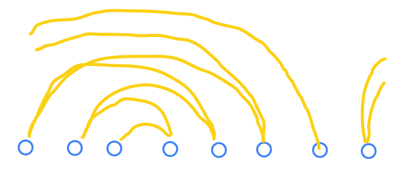
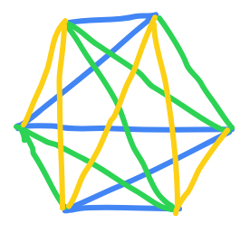

# 构造

## zig-zag pattern

### 引入

首先我们考虑几个问题： 

!!! question "问题引入"

    - 把一个 $n$ 个点 ($n$ 是偶数) 的完全图分成 $\frac{n}{2}$ 条哈密顿路。

    - 把一个 $n$ 个点 ($n$ 是奇数) 的完全图分成 $\frac{n-1}{2}$ 条哈密顿环路。

    - 把一个 $n$ 个点 ($n$ 是偶数) 的完全图分成 $n − 1$ 个匹配。

    - 把一个 $n$ 个点的完全图的所有边排成一个圈，使得任意连
    续的 $n − 1$ 条边都构成一棵树。

然后先考虑第一个最简单的问题， 我们考虑提出以下构造：

相当于第一次向右走一步，然后第二次向左走两步 ··· ， 这个就称作 $\texttt{zig-zag pattern}$ 。

然后如果我们从每一个点向这样走，就会发现放在原图上为：

此时我们就完成了第一个任务。 但是处理到第二个时就有一些棘手了，因为现在这个样子之所以能够完全覆盖完，是因为对于距离为 $1$ 的边，对于每一次 $\texttt{zig-zag pattern}$ 都会同时覆盖两条边。但是对于奇数的情况，就会还剩下一条边没有被覆盖。

这个时候我们就可以对于奇数多出来的那一个点（$x$）单独处理， 即把每一次 $\texttt{zig-zag pattern}$ 得到的链首尾都连接 $x$ ，即如下图：

然后后面这两个问题差不多，所以就不说了（主要是后面的题目没有用到）。

### 题目

???+ note "[P9837 汪了个汪](https://www.luogu.com.cn/problem/P9837)"

    <!-- **标签: 构造** -->

    这个题目我们发现 $\frac{n(n-1)}{2}$ 就代表了 $n$ 个点之间的边，然后既然要求本质不同，就相当于使用的边不能重复；有要求同一行节点不能相同，那么相当于每一行是一个哈密顿路径（的一部分）。

    但是按照 $\texttt{zig-zag pattern}$ 中只能获得 $\frac{n}{2}$ 个，所以我们可以把每一条路径分成两段。

    然后对于奇数的情况，我们可以添加一个节点 $0$ ，然后以 $0$ 为分界点分成两段。

## 其他构造

直接上题目就可以了（这里主要分为调整法，直接构造···）

???+ note "[P16357 [BalticOI 2026] Blocks](https://www.luogu.com.cn/problem/P16357)"

    <!-- **标签: 构造** -->

    这里我们可以分情况讨论，即 $n$ 为奇数还是偶数。

    **Case 1**: $n$ 为偶数

    此时我们考虑一种颜色，可以证明只要他出现了奇数次就不合法了。这里以 $3$ 距离，假设三个位置为 $x, y, z$ ，那么必须满足 $\frac{x+y+z}{3} = mid = \frac{n+1}{2}$ ， 所以 $x + y + z = \frac{3 \cdot (n+1)}{2}$ 此时一定为小数，因此一定不成立。

    所以只需要对于所有的颜色直接构造一个回文串就可以了，

    **Case 2**: $n$ 为奇数

    首先如果有任何的 $1$ 那么必须把他放在中间，如果有多余一个 $1$ 那么就不合法了，然后如果没有 $1$ 可以把一个奇数个的块放一个到中间（如果还没有同样不可法）。

    然后对于所有偶数块，让他们一边放一个；对于奇数的块，把他们一边放一个直到奇数块的个数为 $3$ 。

    因此我们现在剩下了若干个（这里设为 $k$）个 $3$ 的块，需要放在 $ [mid-\frac{3k}{2}, mid-1] \cup [mid+1, mid+\frac{3k}{2}]$ 中。

    此时我们考虑一边放一个，一边放两个。具体来说就是每两个块分成一组（如果不能分成两组就不合法，同上面的式子不能整除）。

    然后此时我们考虑如何构造，首先我们需要知道我们的目标，使用一个简洁的式子描述 $6$ 个点，并且这 $6$ 个点必须和编号 $i$ 有关（否则必然重叠），然后此时我们按照下图分成六块：

    

    其中每一块的长度为 $\frac{k}{2}$ ，然后我们考虑对于这每一对的 $x, y, z$ 分别覆盖这里的一些区域。

    

    但是为什么 $z1, z2$ 一定要共用一个区间呢，因为三个点的位置一定为 $x = mid + i + a, y = mid + i + b, z = mid - 2i + c, a + b + c = 0$ 。那么 $z$ 的步长不一样，自然只能两个 $z$ 共用一个区间了。

???+ note "[CF1667C Half Queen Cover](https://www.luogu.com.cn/problem/CF1667C)"

    <!-- **标签: 构造** -->

    这里我们假设最终答案为 $k$ ，那么不考虑对角线覆盖，此时至少有 $(n - k)^2$ 个方块没有被覆盖。而这些块也只能被对角线覆盖，为了让对角线覆盖的效力尽可能高，我们尝试把所有 $k$ 都放在最上缴，并且横竖不重复，此时就剩下右下角的那个 $(n-k) * (n-k)$ 没有被覆盖。

    为了覆盖这些位置，我们考虑对于每一条对角线被一个方块覆盖，具体来说画图如下：

    

???+ note "[P3557 [POI 2013] GRA-Tower Defense Game](https://www.luogu.com.cn/problem/P3557)"

    <!-- **标签: 构造** -->

    首先给出结论： 只需要随即放塔楼，如果这个点已经被保护过了就不放了。

    **证明：** 假设我们在 $x$ 放了一个增强后的塔楼，分情况讨论：

    - $x$ 位置在没有增强前的位置也是塔楼，那么此时肯定不会更劣，因为放在这里只会覆盖更远的地方，使答案减小

    - $x$ 位置在没有增强前不是塔楼， 那么离他一步之内必定有一个塔楼，那么此时仍然能够覆盖原来塔楼覆盖的区域。