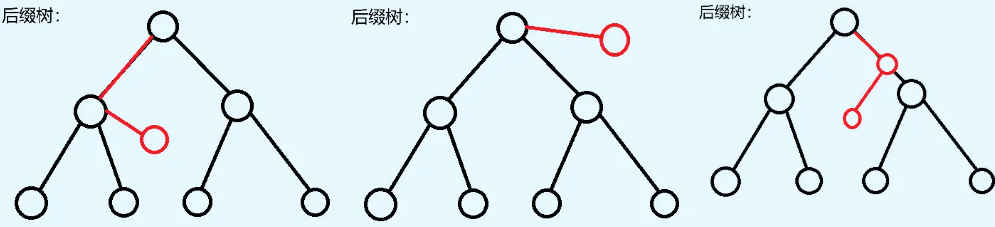

# 后缀自动机

## 引入

后缀自动机是一个有限状态自动机，其满足对于处理的这个字符串，所有的子串都能够表示为一个从 root 出发的子串。

并且后缀自动机是所有满足要求的自动机中 "状态数最少", "转移树最少" 的自动机，这也为他的一些应用奠定了基础。

## endpos

一个拥有如此性质的自动机实际上最大的难点就在如何构建，因此我们考虑如果对于一个普通的 Trie（由于子串相当于所有后缀的前缀，因此 Trie 必定满足要求） 树进行优化，从而令自动机最小。


加入对于上面这个图，我们发现有一些子串，比如 $3, 4, 5, 6$ 和 $7, 8, 9, 10$ 是完全相同的，因此我们可以令 $7$ 连接到 $4$ ，这样依然满足要求。

具体来说，如果我们令 $endpos_s$ 集合表示子串 $s$ 在原字符串中出现的所有位置（尾部），此时其有一定的性质：

* 两个 $endpos$ 不同的节点无法贡献一个节点。

* 两个 $endpos$ 相同的节点一定共享节点。（就比如对于上面图示的 $ab$ 和 $b$，这里他们的 $endpos$ 都是 ${2, 4}$ ，因此他们可以贡献终止节点）

因此我们可以想办法利用 $endpos$ ，从而最大化节点。

## parent 树

这里我们发现所谓的 $endpos$ 实际上就是多个前缀所具有的共同后缀。因此我们考虑把所有前缀倒着插入一个 Trie 。比如下图：


上图还进行了一个下面需要的操作，就是把 Trie 变成一个虚树，从而保证时间复杂度。注意一下当前 $6$ 号节点同时代表了 $aba, abab, ababc$ ，这三个子串。

我们考虑对他们标注出所有的 $endpos$ （当然这里的子串是对于从根到这里的路径）:


我们可以发现每一个节点的 $endpos$ 实际上就是其子树的 $endpos$ 的并集，然后根节点的 $endpos$ 就是其真实出现的位置。并且此时叶子节点的 $endpos$ 必定只有一个元素。

我们可以发现此时所有 $endpos$ 相同的节点都被合并在一起了。为什么呢？~~我也不知道，我也不敢问~~。

因此我们可以考虑在当前局面下（也就是 parent 树中）进一步构建转移，从而能够能够计算从任意一个节点新加入一个 char 的新位置。

**$link$ 的定义：** 一个节点指向其在 parent 树上的父亲。

## 尝试构建

首先我们考虑每一次在字符串末尾新加入一个字符 $c$，因而此时相当于多了一个前缀，因此其可能变成了一下几种情况：



（这里第三种情况说的是在原来压缩的情况下从压缩的位置伸出去一条边）

考虑如何加入这个新的一个链，我们假设此时已经设定了一个 $last$ 表示没有加入 $c$ 之前 $root$ ~ $last$ 能够构成前面的整个字符串。

### **未经压缩的情况：**

那么此时那些地方的节点可能转移到这个新的链上的节点呢。首先一定是那些本来没有 $c$ 这种转移的节点，否则他们既然有转移，如果现在还能转移，那么现在得到的字符串一定相同，也就是没有用。并且一定是 $root$ ~ $last$ 中的节点。因为必定是原来的字符串的一个后缀同样添加了一个 $c$ 。因此如果在没有经过压缩的树上看是这样的：


当然在这里，从最下面有一个节点出现 $c$ 的转移边就可以说明上面的所有点直到 $root$ 都是有转移边的（因为一但下面有，上面的在构建中同样会被覆盖全）

### **经过压缩的情况：**

**首先为什么可以压缩：** 这是一位对于那些压缩在一起的节点。他们的 $endpos$ 都是相同的，据此他们无论后面转移增加什么 $c$ ，后续都是相同的。

因此对于原来转移边 $(a, b)$ ，假设他们有一些（或全部）都未能被保留，而是被合并了，那么就直接连接合并之后的节点，如图：


### 真实转移

这里我们分为两种情况计算：


* **第一种：** 新加入的字符串没有从压缩的节点中开辟一条新的道路
* **第二种：** 完全相反

首先我们先新建一个节点 $clone$ 表示新的那个点，如例子中的 $7$。

#### 第一种转移

首先当然是把 $root$ ~ $last$ 的所有没有 $c$ 的点的转移边指向 $clone$ 。比如在图中的例子，本来这些点指向的是 $5$ ~ $7$ 中的一些点，然后经过压缩之后，就下降到了 $clone$ 。

然后考虑上面的结果需不需要变化。我们发现 $2$ 实际指向的是 $5$ 。这是因为当有 $c$ 的转移边时，更具上面未经压缩时的转移边规律。一定是第一个原来就存在的节点。然后此时根据上面的推论，完全不需要发生变化。但是注意需要把 $clone$ 的 $linl$ 指向上面那个点。

#### 第二种转移

此时依然先处理 $root$ ~ $last$ 的所有没有 $c$ 的点的转移边指向 $clone$ 。解释同上。

然后考虑更新 $2$ 的转移边。看似好像有点和上面的东西相违背。但是这里实际上原来那个所有 $c$ 转移存在的就不需要改变的理论是针对未压缩的情况的。然后现在压缩之后，我们可以发现原来在当前例子中 $2$ 指向的其实是 $8$ , 但是因为新增 $8$ 的节点，因此其转移也要发生改变。

因此我们先创建 $8$ ，然后用 $2$ 指向 $8$ ，然后把 $link$ ，$7$ 的转移边和 $6$ 的转移边更新一次。

## 代码实现

```cpp
struct SAM {
    static constexpr int N = (1000005) << 1;
	
    int cnt, last;
    struct State {
        int len, link;
        map<char, int> next;
    }st[N];
	
    void init() { 
        st[0].len = 0, st[0].link = -1; 
        cnt = 0, last = 0;
    }
	
    SAM() { init(); }
	
    void extend(char c) {
        int cur = ++cnt; siz[cur] = 1;
        st[cur].len = st[last].len + 1;
        int p = last;
        while(p != -1 && !st[p].next.count(c)) {
            st[p].next[c] = cur, p = st[p].link;
        }
		
        if(p == -1) { // 这里新出现的节点完全没有出现过
            st[cur].link = 0;
        } else {
            int q = st[p].next[c];
            if(st[p].len + 1 == st[q].len) {
                st[cur].link = q;
            } else {
                int clone = ++cnt;
                st[clone].len = st[p].len + 1;
                st[clone].next = st[q].next;
                st[clone].link = st[q].link;
                // 这里这个 while 需要把所有原本指向 q 的重新指向 clone
                while(p != -1 && st[p].next[c] == q) {
                    st[p].next[c] = clone, p = st[p].link;
                }
                st[q].link = st[cur].link = clone;
            }
        }
	
        last = cur;
    }
	
    vector<int> v[N];
    void build() {
        for(int i=1; i<=cnt; i++)
            v[st[i].link].push_back(i);
    }
	
    int siz[N];
    void dfs(int x) {
        for(int y : v[x]) dfs(y), siz[x] += siz[y];
        if(siz[x] > 1) ans = max(ans, 1ll * siz[x] * st[x].len);
    }
}
```

这里后面的代码是处理每一个点的 $emdpos$ 大小。注意一下 $endpos$ 不仅是子树大小，根据前面的定义还需要加入那些被包含的前缀。

> [!warning] 注意
> 
> 使用 `std::map` 实现的常数比较大, 因此当值域比较大的时候使用 `std::map` ，否则直接普通数组。

下面给出一个使用普通数组存储的示例。

> [!success]- 代码示例
> 
> ```cpp
> struct SAM {
> 	static constexpr int N = (400005) << 1;
> 	
> 	int cnt, last;
> 	struct State {
> 		int len, link;
> 		int next[27];
> 	}st[N];
> 	
>     int new_node() {
>         st[++cnt] = {0, 0, {}};
>         for(int i=0; i<=26; i++) st[cnt].next[i] = -1;
>         return cnt;
>     }
> 	
> 	void init() {
> 		st[0].len = 0, st[0].link = -1;
>         for(int i=0; i<=26; i++) st[0].next[i] = -1;
> 		cnt = 0, last = 0;
> 	}
> 		
> 	SAM() { init(); }
> 		
> 	void extend(char c) {
> 		int q = new_node(), p = last;
> 		st[q].len = st[last].len + 1;
> 		while(p != -1 && st[p].next[c] == -1) {
> 			st[p].next[c] = q, p = st[p].link;
> 		}
> 		
> 		if(p == -1) {
> 			st[q].link = 0;
> 		} else {
> 			int t = st[p].next[c];
> 			if(st[t].len == st[p].len + 1) {
> 				st[q].link = t;
> 			} else {
> 				int clone = new_node();
> 				st[clone].len = st[p].len + 1;
> 				st[clone].link = st[t].link;
>                 for(int i=0; i<=26; i++) st[clone].next[i] = st[t].next[i];
> 				while(p != -1 && st[p].next[c] == t) {
> 					st[p].next[c] = clone, p = st[p].link;
> 				}
> 				st[t].link = st[q].link = clone;
> 			}
> 		}
> 		
> 		last = q;
> 	}
> 		
>     // 关于题目
> 		
>     int cnt1[N], cnt2[N];
>     void MakeCnt() {
>         int p = 0;
>         for(char c : s) {
>             if(st[p].next[c - 'a'] == -1) p = 0;
>             else p = st[p].next[c - 'a'];
>             cnt1[p]++;
>         }
> 			
>         p = 0;
>         for(char c : t) {
>             if(st[p].next[c - 'a'] == -1) p = 0;
>             else p = st[p].next[c - 'a'];
>             cnt2[p]++;
>         }
>     }
> 		
>     long long Getans() {
>         vector<int> order;
>         for(int i=0; i<=cnt; i++) order.push_back(i);
>         sort(order.begin(), order.end(), [&](int a, int b) {
>             return st[a].len > st[b].len;
>         });
> 		
>         for(int x : order) if(st[x].link != -1) {
>             cnt1[st[x].link] += cnt1[x];
>             cnt2[st[x].link] += cnt2[x];
>         }
> 		
>         long long ans = 0;
>         for(int i=1; i<=cnt; i++) {
>             if(st[i].link == -1) continue;
>             ans += 1ll * cnt1[i] * cnt2[i] * (st[i].len - st[st[i].link].len);
>         }
>         return ans;
>     }
> }sam;
> ```

## 性质

性质是一些后缀自动机的特性：

- SAM 是一个 DAG，并且其状态数小于 $2n-1$ ，转移数小于 $3n-4$ 。这复杂度的正确性实际上也是压缩的性质提供的。

- 这里的 parent 数相当于对于反转的字符串的后缀树。

- 所有相同的字符子串都被压缩在了一起。

- 对于一个节点其代表的字符串是一个区间的所有字符串，具体范围是 $(len_{link_i}, len_x]$ 。并且这些字符串都是 $x$ 节点最长串的后缀（这里最长串就是从 $root$ ~ $x$ 的**最长路径**）。

- 每一个节点他代表的字符串其出现次数就是其 $endpos$ 的数量，而 $endpos$ 就是子树的 $endpos$ 并集加上当前节点是否是一个后缀的结尾。任意 $endpos$ 相同的必定被压缩入一个后缀。

- **注意：** 记得区分上面两种情况，如果需要计算一个节点在 parent 树上所代表的所有算重子树个数，实际上是 $siz_i \times (len_x - len_{link_x})$ 。

- 每一个字符子串可以表示为从 $1$ 出发的路径。并且所有路径都至少会对应一个子串。

- 再后缀自动机上所谓压缩就是这一个节点代表了所有从 $1$ 开始的路径。
## 应用

### 检查子串是否出现

这里直接从开头一直走下去（沿着自动机节点），如果做到一个位置无法继续走的就说明无法匹配。

### 查询本质不同子串个数

有两种办法，一种是在 SAM 上跑拓扑，有多少个路径是从 $0$ 出发的。然后另一个是计算 $\sum_{i=1}^{cnt} len_i - len_{link_i}$ 。这里是因为对于一个节点，除了他压缩的真么多个节点，而剩下的就是 $|endpos|$ 次重复出现在后缀中，因此排除所有重复就是 $len_x - len_{link_x}$ 。

### 任意字符串出现个数

就是上面那个代码中求解的 $siz$ ，相当于其 $endpos$ 大小。

### 所有子串在另一个子串中出现次数

这里我们直接令一个子串在另一个子串的 SAM 中跑。然后和 AC 自动机类似。这里的 $link$ 指针组成的 parent 树中当一个子串被经过，其所有 $link$ 指针可以到达的地方也会收到贡献。因为 $link$ 相当于第一个当前的后缀中没有被压缩进入自己的节点。

## 第 $k$ 小的字符子串

首先这里我们可以先处理一下每一个点能够到达的字符串数量，通过前面性质那一部分我们可以知道对于每一个点其所代表字符串的出现次数。

然后此时我们需要求出在自动机中每一个节点后继状态个数。这里最开始我一直在纠结要不要乘上 $len_x - len_{link_x}$ ，但是实际上不需要。因为在自动机上那些合并的字符串实际上前面的字典序不同，也就是前面必定有真么多条路径可以到达。因此不需要计算。

## 广义SAM

这里我们直接看到一道例子：

> [!tip]+ P3181 [HAOI2016] 找相同字符
> 
> 给定两个字符串，求出在两个字符串中各取出一个子串使得这两个子串相同的方案数。两个方案不同当且仅当这两个子串中至少有一个位置不同。
> 
> $1\le n_1,n_2\le 2\times 10^5$，字符串中只有小写字母。

如何处理呢。首先这里实际上就是需要询问有多少个子串。同时在 $s$ 和 $t$ 中出现过。由于这个子串一定是 $s$ 和 $t$ 中的子串。因此我们考虑把 $s, t$ 同时加入 SAM。具体来说，为了使子串不跨过串，因此我们在他们之间插入一个特殊字符。

然后此时我们需要统计这里面的子串在  $s$, $t$ 中的出现次数，然后任意选两个都可以组成一个贡献，上面那个问题就是一个板子。因此直接做完了。

对于更一般的问题，我们记录一个上一次结束的 $last$ ，然后直接下一次从这里开始就可以了。
